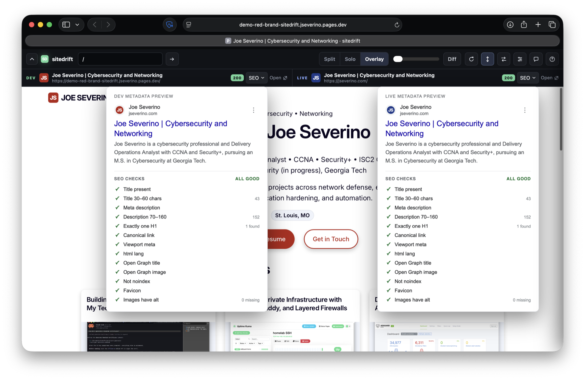
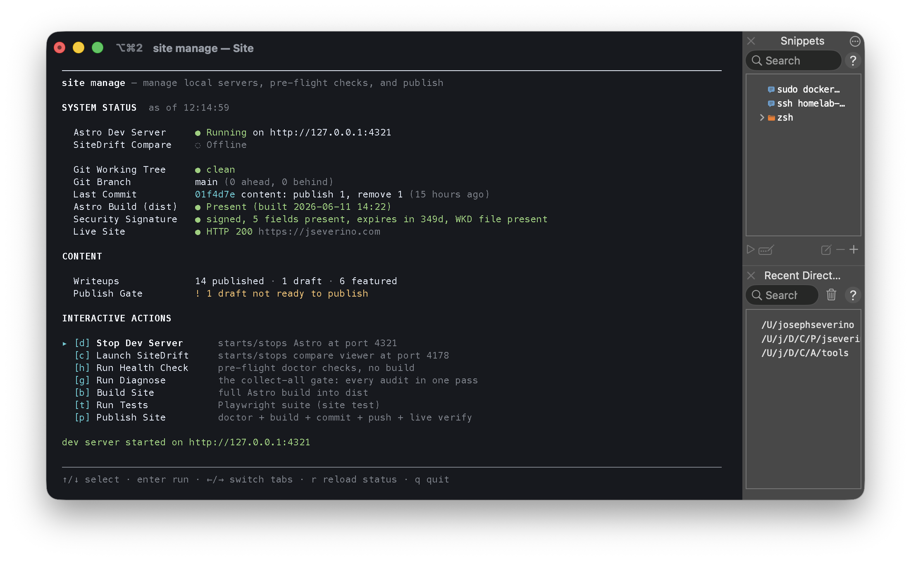
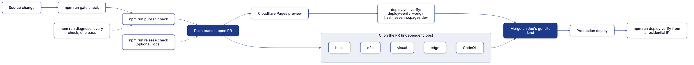

# jseverino.com

[](https://github.com/joeseverino/jseverino.com/actions/workflows/ci.yml)
[](https://github.com/joeseverino/jseverino.com/actions/workflows/codeql.yml)
[](https://github.com/joeseverino/jseverino.com/actions/workflows/dependency-review.yml)
[](https://github.com/joeseverino/jseverino.com/actions/workflows/scorecard.yml)
[](https://github.com/joeseverino/jseverino.com/actions/workflows/lighthouse.yml)

Personal cybersecurity portfolio for Joe Severino, built with Astro, sourced from a private Obsidian vault, and deployed as static output on Cloudflare Pages.

The repository is the public, sanitized build source. The private vault is the editorial source of truth. Cloudflare builds only from committed files in this repo; it does not need access to the vault.

```text
Private Obsidian vault -> sanitized repo snapshot -> Astro build -> Cloudflare Pages
```

## What This Repo Does

- Builds a static personal site with Astro 7.
- Syncs public pages, portfolio writeups, and technology taxonomy from a private vault.
- Rewrites local image references into public asset paths.
- Generates AVIF, WebP, and optimized fallback image variants.
- Records image dimensions in [`src/lib/image-manifest.json`](./src/lib/image-manifest.json) so rendered images include stable `width` and `height` attributes.
- Emits canonical metadata, Open Graph/Twitter metadata, JSON-LD, sitemap, RSS, and robots.txt.
- Uses Cloudflare Pages Functions only where dynamic behavior is required: CSP
  nonce injection, CSP violation reporting, contact form submission handling,
  and the scoped read-only preview review proxy. [`public/_routes.json`](./public/_routes.json)
  keeps static assets off Functions.
- Wraps non-production Cloudflare Pages deployments with
  [`sitedrift`](https://github.com/joeseverino/sitedrift), providing a compact
  DEV-versus-LIVE review toolbar with synchronized navigation, visual
  comparison, response deltas, and per-page SEO checks. Production output is
  not wrapped.

## Repository Map

| Path | Purpose |
| --- | --- |
| [`src/pages/`](./src/pages/) | Astro routes for pages, portfolio, tags, RSS, robots.txt, and errors. |
| [`src/layouts/BaseLayout.astro`](./src/layouts/BaseLayout.astro) | Shared document shell, preload, header, footer, and SEO head. |
| [`src/components/`](./src/components/) | Reusable UI and metadata components. |
| [`src/lib/markdown.ts`](./src/lib/markdown.ts) | Markdown rendering: `markdown-it`, the custom block directives, the raw-HTML allow-list, and writeup chrome. Image directives are in [`src/lib/image-directives.ts`](./src/lib/image-directives.ts). |
| [`src/lib/content.ts`](./src/lib/content.ts) | Astro content glue: collections, `<picture>` enhancement, featured order, and taxonomy lookup. |
| [`src/content/pages/`](./src/content/pages/) | Sanitized synced page Markdown. |
| [`src/content/writeups/`](./src/content/writeups/) | Sanitized synced portfolio Markdown. |
| [`src/content/technology-groups.md`](./src/content/technology-groups.md) | Synced public taxonomy for technology labels and groups. |
| [`src/lib/site-config.ts`](./src/lib/site-config.ts) | The five instance primitives (domain, owner, GitHub account, D1 database, focus areas) every script and the build derive from. |
| [`src/lib/site.ts`](./src/lib/site.ts) | Site identity, social links, and navigation (typed config, derived from `src/lib/site-config.ts`). |
| [`public/assets/`](./public/assets/) | Static site assets organized by bucket: `docs/` (downloadable documents), `fonts/`, `icons/`, `og/` (Open Graph cards), `pages/<slug>/` and `writeups/<slug>/` (vault-synced page and writeup assets). See [Architecture §12 Asset Organization](./docs/Architecture.md#12-asset-organization) for the convention. |
| [`public/_headers`](./public/_headers) | Static Cloudflare security headers. CSP is issued per-request by the middleware (not set here). |
| [`public/_redirects`](./public/_redirects) | Static Cloudflare redirects. |
| [`functions/_middleware.ts`](./functions/_middleware.ts) | Per-request HTML CSP nonce generation and script nonce injection. |
| [`functions/api/contact.ts`](./functions/api/contact.ts) | Contact form endpoint with Turnstile, validation, rate limiting, and D1 storage. |
| [`functions/api/csp-report.ts`](./functions/api/csp-report.ts) | CSP violation report receiver with noise filtering and D1 storage. |
| [`functions/__sitedrift/[[path]].ts`](./functions/__sitedrift/[[path]].ts) | Read-only preview-review proxy scoped to `/__sitedrift/*`; returns 404 in production. |
| [`public/_routes.json`](./public/_routes.json) | Which paths run Pages Functions; static assets are excluded. |
| [`cloudflare/zone.json`](./cloudflare/zone.json) | Desired zone and account settings, checked and applied by `npm run cloudflare:check` / `cloudflare:apply`. |
| [`db/schema.sql`](./db/schema.sql) | D1 schema for contact submissions and CSP reports. |
| [`public/schemas/cordon-v4.json`](./public/schemas/cordon-v4.json) | Hosted JSON Schema for the [Cordon](https://github.com/joeseverino/cordon) command-surface contract, served at `/schemas/` (its `$id`). Published copy; canonical source lives in the cordon repo. |
| [`bin/sync-content.ts`](./bin/sync-content.ts) | Vault-to-repo sync, metadata allowlisting, asset copy, image optimization, and manifest generation. |
| [`bin/publish-check.ts`](./bin/publish-check.ts) | Local release gate: clean, sync, the registry audits, build, and the post-build checks (assets, links, page weight, SEO). Also run by CI on every push. |
| [`bin/site.ts`](./bin/site.ts) | The `site` CLI: scaffold, validate, publish, land, and manage writeups. See [`docs/Site-CLI.md`](./docs/Site-CLI.md). |
| [`tests/audits/registry.ts`](./tests/audits/registry.ts) | The audit inventory every gate runs from. |

## Content Model

The private vault is organized as:

```text
06 Pages/
  _technology-groups.md
  home/index.md
  about/index.md
  contact/index.md
  portfolio/index.md
  privacy/index.md

05 Writeups/
  project-slug/
    index.md
    images/
```

The resume page is the one page sourced from a second private vault: its canonical (`Career/resume.md`) carries the contact identity in frontmatter and per-line surface markers (`<!--site-only-->` / `<!--pdf-only-->`), so the web page and the PDF artifacts curate differently from one source. The downloadable PDF at `public/assets/docs/joseph-severino-resume.pdf` is rendered from the same canonical by the public [resume-engine](https://github.com/joeseverino/resume-engine) pipeline; the sync strips the markers and whitelists frontmatter so contact fields never enter this repo.

The education pages extend the pattern to a third private vault, read only through its governed face: `/education/` and its per-institution pages derive from the [severino-edu-mcp](https://github.com/joeseverino/severino-edu-mcp) `export` CLI (institutions and courses with their public bullets, validated against that vault's schema profile before anything builds), joined to the resume canonical's EDUCATION section, which stays the single owner of institution identity. The sync never parses that vault itself. A course publishes once it is active or completed and carries public bullets, and the resume page links an institution only while its education page is actually emitted, so an unpublished education tree can never leave a dead link.

[`bin/sync-content.ts`](./bin/sync-content.ts) orchestrates explicit Vault, Life-resume, and Education-export adapters, then sends each record through one public projection. [`contracts/content.v1.json`](./contracts/content.v1.json) owns the field contract; `sync:contract` generates Astro's typed Zod schema and the MCP projection. Vault-only fields such as internal IDs, systems, related projects, sensitivity, and operator notes are dropped by declared policy in that contract, with no second hand-maintained list. Local assets are resolved against their source directory and refused if they escape that directory.

Page frontmatter may include an explicit `path`. If omitted, the site falls back to `/` for `home` and `/<slug>/` for other pages. Writeup URLs come from their folder slug. An optional `intro` field renders as the on-page subtitle below the H1; pages without one fall back to `description`, so SEO meta and visible subtitle stay coupled by default.

## Image Pipeline

During sync, image references are collected from Markdown and frontmatter. Optimizable images are processed into:

- AVIF at 512, 1024, and 1600 px widths.
- WebP at 512, 1024, and 1600 px widths.
- An optimized fallback file.

The generated paths and intrinsic dimensions are written to [`src/lib/image-manifest.json`](./src/lib/image-manifest.json). [`Picture.astro`](./src/components/Picture.astro) uses that manifest to output responsive `<picture>` markup with stable dimensions, which prevents layout shift without hand-maintained image metadata.

Image encodes are cached under the gitignored `.cache/` by source-content hash (outside `node_modules`, so `npm ci` keeps them). The cache speeds local syncs but is not part of the public source of truth. A production build fails if a synced image has no manifest entry.

## Brand

The favicons, HD marks, and social cards are generated. [`src/lib/brand.ts`](./src/lib/brand.ts) holds the site's identity (navy `#1E3A8A` plus the `JS` glyph); the rendering logic lives in a standalone, public package, [`branding-engine`](https://github.com/joeseverino/branding-engine) ([npm](https://www.npmjs.com/package/branding-engine)). The site is just a consumer: `bin/make-icons.ts`, `bin/make-og-image.ts`, and `bin/make-github-social.ts` pass `BRAND` to the engine and write to the repo's own paths.

`branding-engine` is an `optionalDependency` pinned to a published, provenance-attested npm version. Because the generated assets in `public/assets/` are committed, the production build never runs the engine; if install can't fetch it, the optional install is skipped and the static build is unchanged. The engine runs only locally, on demand, to regenerate. The full story (one navy identity, then a shared engine) is in [`docs/Brand-System.md`](./docs/Brand-System.md).

## Metadata And SEO

`SeoHead.astro` emits:

- Canonical URL.
- Open Graph and Twitter card metadata.
- JSON-LD for `WebSite`, `Person`, `Article`, and `BreadcrumbList` where applicable.
- `robots` noindex where requested.

The `Person` schema reads from [`src/lib/site.ts`](./src/lib/site.ts), the same object the header and footer use. Portfolio writeups pass published and reviewed dates into Article schema.

Every non-production Pages deployment also includes sitedrift's SEO inspection
panel. It renders DEV and LIVE snippets together, compares title, description,
and canonical metadata, and checks headings, viewport, language, Open Graph,
indexing directives, favicon, and image alt coverage.

## Deployment Preview Review

Cloudflare branch and version previews open in compact sitedrift Solo mode,
showing the preview deployment as DEV and `https://jseverino.com` as LIVE.
Reviewers can switch to Split or Overlay/Diff, mirror links and scrolling,
inspect response timing deltas, open the SEO comparison, and keep notes in that
browser's `localStorage`.

[](https://6ef83545.jseverino.pages.dev/)

Both tools are mine. For this branch, `branding-engine` regenerated the
favicon, wordmark, theme, Open Graph card, and social preview from one
temporary change of the brand color from navy to red, and `sitedrift` wrapped
the branch deployment and compared it with the unchanged production site.



The review also compares metadata and SEO checks, response timing and
transfer deltas, and pixel differences, with notes kept in the browser.

The integration is deliberately preview-only:

- `sitedrift cloudflare` activates only when `CF_PAGES=1` and
  `CF_PAGES_BRANCH` is not `main`.
- Production remains ordinary Astro output.
- `/__sitedrift/*` accepts only `GET` and `HEAD`.
- The LIVE proxy is fixed to `https://jseverino.com`.
- Contact and CSP-report routes are not modified.
- Preview responses remain `noindex`.

See [Deployment Preview Review](./docs/Deployment-Preview-Review.md) for the
workflow, architecture, security boundary, verification steps, and the
[frozen red-brand comparison](https://6ef83545.jseverino.pages.dev/).

## Security Model

The public site is static HTML, CSS, JavaScript, and assets. There is no WordPress runtime, no public database-backed page renderer, no admin panel, no comments, no uploads, and no account system.

Dynamic behavior is intentionally narrow:

- [`functions/_middleware.ts`](./functions/_middleware.ts) runs for HTML responses, generates a nonce, puts it on the `<script>` and `<style>` tags the build stamped with a nonce placeholder (markup that arrives through content gets none), emits a nonce-bearing CSP, and advertises the CSP report endpoint. [`public/_headers`](./public/_headers) carries the other security headers; CSP is issued only per-request by the middleware.
- [`functions/api/contact.ts`](./functions/api/contact.ts) accepts contact submissions, verifies Turnstile server-side (including the hostname and action), validates input against the contract, and stores accepted messages in Cloudflare D1 with parameterized SQL; the per-IP hourly cap is checked inside the `INSERT`, so concurrent requests cannot race past it.
- [`functions/api/csp-report.ts`](./functions/api/csp-report.ts) receives browser CSP violation reports, drops extension/off-site noise, and stores compact records in the same D1 database in one capped batch per request.

Markdown from the vault renders through an allow-list: raw HTML is rebuilt from known tags and attributes, never passed through.

## Local Commands

The ones that matter day to day:

```sh
# Daily
npm run dev                # Start the Astro dev server
npm run sync:content       # Sync published vault content into the repo
npm run diagnose           # Run every check; writes .validation-report.md on failure
npm run diff:build         # Build HEAD vs the working tree and report any change to shipped output

# Release
npm run publish:check      # Fast local build gate (add -- --no-sync for code-only changes)
npm run publish:check:ci   # Rehearse the CI gate: CI=1 + a scratch keyring, before pushing workflow changes
npm run release:check      # Trusted deterministic gate; also fails if validation changes repo state
npm run deploy:verify      # After push: verify remote checks and the deployed production artifact
```

Every other script (asset generation, scaffolding, the individual audits the
gates compose) is in [`docs/Commands.md`](./docs/Commands.md), an overview by
role followed by the detail per command. `npm run help` prints the live
grouped list straight from `package.json`, and a unit test asserts the
reference covers every script, so neither can drift.

Publishing runs through the repo's own `site` CLI ([`bin/site.ts`](./bin/site.ts), `npm run site -- <command>`): `site publish` opens a content PR from a temporary worktree cut from `origin/main`, committing exactly the files the sync declares, and `site land` merges it once the checks pass, waits for the deploy, and verifies it live. Nothing merges unless `site land` runs. Every command takes `--json` for agent callers. Its `site manage` TUI puts the featured order, publish state, and gate issues of every writeup on one screen. See [`docs/Site-CLI.md`](./docs/Site-CLI.md).



The testing suite, local quality audits, repository policies, and visual baselines are toured in [`tests/README.md`](./tests/README.md) and documented in full in [`tests/ARCHITECTURE.md`](./tests/ARCHITECTURE.md).

## Validation & Testing

Every change is verified across four layers: local Node audits that assert invariants about the source and the build, unit tests for the pure logic (the markdown DSL, the Cloudflare Pages functions, the gate harness itself), Playwright specs that drive the built site in a real browser and through the Cloudflare runtime, and post-deploy probes that re-check each deployment. Together they cover signed security metadata, WCAG contrast and an axe accessibility sweep, schema parity on both boundaries (vault/Zod/MCP and handler/OpenAPI/D1), strict types over the whole repo, no duplicated code, serverless request handling, internal link integrity, structural HTML, page-weight budgets, cross-browser functional flows, pixel baselines, and live header/CSP checks.

The everyday entry point is **`npm run diagnose`**, the collect-all gate. It runs every check in the inventory without stopping at the first failure: a green run prints a single line, a red run writes `.validation-report.md` with each failure, its remediation, and the exact command to rerun that one check. `--fast` runs only the static checks, `--no-tests` skips the browser suite, and `--json` emits a machine-readable result for agents and CI.

Start with the tour in [`tests/README.md`](./tests/README.md); the full reference, with every audit, spec, and fix, is [`tests/ARCHITECTURE.md`](./tests/ARCHITECTURE.md).



<sup>Diagram source: [`docs/diagrams/validation-flow.mmd`](./docs/diagrams/validation-flow.mmd),
pre-rendered with [`diagram`](https://github.com/joeseverino/tools/blob/main/bin/diagram).</sup>

### GitHub Actions Continuous Integration

Every push and pull request to `main`, plus the scheduled jobs:

| Workflow | Purpose | Verified Result |
| --- | --- | --- |
| [`ci`](./.github/workflows/ci.yml) | Four independent jobs, no job waiting on another, so a failure always reports on its own required check. `build` runs the gate audits (source integrity, repository policy, documentation integrity, stylesheet lint) and then the registry publish gate `publish:check --no-sync` on the same artifact `build-static` ships (plus a CycloneDX SBOM on `main`). The `playwright` matrix runs `e2e` (cross-browser, three workers), `visual` (macOS Chromium baselines of the synthetic content in `tests/fixtures/content`, so a publish never moves one), and `edge`, which serves the build through the Cloudflare runtime with `wrangler pages dev` and asserts what only that runtime produces: the per-request CSP nonce on every script tag, the `_headers` security and cache rules, a real 404, the contact function's refusals, and byte-exact `security.txt`, all before anything deploys. | Green checks on the committed tree, SBOM artifact on `main`, and a summary on every job. |
| [`deploy`](./.github/workflows/deploy.yml) | Starts when Cloudflare Pages reports its check-run complete (nothing polls). Runs `deploy-verify --origin` against that deployment's own `*.pages.dev` URL (headers, nonce, cache rules, every sitemap route, 404, contact refusal, `security.txt`), and keeps one pull-request comment current with the CI summaries and the deployment result, whichever finishes first. Also recovers the CI run GitHub suppresses after a Dependabot auto-merge. | One updating PR comment; a verification summary for every deployment. |
| [`codeql`](./.github/workflows/codeql.yml) | Scans JavaScript and TypeScript source files for semantic vulnerabilities; skipped (reported as passing) on pull requests that touch only content. | Clean GitHub code scanning dashboard (zero open alerts). |
| [`dependency review`](./.github/workflows/dependency-review.yml) | Audits manifest package updates for high-severity advisories; skipped on content-only pull requests; comments only when it blocks. | Pull request status validation. |
| [`npm audit`](./.github/workflows/npm-audit.yml) | Weekly `npm run audit` of the lockfile, for advisories published against what is already installed. Accepted advisories live in [`security/audit-allowlist.json`](./security/audit-allowlist.json), each with a `reviewBy` date. | Fails on a high or critical advisory that is not accepted, or accepted past its review date. |
| [`scorecard`](./.github/workflows/scorecard.yml) | Computes OpenSSF security scorecard health metrics. | Weekly SARIF supply-chain reports. |
| [`workflow lint`](./.github/workflows/workflow-lint.yml) | Lints GitHub Action runner steps using actionlint. | PR/push syntax validation. |
| [`link check`](./.github/workflows/link-check.yml) | Audits all Markdown documentation and public links via Lychee. | Detailed connectivity report artifacts. |
| [`lighthouse`](./.github/workflows/lighthouse.yml) | Weekly Lighthouse run (the lockfile's Lighthouse, the same generation PageSpeed Insights scores with) against the live homepage and a deep writeup page. | Fails below accessibility 95 or SEO 90; warns below performance 85 or best practices 70. Scores in the job summary, reports as artifacts. Best practices reads in the 70s from any client Cloudflare distrusts, because Bot Fight Mode's injected detection script uses deprecated browser APIs; PageSpeed Insights is not served that script and reports 100. |
| [`dependabot auto-merge`](./.github/workflows/dependabot-auto-merge.yml) | Enables squash auto-merge on Dependabot's minor and patch PRs, except `sitedrift` (bundled into the edge functions); GitHub merges once every required check passes. | Dependency updates land without waiting on a manual merge. |
| [`dependabot stale`](./.github/workflows/dependabot-stale.yml) | Weekly: opens an issue listing Dependabot PRs open longer than seven days, so a wedged auto-merge is never silent. | Self-closing issue labelled `dependabot-stale`. |

Workflow dependencies are pinned to immutable SHAs or container digests. Every workflow declares a top-level `permissions: contents: read`; any wider scope (`security-events: write` for SARIF upload, `contents` and `pull-requests: write` for auto-merge, `pull-requests: write` for the PR comment and a blocking dependency review, `issues: write` for self-closing alerts) is granted only to the specific job that needs it. Runners are pinned (`ubuntu-24.04`, `macos-26`), every job has a `timeout-minutes`, and checkouts drop their credentials. Dependabot checks npm weekly and GitHub Actions monthly via [`.github/dependabot.yml`](./.github/dependabot.yml), waits seven days after a release before proposing it, ignores semver-major updates on both, and its minor and patch PRs auto-merge once the required checks pass.

The GitHub code-scanning dashboard is kept at zero open alerts. CodeQL findings are fixed at the source; OpenSSF Scorecard findings that do not apply to a solo personal repo (Branch-Protection, Code-Review, Fuzzing, CII-Best-Practices) are dismissed with a "won't fix: solo personal repo" reason and an inline explanation. <a id="scorecard-score"></a>The Scorecard aggregate was **6.9 / 10** on 2026-09-30 (the weekly `scorecard` run; each run's job summary carries the current figure and every check's reason). Below maximum: Branch-Protection, Code-Review, Fuzzing, CII-Best-Practices, and Contributors, which follow from a one-person repo; License, because the license is not an OSI one; and Vulnerabilities, which counts every OSV advisory in the lockfile at any severity, while `npm run audit` fails on a high or critical one that [`security/audit-allowlist.json`](./security/audit-allowlist.json) does not accept. Maintained, Pinned-Dependencies, SAST, Token-Permissions, and Dangerous-Workflow score 10.

Preview deployments (`*.pages.dev`) carry an `X-Robots-Tag: noindex` from [`public/_headers`](./public/_headers) so only the canonical custom domain ever lands in search results.

## Current PageSpeed Snapshot

Google PageSpeed Insights reported 100 across every scored category for the live homepage on desktop, and 99 / 100 / 100 / 100 on mobile, on September 5, 2026 at 9:30 AM CDT.

| Mode | Performance | Accessibility | Best Practices | SEO | FCP | LCP | TBT | CLS | Speed Index |
| --- | ---: | ---: | ---: | ---: | ---: | ---: | ---: | ---: | ---: |
| Mobile, emulated Moto G Power / Slow 4G | 100 | 100 | 100 | 100 | 0.9 s | 1.8 s | 0 ms | 0 | 1.4 s |
| Desktop, emulated desktop / custom throttling | 100 | 100 | 100 | 100 | 0.3 s | 0.5 s | 0 ms | 0 | 0.4 s |

The PDFs used as evidence were exported from PageSpeed Insights for `https://jseverino.com/` with Lighthouse 13.3.0. The run also passed the trust-and-safety checks for effective CSP, strong HSTS, and Trusted Types mitigation.

## Cloudflare Operations

The Pages project owns runtime bindings in the Cloudflare dashboard; this repo intentionally has no `wrangler.toml`. The shared D1 binding is named `DB` and points at `jseverino-contact`.

The zone and account posture (TLS, HSTS, WAF rules, the rate limit, the `pages.dev` redirect, API Shield, Turnstile hostnames) is declared in [`cloudflare/zone.json`](./cloudflare/zone.json); `npm run cloudflare:check` diffs it against the live state and `npm run cloudflare:apply` applies it. See [`docs/Cloudflare.md`](./docs/Cloudflare.md).

Apply the D1 schema after any change to [`db/schema.sql`](./db/schema.sql):

```sh
wrangler d1 execute jseverino-contact --remote --file=./db/schema.sql
```

Check CSP reports after deployment:

```sh
wrangler d1 execute jseverino-contact --remote --command "SELECT created_at, effective_directive, blocked_uri, document_uri FROM csp_reports ORDER BY created_at DESC LIMIT 20;"
```

## Generated And Local Files

Do not commit:

- `node_modules/`
- `.astro/`, `.vite/`, `.wrangler/`
- `dist/`, `dist-visual/`
- `.cache/` (image encodes, sync caches, the drafts overlay)
- `test-results/`, `playwright-report/`, `.validation-report.md`
- `.env*`, `.dev.vars*`
- `.claude/`, `.gemini/`
- `.DS_Store`

[`bin/clean-generated.ts`](./bin/clean-generated.ts) removes build output and caches before publish checks.

## Documentation

- [`docs/Architecture.md`](./docs/Architecture.md) explains the build, content, rendering, image, and edge architecture.
- [`docs/Brand-System.md`](./docs/Brand-System.md) tells how the site's brand became one navy identity rendered by the standalone [`branding-engine`](https://github.com/joeseverino/branding-engine).
- [`docs/Vault-Workflow.md`](./docs/Vault-Workflow.md) explains the private-to-public sync contract.
- [`docs/Blueprint-Setup.md`](./docs/Blueprint-Setup.md) inventories every instance-specific value (identity, brand, edge config, dashboard) for reuse as a blueprint.
- [`docs/Authoring-Guide.md`](./docs/Authoring-Guide.md) documents supported Markdown extensions.
- [`docs/Commands.md`](./docs/Commands.md) is the full command reference: every npm script by role, with detail per command.
- [`docs/Dependencies.md`](./docs/Dependencies.md) records why each `overrides` entry in `package.json` exists and the condition for removing it.
- [`docs/Site-CLI.md`](./docs/Site-CLI.md) documents the `site` publishing CLI and the `site manage` TUI.
- [`docs/SEO.md`](./docs/SEO.md) documents canonical URLs, structured data, discovery files, and metadata flow.
- [`docs/Cloudflare.md`](./docs/Cloudflare.md) documents what runs in the repo versus the zone, the free-plan limits behind it, the features that stay off, and the `cloudflare:check` / `cloudflare:apply` workflow.
- [`docs/Deployment-Preview-Review.md`](./docs/Deployment-Preview-Review.md) documents the sitedrift-powered Cloudflare preview review workflow and production guard.
- [`docs/Accessibility.md`](./docs/Accessibility.md) documents landmarks, skip navigation, alt text, focus behavior, reduced motion, keyboard coverage, and contrast posture.
- [`docs/WordPress-To-Astro-Migration.md`](./docs/WordPress-To-Astro-Migration.md) documents the platform migration decision and performance comparison.
- [`docs/Release-Checklist.md`](./docs/Release-Checklist.md) documents preflight, publish, signed tag, deploy, header, SEO, and accessibility checks.
- [`SECURITY.md`](./SECURITY.md) documents the security posture and vulnerability reporting process.
- [`CONTRIBUTING.md`](./CONTRIBUTING.md) documents how to report bugs, the verification gates a change passes, and the policy for adding tests.
- [`LICENSE`](./LICENSE) covers the original source code, written content, and images in this repository. The repo is published for transparency and review; no rights are granted to copy, modify, or redistribute without prior written permission.

## History

This site moved from WordPress to Astro in early 2026. The main reason was to remove the public origin runtime and the plugin and admin attack surface, and to ship a static artifact that can be reviewed. The migration rationale and measured comparison are documented in [`docs/WordPress-To-Astro-Migration.md`](./docs/WordPress-To-Astro-Migration.md).
