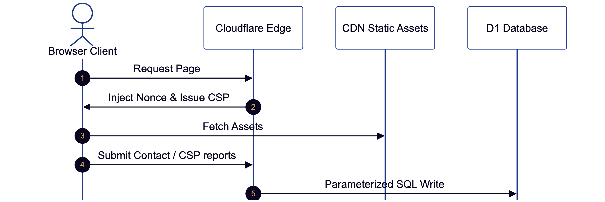

# Technical Architecture

This document explains how `jseverino.com` is built, where data enters the system, what the build transforms, and which parts run at Cloudflare's edge.

## 1. System Shape

The site is a static Astro build deployed to Cloudflare Pages.


<sup>Diagram source: [`docs/diagrams/system-shape.mmd`](./diagrams/system-shape.mmd),
pre-rendered with [`diagram`](https://github.com/joeseverino/tools/blob/main/bin/diagram).</sup>

The public serving layer is static by default. The request-time execution and data boundary is managed on the edge:



<sup>Diagram source: [`docs/diagrams/edge-request-flow.mmd`](./diagrams/edge-request-flow.mmd),
pre-rendered with [`diagram`](https://github.com/joeseverino/tools/blob/main/bin/diagram).</sup>


The public serving layer is static by default. The only request-time code is Cloudflare Pages Functions:

- [`functions/_middleware.ts`](../functions/_middleware.ts) rewrites HTML responses to add CSP nonces and reporting directives.
- [`functions/api/contact.ts`](../functions/api/contact.ts) handles contact form submissions.
- [`functions/api/csp-report.ts`](../functions/api/csp-report.ts) receives CSP violation reports and stores filtered records in D1.
- [`functions/__sitedrift/[[path]].ts`](../functions/__sitedrift/[[path]].ts)
  exports a read-only preview-review proxy under `/__sitedrift/*`. Production
  has no generated sitedrift configuration, so that route returns `404`.

There is no WordPress runtime, public admin panel, user account system, comment system, upload endpoint, or origin application server. A May 2026 migration comparison measured lower document TTFB and substantially lower page weight after this change; details are in the [WordPress to Astro migration comparison](./WordPress-To-Astro-Migration.md#may-2026-migration-comparison).

## 2. Source Of Truth

The private Obsidian vault is the editorial source of truth. This repository is the sanitized public snapshot and build source.

Synced public source files:

- [`src/content/pages/`](../src/content/pages/)
- [`src/content/writeups/`](../src/content/writeups/)
- [`src/content/technology-groups.md`](../src/content/technology-groups.md)
- [`public/assets/pages/`](../public/assets/pages/)
- [`public/assets/writeups/`](../public/assets/writeups/)
- [`src/lib/image-manifest.json`](../src/lib/image-manifest.json)

Cloudflare Pages builds from the committed snapshot. It does not need vault access.

### Portfolio Software list

The Software tab of `/portfolio` is *not* vault-synced. Its repo facts — which
repos, description, primary language, last push — come from the **GitHub**
account's public repos, which are the source of truth for that data: edit a
repo's GitHub description and the card copy follows on the next build. The list
is derived at build time, never hand-keyed:

- [`src/lib/github.ts`](../src/lib/github.ts) fetches the public repos (build
  time only, so CSP never applies). It falls back to the committed snapshot
  [`src/data/github-repos.json`](../src/data/github-repos.json) if GitHub is
  unreachable, so a hiccup or rate limit cannot break a deploy.
- [`src/lib/software.config.ts`](../src/lib/software.config.ts) is the only
  hand-maintained input: the skip list, featured set, order, writeup
  cross-links, and the PyPI/npm package mappings GitHub cannot know.
- [`src/lib/software.ts`](../src/lib/software.ts) composes those with live
  PyPI/npm version and download counts.

Refresh the snapshot fallback with `npm run snapshot:github` after editing repo
descriptions or adding repos.

## 3. Sync Pipeline

[`bin/sync-content.mjs`](../bin/sync-content.mjs) performs the private-to-public sync.

Main responsibilities:

- Read published vault pages and writeups.
- Copy `_technology-groups.md` to [`src/content/technology-groups.md`](../src/content/technology-groups.md).
- Allowlist public frontmatter fields.
- Drop vault-only metadata by omission.
- Rewrite local asset references to public `/assets/...` paths.
- Refuse asset paths that resolve outside the source folder.
- Optimize referenced images.
- Write [`src/lib/image-manifest.json`](../src/lib/image-manifest.json).
- Maintain a local content-hash manifest to detect changed writeup bodies.

The sync manifest lives under `node_modules/.cache`. It is a local acceleration and change-detection aid, not canonical content. On a first sync without a prior hash, existing `last_reviewed` or `published_at` metadata is preserved instead of stamping everything with the current date.

## 4. Content Collections

Astro content collections are defined in [`src/content.config.ts`](../src/content.config.ts).

Pages:

- `title`
- optional `description`
- optional `path`
- `published`

Writeups:

- `title`
- optional `description`
- `published`
- optional `published_at`
- optional `last_reviewed`
- optional `cover_image`
- optional `cover_alt`
- `technologies`
- `featured`
- optional `featured_order`

Generated pages are filtered so drafts render in local dev but do not render in production builds.

## 5. Markdown Rendering

[`src/lib/content.ts`](../src/lib/content.ts) owns Markdown rendering and content loading. It uses `markdown-it` plus repo-specific transforms.

Supported transformations include:

- responsive image enhancement through `Picture.astro`;
- figure promotion and captions;
- fenced-code normalization;
- terminal blocks;
- split layouts;
- hero block on the home page;
- button and button-row directives;
- table wrappers with captions;
- featured project and technology cloud injection on pages.

The input is trusted owner-authored Markdown. Where custom directives interpolate text into generated HTML, the renderer escapes dynamic strings before insertion.

## 6. Site Chrome And Taxonomy

Global site chrome is repo configuration, not vault content. It lives in [`src/lib/site.ts`](../src/lib/site.ts), a typed object derived from the cross-runtime identity primitive [`src/lib/site-config.mjs`](../src/lib/site-config.mjs). Because it is plain TypeScript, `astro check` validates the shape at build time and the header, footer, and `SeoHead` import it directly with no async content load.

`site.ts` covers:

- `name` — public display name, derived from `SITE.owner` (header brand, JSON-LD `Person.name`, page-title suffix);
- `jobTitle` — professional title (JSON-LD `Person.jobTitle`);
- `summary` — one-sentence summary (JSON-LD `Person.description`, default meta description);
- `skills` — string list (`Person.knowsAbout`);
- `socialLinks` — `{label, href}[]` (footer icons, `Person.sameAs`);
- `navItems` — `{label, href}[]` (primary navigation);
- `url` / `repoUrl` — derived from `SITE.domain` and `SITE.github`.

The four instance primitives that everything else derives from — `domain`, `owner`, `github`, `d1` — are single-sourced in [`src/lib/site-config.mjs`](../src/lib/site-config.mjs) (`.mjs` so `bin/` scripts and `astro.config.mjs` import the same values). See [`Blueprint-Setup.md`](./Blueprint-Setup.md) for the full list of per-instance values.

Technology labels and groupings come from [`src/content/technology-groups.md`](../src/content/technology-groups.md). Writeups store technology slugs; the renderer resolves those slugs to labels and groups at build time.

## 7. Client Conventions

### Browser contract

The production target is current evergreen Chromium, Firefox, and Safari/WebKit rather than legacy engines. Native CSS nesting, logical properties, `:has()`, `color-mix()`, and the Popover API are baseline requirements. Scroll-driven header animation is progressive: browsers without it use the `IntersectionObserver` fallback.

Playwright exercises the current bundled Chromium, Firefox, and WebKit engines on desktop and mobile-sized projects. This is the compatibility contract enforced by CI; no CSS transpilation or legacy polyfill bundle is shipped.

`stylelint.config.mjs` extends the standard modern CSS ruleset while documenting the small set of project-specific exceptions. `npm run check:css-vars` independently fails when a custom property is defined but never referenced. Both run as part of `npm run check` and affect development/CI only.

### Sticky-header shadow

The header shadow is driven by `animation-timeline: scroll()` in supporting browsers. The inline script in [`src/components/Header.astro`](../src/components/Header.astro) gates an `IntersectionObserver` fallback behind `CSS.supports()` so non-supporting engines still get the shadow without running JS in the modern path.

### Mobile menu

The mobile navigation is a `popover="auto"` element. The toggle button uses `popovertarget` for open/close; Escape and light-dismiss are native. The script only mirrors `aria-expanded` and `aria-label` on the toggle from the popover `toggle` event. There is no custom focus-trap, backdrop element, or scroll-lock plumbing — the `::backdrop` pseudo and `body:has(.mobile-nav:popover-open)` handle those.

### Header height

`--header-height` is declared as a token (3.6rem desktop, 3.8rem at the same `(max-width: 599px)` breakpoint where the nav-toggle takes over). No JS measures or writes it. This keeps the inline `style` attribute on `<html>` empty, which keeps `style-src-attr` violations at zero without weakening the CSP.

## 8. Image Pipeline

Referenced images are processed during sync, before Astro builds the site.

For each optimizable source image, the pipeline emits:

- AVIF variants at 512, 1024, and 1600 px;
- WebP variants at 512, 1024, and 1600 px;
- one optimized fallback file.

[`src/lib/image-manifest.json`](../src/lib/image-manifest.json) records the output variants and source dimensions. [`src/components/Picture.astro`](../src/components/Picture.astro) uses the manifest to render stable responsive images with explicit `width` and `height` attributes.

This design keeps image optimization deterministic and avoids runtime image services. The efficiency of this pipeline is documented in the [Custom Detection Engine comparison](./WordPress-To-Astro-Migration.md#case-study-custom-detection-engine-writeup), where the Astro version transferred far less image weight than the legacy WordPress page.

## 9. SEO And Metadata

[`src/components/SeoHead.astro`](../src/components/SeoHead.astro) emits page metadata from route-level props and shared site data.

It handles:

- document title;
- meta description;
- canonical URL;
- Open Graph metadata;
- Twitter card metadata;
- JSON-LD for `WebSite`, `Person`, `Article`, and `BreadcrumbList`;
- article published and modified dates;
- optional noindex.

The homepage canonical must be `/`, not `/home/`. The page loader preserves explicit synced paths and falls back to `/` only for the `home` slug.

## 10. Edge Security

[`public/_headers`](../public/_headers) defines the static security headers (`X-Content-Type-Options`, `X-Frame-Options`, `Referrer-Policy`, `Permissions-Policy`). The Content-Security-Policy is **not** set there — it is issued only by the middleware, per-request, so every HTML response carries a fresh nonce.

For every HTML response, [`functions/_middleware.ts`](../functions/_middleware.ts):

1. **Skips bodyless responses.** It immediately returns the original response for `304 Not Modified` and `204 No Content` statuses, preventing broken caching behavior or empty documents.
2. Generates a per-request nonce.
3. Uses `HTMLRewriter` to attach the nonce to every `<script>` tag in the response body.
4. **Strips decompression headers.** `HTMLRewriter` decompresses the response stream but does not automatically remove the `Content-Encoding` or `Content-Length` headers. The middleware explicitly deletes these headers after transformation to ensure the browser correctly parses the uncompressed HTML, preventing intermittent blank page errors.
5. Emits a `Content-Security-Policy` response header containing that same nonce.
6. Emits `Reporting-Endpoints` plus CSP `report-to` / `report-uri` directives pointing at `/api/csp-report`.

Component scripts are emitted as external `/_astro/*.js` bundles (forced via `vite.build.assetsInlineLimit: 0` in [`astro.config.mjs`](../astro.config.mjs)) rather than inlined into HTML. The only inline `<script>` element in production HTML is the JSON-LD data block — which is data, not executable code, but still receives a nonce. This means CSP enforcement applies to every script the browser sees, and there is no inline executable JavaScript on the page at all.

The policy significantly reduces script-injection risk while still allowing first-party bundles, Cloudflare Web Analytics, and Cloudflare Turnstile. This move to a [nonce-based CSP](./WordPress-To-Astro-Migration.md#server-response-and-security) replaced the `'unsafe-inline'` requirements of the legacy platform, hardening the site's security posture.

The CSP report endpoint accepts both legacy CSP report payloads and modern Reporting API `csp-violation` payloads. It stores only reports whose document URL belongs to `https://jseverino.com` and drops browser-extension noise on **two** axes: blocked URIs that use a `chrome-extension:`, `moz-extension:`, `safari-web-extension:`, or `edge-extension:` scheme, and reports whose `source_file` starts with one of those schemes. The source-file filter catches the case where an extension-injected content script triggers a violation against a same-origin URI, which would otherwise look legitimate from the blocked-URI alone. Reports are capped in size before parsing and are written to the same D1 binding as the contact form.

The contact function applies:

- Turnstile verification;
- honeypot rejection;
- required-field validation;
- length caps;
- email format validation;
- per-IP hourly rate limiting backed by D1;
- parameterized D1 inserts.

### Edge schema validation

Cloudflare API Shield's [Schema validation](https://developers.cloudflare.com/api-shield/security/schema-validation/) pre-validates incoming requests against an OpenAPI 3 schema at the edge, before any Pages Function runs. The schema lives at [`db/contact-openapi.json`](../db/contact-openapi.json) — alongside [`db/schema.sql`](../db/schema.sql) and the hosted [`public/schemas/cordon-v4.json`](../public/schemas/cordon-v4.json) (served at `/schemas/`, its `$id`, for the [Cordon](https://github.com/joeseverino/cordon) command-surface contract), the machine-readable schemas this repo declares — and is uploaded to the Cloudflare dashboard (Security → Web assets → Schema validation). It is not consumed by the build.

Coverage:

- **`POST /api/contact`** — bound to `contact-openapi.json`'s `ContactSubmission` schema. Validates `name` (1-190 chars), `email` (RFC format, 3-190 chars), `message` (1-5000 chars), and `turnstileToken` (non-empty). Optional `company` honeypot and `sourceUrl` are permitted; unknown properties are rejected (`additionalProperties: false`). Documents the 200, 400, 413, 415, 429, and 500 response shapes too.
- **`POST /api/csp-report`** — left without a schema. Report payload shape is dictated by the browser and varies between legacy CSP and Reporting API; validating it would create false rejections.

The action is currently set to **None** (log-only) so non-compliant requests still reach the function and get the function-level error message. Promote to **Block** once compliant traffic is consistently observed for a few days. When the action is Block, non-compliant payloads are rejected at the edge and consume zero Pages Function compute.

## 11. Build Output

`npm run build:static` produces a deployable static site. Locally the build lands in `dist.nosync/`; on Cloudflare Pages (which sets `CF_PAGES=1`) it lands in `dist/`. See [`astro.config.mjs`](../astro.config.mjs) for the `outDir` selection.

After Astro builds, the command invokes `sitedrift cloudflare`. On
non-production Pages branches, sitedrift preserves the generated pages and
installs its compact DEV-versus-LIVE review shell. On `main`, it exits without
changing Astro's output. See
[Deployment Preview Review](./Deployment-Preview-Review.md).

The output tree:

```text
dist/
├── _astro/                     # Astro-emitted fingerprinted bundles
│   ├── *.css                   # Component + global CSS, content-hashed
│   └── *.js                    # Component <script> blocks, content-hashed
├── _headers                    # Cloudflare Pages headers (copied from public/)
├── _redirects                  # Cloudflare Pages redirects (copied from public/)
├── .well-known/
│   ├── security.txt            # Clear-signed RFC 9116 disclosure pointer
│   └── openpgpkey/             # WKD public key for encrypted vulnerability reports
├── assets/                     # Static site assets — see §12 for the convention
│   ├── docs/                   # Downloadable documents (resume PDF, etc.)
│   ├── fonts/                  # Subset Inter variable WOFF2
│   ├── icons/                  # Favicons and apple-touch-icon
│   ├── og/                     # Open Graph card images
│   ├── pages/<slug>/           # Page-attached assets, synced from the vault
│   └── writeups/<slug>/        # Per-writeup image variants (AVIF/WebP/fallback), synced from the vault
├── __sitedrift/                # preview only: viewer assets and configuration
├── __sitedrift_source/         # preview only: preserved Astro HTML
├── <route>/index.html          # One HTML file per route
└── sitemap-index.xml           # @astrojs/sitemap output
```

**Fingerprinting.** Astro hashes every artifact under `_astro/` (and any image variant written by the pipeline) by content. Filenames change when bytes change, so they can be cached `immutable` for one year (see [`public/_headers`](../public/_headers)) without risk of stale serves. HTML is short-cached and revalidated.

**External scripts.** Component `<script>` blocks compile to external `/_astro/*.js` modules rather than being inlined into HTML. This is set by `vite.build.assetsInlineLimit: 0` in [`astro.config.mjs`](../astro.config.mjs). The only inline `<script>` element in any HTML response is the JSON-LD structured-data block — and that is data, not executable code. The middleware nonces every `<script>` tag the browser sees, including the external bundles.

**Functions are not in `dist/`.** Cloudflare Pages bundles the `functions/`
directory separately at deploy time; it is not part of the static `dist/` tree
the Astro build writes. The middleware, contact endpoint, CSP report endpoint,
and scoped sitedrift proxy run as Workers at the edge. The sitedrift Function
requires preview-generated configuration and therefore returns `404` on
production.

### Resource hints

[`src/layouts/BaseLayout.astro`](../src/layouts/BaseLayout.astro) emits three categories of resource hints in `<head>`, each saving real wall-clock time on first paint:

| Hint | Target | Purpose |
|---|---|---|
| `<link rel="preconnect">` | `https://static.cloudflareinsights.com` (every page) | Warms DNS + TLS for the Cloudflare Web Analytics beacon, which Cloudflare auto-injects into every HTML response. Removes ~100-300ms of cold-start latency on the first request to that origin. |
| `<link rel="preconnect">` | `https://challenges.cloudflare.com` (contact page only) | Warms DNS + TLS for Cloudflare Turnstile, which loads `turnstile/v0/api.js` from this origin on the contact page. |
| `<link rel="preload" as="font">` | `/assets/fonts/inter/inter-variable-latin.woff2` | Starts fetching the subset variable font during HTML parsing, before the CSS that declares `@font-face` is parsed. Prevents the brief unstyled-text flash. `crossorigin` matches the fetch mode the browser will use for the actual font request. |

Per-page preconnect origins are passed into `BaseLayout` via the `preconnect` prop — for example, `src/pages/contact.astro` passes `preconnect={['https://challenges.cloudflare.com']}`. The site-wide insights beacon preconnect is always emitted; per-page entries are appended after it.

Resource hints are advisory: a browser may skip them under tight CPU/memory budgets, but on a healthy device they reliably shave hundreds of milliseconds off connection setup for the third-party origins this site uses.

## 12. Asset Organization

`public/` is the input side of the asset pipeline. Cloudflare Pages copies its contents verbatim into `dist/` at build time (Astro emits the rest under `_astro/` from component imports). The `public/assets/` subdirectories follow a strict convention.

| Subdirectory | Source | Purpose | Modified by |
|---|---|---|---|
| `public/assets/docs/` | Repo | Downloadable documents (e.g., `Joseph_Severino_Resume.pdf`) | Hand-edited in the repo |
| `public/assets/fonts/` | Repo | Subset web fonts (Inter variable WOFF2) | Hand-edited in the repo |
| `public/assets/icons/` | Repo | Favicon set (`.ico`, `.svg`, PNG sizes, apple-touch) | `npm run make:icons` |
| `public/assets/brand/` | Repo | HD brand marks + Person-schema headshot | `npm run make:icons` (marks) / headshot hand-added |
| `public/assets/og/` | Repo | Open Graph card images (default + per-page) | `npm run make:og` |
| `public/assets/pages/<slug>/` | Vault | Page-attached assets, synced from `06 Pages/<slug>/images/` | `npm run sync:content` |
| `public/assets/writeups/<slug>/` | Vault | Writeup-attached image variants, synced from `05 Writeups/<slug>/images/` | `npm run sync:content` |

### Vault-synced vs repo-managed

This is the central distinction:

- **Vault-synced** (`pages/`, `writeups/`) tracks editorial content. Files appear here only because the vault references them. They are reprocessed (image variants, manifest entries) on every `sync:content`. **Direct edits in the repo are wiped on the next sync — edit the vault.**
- **Repo-managed** (`docs/`, `fonts/`, `icons/`, `og/`) is site chrome. These assets belong to the site as a whole, not to a single editorial page. They are tracked in the repo because they don't change often and don't need vault versioning.

A new asset that's specific to one page or writeup belongs in the vault. A new site-wide asset (a second downloadable document, a new font, a replacement favicon set) belongs in the corresponding `public/assets/<bucket>/` directory in the repo.

### Brand assets — one source of truth

Favicons, social cards, and HD brand marks are all generated from one place:

- `src/lib/brand.mjs` holds the brand colour + glyph, imported by both the Astro site (`<meta name="theme-color">`) and the generators. It is a vendored mirror of `severino-brand/brand/tokens.json` (`brand`), regenerated by `npm run sync:tokens` — committed so the build stays self-sufficient. The rendering logic lives in the standalone [`branding-engine`](https://github.com/joeseverino/branding-engine) package, an `optionalDependency` pinned to a published, provenance-attested npm version.
- The `branding-engine` package composes the "JS" mark from real Inter (weight 800) outlines and renders the social cards (headless Chromium). The site's generators pass it `BRAND` and write to the site's own paths.
- `npm run make:icons` writes the favicon set (served) plus HD marks to `public/assets/brand/`; `make:og` and `make:social` build the social cards. All three call into `branding-engine`.

The design tokens follow the same model. `severino-brand/brand/tokens.json` is the upstream source of truth for both the brand identity (`brand`) and the design system (`designSystem` — the `:root` custom properties). `npm run sync:tokens` ([`bin/sync-tokens.mjs`](../bin/sync-tokens.mjs)) regenerates two committed files between `tokens:start`/`tokens:end` markers: the `:root` block in [`src/styles/base.css`](../src/styles/base.css) and the `BRAND` export in `src/lib/brand.mjs`. The build never reads the brand kit, mirroring the `sync:content` model — edit tokens upstream, not the marked regions.

To restyle the brand, edit `tokens.json` upstream, run `npm run sync:tokens`, then re-run the generators (`--color-primary`/`-deep` are emitted at runtime by `brand.css.ts` from `BRAND.navy`/`navyDeep`).

For the full story (how the brand went from an inherited WordPress purple and an unknown-origin yellow logo to one navy identity, then to a shared engine), see [`docs/Brand-System.md`](./Brand-System.md).

### Stable URLs

All assets resolve under `/assets/<bucket>/<filename>`. Filenames are not fingerprinted at this level — Astro fingerprints only what goes through `_astro/` (component bundles and component CSS). The URL of a vault-synced image will not change unless its source filename changes.

This stability is intentional for assets that external links may bookmark, like `https://jseverino.com/assets/docs/Joseph_Severino_Resume.pdf` (linked from LinkedIn, recruiter outreach, etc.).

The image *variants* emitted by the image pipeline (AVIF/WebP at multiple widths) live alongside the original under `images/` and are fingerprinted internally by content; the `<picture>` `srcset` URLs change only when source-image content hashes change.

### Cache behavior

`/assets/*` is served `immutable` with a one-year max-age (see [`public/_headers`](../public/_headers)).

- For **repo-managed assets** (favicons, fonts, OG defaults, downloadable docs): immutable caching is the right tradeoff since these change rarely. To force a refresh of an existing URL, change the filename (e.g., `resume-2027.pdf`).
- For **vault-synced images**: the image pipeline emits content-hashed variants, so a real content change produces new variant filenames that bypass the cache cleanly.

### When to add a new bucket

The convention scales by adding a new top-level bucket under `public/assets/`. Examples:
- A `videos/` bucket if MP4/WebM downloads ever ship.
- A `data/` bucket for JSON exports or downloadable datasets.

Avoid using existing buckets for unrelated content (e.g., putting a video under `docs/`) — the bucket name is the convention contract.

## 13. Runtime Configuration

The site needs three pieces of Cloudflare-side configuration to run. None of them live in the repo; they are configured in the Cloudflare Pages project settings.

### D1 binding

| Binding | Database | Used by |
|---|---|---|
| `DB` | `jseverino-contact` | [`functions/api/contact.ts`](../functions/api/contact.ts), [`functions/api/csp-report.ts`](../functions/api/csp-report.ts) |

The schema lives at [`db/schema.sql`](../db/schema.sql) and is applied with:

```sh
# Remote (production):
wrangler d1 execute jseverino-contact --remote --file=./db/schema.sql

# Local (for `wrangler pages dev`):
wrangler d1 execute jseverino-contact --local --file=./db/schema.sql
```

The schema is described in detail in [`SECURITY.md`](../SECURITY.md#d1-schema).

The same database holds:

- `contact_submissions` — accepted contact form submissions and triage fields.
- `csp_reports` — filtered CSP violation reports from browsers.

### Function environment variables

| Variable | Scope | Used by |
|---|---|---|
| `TURNSTILE_SECRET_KEY` | Server (Pages Function env) | [`functions/api/contact.ts`](../functions/api/contact.ts) |

This is the secret half of the Cloudflare Turnstile keypair. It must never appear in the repo, the build output, or the public site. It is set in the Pages project's encrypted environment variables. For local development, copy [`.dev.vars.example`](../.dev.vars.example) to `.dev.vars` (gitignored) — `wrangler pages dev` reads it automatically.

### Build environment variables

| Variable | Scope | Used by |
|---|---|---|
| `PUBLIC_TURNSTILE_SITE_KEY` | Build (Vite `import.meta.env`) | [`src/components/ContactForm.astro`](../src/components/ContactForm.astro) |
| `GITHUB_TOKEN` | Build (Node `process.env`) | [`src/lib/github.ts`](../src/lib/github.ts) |

`PUBLIC_TURNSTILE_SITE_KEY` is the public half of the Turnstile keypair — it is safe to ship in HTML. It is set as a build environment variable in the Pages project so the static build can embed it into the contact form. For local `astro dev`, copy [`.env.example`](../.env.example) to `.env`.

`GITHUB_TOKEN` is **optional** — a fine-grained PAT with public-repository read access, set as an encrypted build variable in the Pages project. It only raises the GitHub API rate limit (60 → 5,000 requests/hour) so the Software-list fetch is reliable on Cloudflare's shared CI IPs. The build works without it (local builds run unauthenticated; one request per build, well under the anonymous limit) and falls back to the committed snapshot on failure. Never grant it more than public read.

### No `wrangler.toml`

This repo intentionally has no `wrangler.toml`. Pages projects with both dashboard config and a `wrangler.toml` create a precedence conflict; keeping the binding and environment configuration in the Cloudflare dashboard puts the runtime config in one place and out of the public repository.

### Local preview against the real edge runtime

`astro dev` is the day-to-day dev server. It does not run Pages Functions, so
the middleware (CSP nonces/reporting), `/api/contact`, `/api/csp-report`, and
the hosted sitedrift proxy are inactive locally.

To exercise the edge runtime locally, build first and run `wrangler pages dev`:

```sh
npm run build:static
npx wrangler pages dev dist.nosync
```

The site is then served at `http://localhost:8788` with the middleware and Functions active. `curl -sI http://localhost:8788/ | grep -i -E 'content-security-policy|reporting-endpoints'` is the canonical pre-deploy CSP/reporting check.

## 14. Release Gate

[`bin/publish-check.mjs`](../bin/publish-check.mjs) is the local publish gate. It cleans generated output, syncs content from the vault (skippable with `--no-sync`), resolves iCloud conflict copies, then runs every `publish`-gated audit from the single-source inventory in [`tests/audits/registry.mjs`](../tests/audits/registry.mjs) — the signed `security.txt`, WCAG contrast, vault/Zod/MCP parity, the sitedrift preview guard, the unit test suite, docs link integrity, CSS lint and the unused custom-property audit, and `astro check` — followed by the production build and the post-build audits (image weight, internal link integrity, the page-weight budget, and SEO metadata). All gates share one process harness ([`bin/lib/run.mjs`](../bin/lib/run.mjs)) that enforces per-check timeouts and surfaces spawn failures instead of hanging.

The iCloud conflict-copy cleanup step in [`bin/clean-generated.mjs`](../bin/clean-generated.mjs) prefers the canonical (un-numbered) path when it exists and only restores from a numbered conflict copy if the canonical path was renamed away. This prevents the previous behavior where a freshly-synced canonical file could be replaced by an older numbered copy that iCloud touched more recently.

This does not replace human review, but it catches broken builds, oversized assets, and generated-file drift before publishing.

[`bin/release-check.mjs`](../bin/release-check.mjs) is the deterministic
repo-local release orchestrator. It enforces repository policy, snapshots Git
state, runs `publish:check`, adds the cross-browser functional suite and macOS
Chromium visual gate, runs `git diff --check`, and fails if validation changed
the worktree. A pass means the repository-controlled release inputs are
internally consistent and reproducible. Registry freshness, immutable
Cloudflare preview review, and live post-deploy checks remain separate because
they depend on external state or human judgment. See
[`tests/ARCHITECTURE.md`](../tests/ARCHITECTURE.md) for the browser test map and
inline visual baselines.

[`bin/deploy-verify.mjs`](../bin/deploy-verify.mjs) is the post-push production
gate. It requires a clean `main` checkout whose HEAD matches `origin/main`,
waits for the exact commit's GitHub and Cloudflare checks, runs the production
dependency audit, validates live security headers and the production sitedrift
guard, checks every live sitemap URL, and requires zero open code-scanning
alerts.

GitHub Actions provide the remote quality gate:

- [`build`](../.github/workflows/build.yml) runs the registry publish gate (`npm run publish:check -- --no-sync`) on a clean runner and uploads a CycloneDX SBOM artifact, so the committed tree must pass everything the local gate passes except the local-only vault parity check.
- [`codeql`](../.github/workflows/codeql.yml) scans JavaScript and TypeScript on pushes, pull requests, and a weekly schedule.
- [`dependency review`](../.github/workflows/dependency-review.yml) fails pull requests that introduce high-severity dependency advisories.
- [`workflow lint`](../.github/workflows/workflow-lint.yml) runs actionlint when workflow files change.
- [`link check`](../.github/workflows/link-check.yml) validates repository documentation links and public content links separately, then uploads lychee reports.
- [`lighthouse`](../.github/workflows/lighthouse.yml) runs Lighthouse CI against selected live URLs and uploads the generated reports.
- [`scorecard`](../.github/workflows/scorecard.yml) runs OpenSSF Scorecard and uploads SARIF to GitHub code scanning plus an artifact copy.
- [`playwright`](../.github/workflows/playwright.yml) builds the site, serves it
  with `astro preview`, and runs functional checks across Chromium, Firefox, and
  WebKit plus a dedicated macOS Chromium visual-regression job. The visual job
  uses committed PNG baselines and uploads the HTML report plus `test-results/`
  so expected, actual, and diff images are retained on failure. Approved
  baseline PNG changes are committed with the frontend change, giving GitHub a
  durable version-to-version image audit trail.

Every workflow declares a top-level `permissions: contents: read`. Workflows that need to write SARIF to code scanning (`codeql`, `scorecard`) scope `security-events: write` at the **job** level only, so unrelated steps in the same workflow cannot inherit the elevated scope. Workflow dependencies are pinned to immutable commit SHAs or container digests. Version comments beside action pins record the upstream release tag used when the SHA was selected.

The GitHub code-scanning dashboard is kept at zero open alerts as a release-gate signal. CodeQL findings are fixed at the source; OpenSSF Scorecard findings that do not apply to a solo personal repo (`Branch-Protection`, `Code-Review`, `Fuzzing`, `CII-Best-Practices`, `Maintained` for the first 90 days of the repo's life) are dismissed in the dashboard with an inline justification. The current local Scorecard aggregate is **6.4 / 10** (2026-05-29); the failing checks are structural to a one-person project and are not real security gaps. The release checklist in [`docs/Release-Checklist.md`](./Release-Checklist.md#4-commit-and-push) documents the `gh api` query for confirming the dashboard is clean after any workflow or build-script change.

## Related Docs

- [`docs/Vault-Workflow.md`](./Vault-Workflow.md)
- [`docs/WordPress-To-Astro-Migration.md`](./WordPress-To-Astro-Migration.md)
- [`docs/Brand-System.md`](./Brand-System.md)
- [`docs/Authoring-Guide.md`](./Authoring-Guide.md)
- [`docs/SEO.md`](./SEO.md)
- [`docs/Deployment-Preview-Review.md`](./Deployment-Preview-Review.md)
- [`docs/Accessibility.md`](./Accessibility.md)
- [`docs/Release-Checklist.md`](./Release-Checklist.md)
- [`SECURITY.md`](../SECURITY.md)
