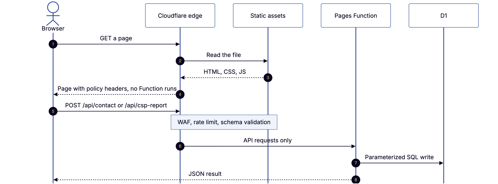

# Technical Architecture

How `jseverino.com` is built: where data enters, what the build transforms, and what runs at Cloudflare's edge.

## 1. System Shape

The site is a static Astro build deployed to Cloudflare Pages.


<sup>Diagram source: [`docs/diagrams/system-shape.fig`](./diagrams/system-shape.fig),
pre-rendered with [`brand figure`](https://github.com/joeseverino/branding-engine).</sup>

The request-time execution and data boundary is at the edge:



<sup>Diagram source: [`docs/diagrams/edge-request-flow.mmd`](./diagrams/edge-request-flow.mmd),
pre-rendered with [`diagram`](https://github.com/joeseverino/tools/blob/main/bin/diagram).</sup>

The public serving layer is static. Every HTML page is a plain static asset served without invoking a Function. The only request-time code is Cloudflare Pages Functions, and [`public/_routes.json`](../public/_routes.json) includes only `/api/*` and `/__sitedrift/*`, with an empty exclude list:

- [`functions/api/contact.ts`](../functions/api/contact.ts) handles contact form submissions.
- [`functions/api/csp-report.ts`](../functions/api/csp-report.ts) receives CSP violation reports and stores filtered records in D1.
- [`functions/__sitedrift/[[path]].ts`](../functions/__sitedrift/[[path]].ts)
  exports a read-only preview-review proxy under `/__sitedrift/*`. It is inert
  in production: with no generated sitedrift configuration, the route returns
  `404`.

There is no public admin panel, user account system, comment system, upload endpoint, or origin application server. Measurements are in the [WordPress to Astro migration comparison](./WordPress-To-Astro-Migration.md#may-2026-migration-comparison).

## 2. Source Of Truth

The private Obsidian vault is the editorial source of truth. This repository is the sanitized public snapshot and build source.

Synced public source files:

- [`src/content/pages/`](../src/content/pages/) and
  [`src/content/writeups/`](../src/content/writeups/): one `<slug>/index.mdx`
  per document, with its image masters in `<slug>/images/`
- [`src/content/technology-groups.md`](../src/content/technology-groups.md)

Cloudflare Pages builds from the committed snapshot. It does not need vault access.

Schema is single-sourced separately from content. [`contracts/content.v1.json`](../contracts/content.v1.json)
is the canonical, versioned description of page and writeup fields, including
visibility, defaults, ownership, editability, and CLI flags. From that one input,
[`bin/sync-content-contract.ts`](../bin/sync-content-contract.ts) generates the
typed Astro schema and the public contract projection consumed by the MCP and
Tools surfaces. Those consumers do not maintain a second field list.

The contact boundary follows the same pattern. [`contracts/contact.v1.json`](../contracts/contact.v1.json)
owns request fields, limits, formats, and runtime ceilings. The browser form,
Cloudflare Pages Function, and generated API Shield OpenAPI document consume or
derive from that contract. Contract-projection audits fail when any generated
surface becomes stale.

### Portfolio Software list

The Software tab of `/portfolio` is not vault-synced. Repo facts (which
repos, description, primary language, last push) come from the GitHub
account's public repos, so editing a repo's GitHub description updates the card on the next snapshot. The list
is derived at build time, never hand-keyed:

- [`src/lib/github.ts`](../src/lib/github.ts) reads the committed snapshot
  [`src/data/github-repos.json`](../src/data/github-repos.json). Builds never
  call GitHub, so they need no token and a rate limit cannot change the artifact. `npm run snapshot:github` refreshes it; commit the result.
- [`src/lib/software.config.ts`](../src/lib/software.config.ts) is the only
  hand-maintained input: the skip list, featured set, order, writeup
  cross-links, and the PyPI/npm package mappings GitHub cannot know.
- [`src/data/package-registry.json`](../src/data/package-registry.json) is the
  matching snapshot of PyPI/npm versions and monthly downloads. `npm run snapshot:software` refreshes it and writes
  nothing if any lookup fails.
- [`src/lib/software.ts`](../src/lib/software.ts) composes those snapshots with
  the curation config.

Run `npm run snapshot:github` after editing repo descriptions or
adding repos, and `npm run snapshot:software` after publishing a package.

The snapshot scripts' registry requests have a five-second timeout, including
response-body reads. Content, GitHub, and software loaders share pending work
through [`async-cache.ts`](../src/lib/async-cache.ts); failed loads can be retried.

## 3. Sync Pipeline

[`bin/sync-content.ts`](../bin/sync-content.ts) orchestrates the private-to-public sync.
It delegates source-specific parsing to [`bin/content-sync/source-adapters.ts`](../bin/content-sync/source-adapters.ts)
and public sanitization to [`bin/content-sync/public-projection.ts`](../bin/content-sync/public-projection.ts).
This keeps acquisition, policy, and orchestration as separate responsibilities.

Main responsibilities:

- Read published vault pages and writeups.
- Copy `_technology-groups.md` to [`src/content/technology-groups.md`](../src/content/technology-groups.md).
- Allowlist public frontmatter fields.
- Drop vault-only metadata by omission.
- Write each document as `<collection>/<slug>/index.mdx`; a writeup drops the
  H1, lede, and leading image its page renders from frontmatter.
- Refuse asset paths that resolve outside the source folder.
- Write each referenced image's master beside its document: at most 1600
  pixels wide, sRGB, every metadata block removed. Astro encodes the variants
  from it at build time.
- Date `last_reviewed` from the committed snapshot: a writeup whose projected body changed gets today; an unchanged one keeps the later of the vault's date and the committed one, so a re-sync is idempotent.
- Report every file written or removed (`--report`), the exact set `site publish` commits.

The sync is split along its seams in [`bin/content-sync/`](../bin/content-sync/): asset references, image masters, document rows, education, prune, the compile check, and the one writer that records every output. `--check` resolves the same references and the frontmatter contract, and compiles every document with the site's renderer, without writing anything (`site validate`), so an MDX error or a refused block surfaces with its line before a build. Masters are cached under the gitignored `.cache/` by source hash and encoder version, outside `node_modules` so `npm ci` keeps them; each is written to a temp name and renamed, so an interrupted sync leaves no partial file. A relative link outside `images/` would 404 on the site: `--check` reports it, and the sync stops on it for a published document and warns for a draft.

## 4. Content Collections

Astro content collections are registered in [`src/content.config.ts`](../src/content.config.ts).
Their field validators come from the committed generated module
[`src/generated/content-schema.ts`](../src/generated/content-schema.ts), which is
derived from the canonical content contract and checked for freshness in every
diagnosis.

Pages:

- `title`
- optional `description`
- optional `path`
- `published`

Writeups:

- `title`
- optional `description`
- `published`
- optional `published_at`
- optional `last_reviewed`
- optional `cover_image`: an `image()` path relative to the document, so the
  cover goes through Astro's image pipeline (required at publish)
- optional `cover_alt`
- `technologies`
- `featured`
- optional `featured_order`

The committed snapshot holds no drafts (the no-drafts audit enforces it). `site dev --drafts` syncs unpublished content into the gitignored `.cache/drafts` overlay and points the dev server at it through `SITE_CONTENT_ROOT`; the loaders render unpublished entries only under `astro dev`.

To add or change a writeup field, edit only the canonical contract and run
`npm run sync:contract`. `npm run scaffold:writeup-field` makes that edit.

## 5. Markdown Rendering

Documents are MDX, rendered by Astro 7's default Markdown processor,
[Sätteri](https://satteri.bruits.org/): a Rust parser with plugins written in
TypeScript against the standard mdast and hast trees. The site's plugins are in
[`src/lib/markdown/`](../src/lib/markdown/), each a separate pass:

- [`guard.ts`](../src/lib/markdown/guard.ts) keeps content from being code. MDX
  would run `import`/`export` and `{…}` expressions at build time and treat raw
  HTML as JSX; the guard refuses all three, limits raw HTML to an allow-list of
  tags and string attributes, and refuses URL schemes other than http(s) and
  mailto. A refusal fails the build with its line.
- [`literal.ts`](../src/lib/markdown/literal.ts) puts inline `:name` text
  directives back as the text they were parsed from, so a MAC address's `:1e`
  stays literal.
- [`blocks.ts`](../src/lib/markdown/blocks.ts) renders the container directives
  (`:::figure`, `:::table`, `:::button`, `:::buttons`, `:::center`,
  `:::hero`, `:::split`/`:::side`) to the site's markup, and the placeholders
  (`::featured-projects`, `::technology-cloud`, `::contact-form`) to elements a
  page maps to components, grouping the prose between them into runs.
- [`prose.ts`](../src/lib/markdown/prose.ts) reads image modifiers
  (``) and, in a writeup, turns a paragraph that is only a
  link into a button.
- [`markup.ts`](../src/lib/markdown/markup.ts) renders ` ```terminal ` fences,
  adds break opportunities after `.` and `:` in table cells, and wraps every
  table in a scrollable figure.

[`ContentBody.astro`](../src/components/content/ContentBody.astro) renders an
entry with its component map: every Markdown image as
[`Picture.astro`](../src/components/Picture.astro), each placeholder as its
component, and each run of prose in the page's wrapper. The syntax is in the
[Authoring Guide](./Authoring-Guide.md); the plugins' behavior is pinned by
[`tests/unit/content-render.test.ts`](../tests/unit/content-render.test.ts).

## 6. Site Chrome And Taxonomy

Site chrome is repo configuration; the vault holds none of it. It lives in [`src/lib/site.ts`](../src/lib/site.ts), a typed object derived from the identity primitive [`src/lib/site-config.ts`](../src/lib/site-config.ts). `astro check` validates its shape, and the header, footer, and `SeoHead` import it directly with no async content load.

`site.ts` covers:

- `name`: public display name, derived from `SITE.owner` (header brand, JSON-LD `Person.name`, page-title suffix);
- `jobTitle`: professional title (JSON-LD `Person.jobTitle`);
- `summary`: one-sentence summary (JSON-LD `Person.description`, default meta description);
- `skills`: string list (`Person.knowsAbout`);
- `socialLinks`: `{label, href}[]` (footer icons, `Person.sameAs`);
- `navItems`: `{label, href}[]` (primary navigation);
- `url` / `repoUrl`: derived from `SITE.domain` and `SITE.github`.

The five instance primitives everything else derives from (`domain`, `owner`, `github`, `d1`, `focus`) are single-sourced in [`src/lib/site-config.ts`](../src/lib/site-config.ts) (dependency-free, so `bin/` scripts and `astro.config.ts` import the same values). See [`Blueprint-Setup.md`](./Blueprint-Setup.md) for the full list of per-instance values.

Technology labels and groupings come from [`src/content/technology-groups.md`](../src/content/technology-groups.md). Writeups store technology slugs; the renderer resolves those slugs to labels and groups at build time.

## 7. Client Conventions

### Browser contract

The production target is current evergreen Chromium, Firefox, and Safari/WebKit. Native CSS nesting, logical properties, `:has()`, `color-mix()`, and the Popover API are baseline requirements. Scroll-driven header animation is progressive: browsers without it use the `IntersectionObserver` fallback.

Playwright runs the bundled Chromium, Firefox, and WebKit engines on desktop and mobile-sized projects. That is the compatibility contract CI enforces. No CSS transpilation or polyfill bundle ships.

`stylelint.config.ts` extends the standard modern CSS ruleset and documents the project-specific exceptions. `npm run check:css-vars` fails when a custom property is defined but never referenced. Both run in `npm run check` and affect development and CI only.

[`base.css`](../src/styles/base.css) imports each focused stylesheet once.
Contact controls live in `forms.css`; footer, theme controls, and social links
live in `footer.css`; skip-link and assistive rules live in `accessibility.css`.
The source-integrity and CSS-variable audits reuse the same
[`walkFiles`](../src/lib/walk.ts) helper as the other file-based audits.

### Sticky-header shadow

The header shadow is driven by `animation-timeline: scroll()` in supporting browsers. The bundled script in [`src/components/Header.astro`](../src/components/Header.astro) gates an `IntersectionObserver` fallback behind `CSS.supports()`. The same module owns mobile-menu state and delegates link clicks to the menu.

Interactive CSS separates hit areas from visual effects. Writeup and software
cards share [`CardSurface.astro`](../src/components/CardSurface.astro): the list
item stays stationary while its surface lifts on fine-pointer hover. Keyboard
focus receives the same raised shadow. Buttons retain their lift with a hit
area that accounts for their border width. Shared rules live in `content.css`;
variants add only their differences. Regression tests check edge-hover behavior,
focus, forced colors, and reduced motion across browser engines.

Portfolio tabs derive selected panels and focusability from the active tab,
follow URL hash changes, preserve query parameters, and support arrows, Home,
and End. These states use the existing DOM rather than a second client-side
copy of the portfolio data.

Both paths set one registered custom property, `--header-scroll` (a `<number>`, 0 to 1); one rule composes the scrim color and shadow from it. The keyframe carries **no color**: Chromium and WebKit resolve a keyframe's `var()` colors once and keep that value when `color-scheme` changes. Anything animated that depends on a themeable token interpolates a number and composes the color outside the keyframe. [`tests/playwright/theme.spec.ts`](../tests/playwright/theme.spec.ts) pins the behavior.

### Mobile menu

The mobile navigation is a `popover="auto"` element. The toggle button uses `popovertarget`; Escape and light-dismiss are native. The script only mirrors `aria-expanded` and `aria-label` on the toggle from the popover `toggle` event. The `::backdrop` pseudo and `body:has(.mobile-nav:popover-open)` replace any focus-trap, backdrop element, or scroll-lock code.

### Header height

`--header-height` is a token (3.6rem, the header's minimum height). `--menu-offset` in `responsive.css` (3.8rem) is where the menu panel starts: the header's height once the menu button sizes it. No JS measures or writes either, so the inline `style` attribute on `<html>` stays empty and `style-src-attr` violations stay at zero.

### Responsive behavior

The stylesheet has no viewport breakpoints. Type, spacing, and the corner radius scale with `clamp()`, and the card and split layouts size from their content (`min(100%, …)` inside `auto-fill` and `auto-fit` grids). The five parts that rearrange when space runs short (the primary nav, the page hero, the software list, the archive summary, and the technology rows) are containers declared in [`responsive.css`](../src/styles/responsive.css), and each answers to its own width at 33.5rem (the width of a full-width container at a 600px viewport). The other media queries are about capability or preference (hover, pointer, forced colors, reduced motion, scripting, color scheme), not size.

A size container is a containing block for fixed-position descendants, so `main` and the content flow must not become containers: the resume page's fixed download button would anchor to them instead of the viewport.

## 8. Image Pipeline

Images are encoded by Astro at build time from the masters the sync commits
beside each document (at most 1600 pixels wide, sRGB, no metadata).
[`Picture.astro`](../src/components/Picture.astro) renders every content image
and cover as a `<picture>`: an AVIF `<source>` and a WebP ``, each at 512,
768, 1024, and 1600 pixels (Astro drops any wider than the master), with the
`sizes` the layout needs and the intrinsic `width` and `height` on the ``.
Every browser the site's CSS supports decodes both formats. The encoder
settings (AVIF quality 60, WebP 82) live in the image service config in
[`astro.config.ts`](../astro.config.ts), and the widths in
[`src/lib/images.ts`](../src/lib/images.ts).

`Picture.astro` never reads an image's metadata itself: an image read outside Astro's pipeline ships its unprocessed original, and the
asset audit fails on any shipped image over 1.5 MB. Social cards are a 1200px
JPEG from `getImage()`, which reports the card's size without a read.

Encodes are cached in `node_modules/.astro`, which Cloudflare Pages keeps
between builds (Settings, Build, Build cache) and CI restores with
`actions/cache` (the `astro-cache` input of the setup action), so a build
re-encodes only new or changed images. See the
[Custom Detection Engine comparison](./WordPress-To-Astro-Migration.md#case-study-custom-detection-engine-writeup).

## 9. SEO And Metadata

[`src/components/SeoHead.astro`](../src/components/SeoHead.astro) emits page metadata from route-level props and shared site data.

It handles:

- document title;
- meta description;
- canonical URL;
- Open Graph metadata;
- Twitter card metadata;
- JSON-LD for `WebSite`, `Person`, `Article`, and `BreadcrumbList`;
- article published and modified dates;
- optional noindex.

The homepage canonical must be `/`, not `/home/`. The page loader preserves explicit synced paths and falls back to `/` only for the `home` slug.

## 10. Edge Security

[`public/_headers`](../public/_headers) defines the security headers (`X-Content-Type-Options`, `X-Frame-Options`, `Referrer-Policy`, `Permissions-Policy`) and holds placeholders for the Content-Security-Policy. The CSP is built at build time, so every page is a static asset that carries it without a Function. Pages applies `_headers` to static assets only, not to Function responses, which set their own headers.

[`bin/build-csp.ts`](../bin/build-csp.ts) runs from [`bin/build-static.ts`](../bin/build-static.ts) after the sitedrift preview wrap:

1. Scans every built HTML page for inline scripts and styles.
2. SHA-256 hashes the one inline theme-bootstrap script (an `is:inline` script in [`src/layouts/BaseLayout.astro`](../src/layouts/BaseLayout.astro), marked at build time with `nonce="__CSP_INLINE__"`, a marker `build-csp` strips from the output) and the one inlined stylesheet, which is identical on every page and so yields one hash. The stylesheet is inlined at build time (`build.inlineStylesheets: 'always'`), so first paint never waits on a stylesheet request.
3. **Fails the build** on any inline script or style the site did not emit, on any external script outside same-origin, `https://challenges.cloudflare.com`, and `https://static.cloudflareinsights.com`, on more than 4 inline script hashes or 4 style hashes, and on any `_headers` line over 2000 characters.
4. Writes the finished policy into `dist/_headers` in place of the `__CSP__`, `__CSP_CONTACT__`, `__TT_REPORT_ONLY__`, and `__REPORTING_ENDPOINTS__` placeholders.

The policy is `default-src 'none'` plus the site's own origin, the hashes, Turnstile, and Cloudflare Web Analytics, with no `'unsafe-inline'`, `'unsafe-eval'`, nonce, `'strict-dynamic'`, or `blob:`. It carries `report-to csp-endpoint` pointing at `/api/csp-report` (with a `Reporting-Endpoints` header), a `report-uri` fallback to the same endpoint for browsers that ignore `report-to` (Firefox), and Trusted Types enforcement. `/contact/*` has its own rule in `_headers`: Pages merges the headers of every matching rule, so the rule detaches the global policy (`! Content-Security-Policy`), sets one without Trusted Types, and adds a report-only `require-trusted-types-for 'script'` header, because Turnstile's script trips it. The policy module is [`functions/lib/csp.ts`](../functions/lib/csp.ts) (`htmlPolicy`, `scanInline`, `inlineHashes`, `hashSource`). The only request-time CSP is the preview proxy's, which hashes the markup it fetches and nonces the bridge script sitedrift injects; it is not served on production.

The origin and report endpoint the policy and the report receiver name come from [`functions/generated/site.ts`](../functions/generated/site.ts), a projection of [`src/lib/site-config.ts`](../src/lib/site-config.ts) written by `npm run sync:edge-site` (Cloudflare bundles `functions/` on its own, so it cannot import `src/lib`); the contract-projections audit fails when it is stale.

Component scripts are external `/_astro/*.js` bundles (`vite.build.assetsInlineLimit: 0` in [`astro.config.ts`](../astro.config.ts)). Besides the hashed theme-bootstrap script, the only inline `<script>` in production HTML is the JSON-LD data block.

The [hash-based CSP](./WordPress-To-Astro-Migration.md#server-response-and-security) replaced the legacy platform's `'unsafe-inline'`. The full header set is in [Security](./Security.md#http-response-headers).

[`guard.ts`](../src/lib/markdown/guard.ts) limits raw HTML in content to listed formatting tags with listed, plain-string attributes, and `href`/`src` to `http`, `https`, `mailto`, or relative URLs. Any other tag (`<script>`, `<style>`, `<iframe>`, ...), an event handler, an expression, or an `import` fails the build.

Client scripts do not assign `innerHTML`, `outerHTML`, or call
`insertAdjacentHTML`; the repository-policy gate rejects those browser parsing
sinks. The lightbox preserves rich captions by cloning their existing DOM nodes.
Button blocks render the Markdown links they hold, so the guard checks their
URL schemes like any other link.

The CSP report endpoint accepts legacy CSP report payloads and Reporting API `csp-violation` payloads. It stores only reports whose document URL belongs to `https://jseverino.com`. It drops browser-extension noise on two axes: blocked URIs using a `chrome-extension:`, `moz-extension:`, `safari-web-extension:`, or `edge-extension:` scheme, and reports whose `source_file` starts with one of those schemes. The source-file filter catches an extension-injected content script that triggers a violation against a same-origin URI, which the blocked URI alone would not reveal. Reports are size-capped before parsing and written to the same D1 binding as the contact form. The endpoint is unauthenticated, so writes are bounded: each request's reports go out as one D1 batch, a report identical to one stored in the last hour is skipped, and each IP gets at most 30 stored reports per hour, with both checks inside the INSERT.

The contact page shows a LinkedIn fallback until its submission handler is installed. With JavaScript enabled, CSS delays the fallback three seconds. With JavaScript disabled it appears immediately; with the bundle blocked it appears after the delay. The form stays hidden until its handler is ready and declares POST explicitly, so messages never default to a GET query string.

Submission is marked busy, ignores repeat submissions while pending, and times
out after fifteen seconds. Success clears the form; failures retain entered
text and restore the submit control for retry.

The contact function applies:

- Turnstile verification;
- honeypot rejection;
- required-field validation;
- length caps;
- email format validation;
- Turnstile `hostname` and `action` checks (the token must come from the contact widget on this site) and a per-request `idempotency_key`;
- per-IP hourly rate limiting backed by D1, checked inside the INSERT so concurrent requests cannot race past it;
- parameterized D1 inserts.

Both API endpoints use [`request-json.ts`](../functions/lib/request-json.ts)
to match media types exactly and read JSON into a bounded byte buffer. The
reader counts UTF-8 bytes, rejects invalid UTF-8, and cancels oversized streams
without trusting `Content-Length` or buffering the entire upload first. Each
endpoint retains its own size limit and response format.

The contact runtime contract also sets a five-second Turnstile verification
timeout covering the response body. Provider HTTP errors fail verification;
database failures during the capped insert return the documented JSON error. Closed-schema validation rejects unknown own keys,
including names inherited from `Object.prototype`. Both endpoints share the
minimal D1 type declarations in [`database.ts`](../functions/lib/database.ts).

### Edge schema validation

Cloudflare API Shield's [Schema validation](https://developers.cloudflare.com/api-shield/security/schema-validation/) pre-validates incoming requests against an OpenAPI 3 schema at the edge, before any Pages Function runs. The schema lives at [`contracts/contact.openapi.json`](../contracts/contact.openapi.json), next to [`cloudflare/d1.sql`](../cloudflare/d1.sql); the hosted [`public/schemas/cordon-v4.json`](../public/schemas/cordon-v4.json) (served at `/schemas/`, its `$id`, for the [Cordon](https://github.com/joeseverino/cordon) command-surface contract) is the repo's other machine-readable schema. The binding is declared in [`cloudflare/zone.json`](../cloudflare/zone.json) and applied with `npm run cloudflare:apply` ([Cloudflare](./Cloudflare.md)). It is not consumed by the build.

Coverage:

- **`POST /api/contact`**: bound to `contact-openapi.json`'s `ContactSubmission` schema. Validates `name` (1-190 chars), `email` (RFC format, 3-190 chars), `message` (1-5000 chars), and `turnstileToken` (non-empty). Optional `company` honeypot and `sourceUrl` are permitted (`sourceUrl` is stored only when it, or the `Referer`, names this site, as a path without query or fragment); unknown properties are rejected (`additionalProperties: false`). Documents the 200, 400, 413, 415, 429, and 500 response shapes too.
- **`POST /api/csp-report`**: left without a schema. Report payload shape is dictated by the browser and varies between legacy CSP and Reporting API; validating it would create false rejections.

The action is **Block**, the only one offered: non-compliant payloads are rejected at the edge and consume no Pages Function compute.

## 11. Build Output

`npm run build:static` produces a deployable static site in `dist/`, locally and on Cloudflare Pages; [`src/lib/build-output.ts`](../src/lib/build-output.ts) is the one place that names it.

[`bin/build-static.ts`](../bin/build-static.ts) writes the content index, runs `astro build`, then `sitedrift cloudflare`. On
non-production Pages branches, sitedrift preserves the generated pages and
installs its DEV-versus-LIVE review shell, and the build marks the inline
script on the viewer it wrote for hashing. On `main`, it exits without changing
Astro's output. See [Deployment Preview Review](./Deployment-Preview-Review.md).
Under `site --json` (`SITE_JSON=1`), `astro build` uses Astro's JSON logger;
[Site CLI](./Site-CLI.md) has the detail.

The output tree:

```text
dist/
├── _astro/                     # Astro-emitted fingerprinted bundles
│   ├── *.css                   # Component + global CSS, content-hashed
│   └── *.js                    # Component <script> blocks, content-hashed
├── _headers                    # Cloudflare Pages headers (copied from public/)
├── _redirects                  # Cloudflare Pages redirects (copied from public/)
├── _routes.json                # Which paths invoke Functions (copied from public/)
├── content-index.json          # Writeup index for HQ, generated at build
├── .well-known/
│   ├── security.txt            # Clear-signed RFC 9116 disclosure pointer
│   └── openpgpkey/             # WKD public key for encrypted vulnerability reports
├── assets/                     # Static site assets; see §12 for the convention
│   ├── docs/                   # Downloadable documents (resume PDF, etc.)
│   ├── fonts/                  # Subset Inter variable WOFF2
│   ├── icons/                  # Favicons and apple-touch-icon
│   ├── og/                     # Open Graph card images
│   └── brand/                  # HD brand marks and the Person-schema headshot
├── __sitedrift/                # preview only: viewer assets and configuration
├── __sitedrift_source/         # preview only: preserved Astro HTML
├── <route>/index.html          # One HTML file per route
└── sitemap-index.xml           # @astrojs/sitemap output
```

**Fingerprinting.** Astro hashes every artifact under `_astro/` by content,
including every encoded content image, so those filenames can be cached
`immutable` for one year. HTML is short-cached and revalidated.

**External scripts.** Component `<script>` blocks compile to external `/_astro/*.js` modules (`vite.build.assetsInlineLimit: 0` in [`astro.config.ts`](../astro.config.ts)). `bin/build-csp.ts` verifies at build time that the JSON-LD block is the only other inline script.

**Functions are not in `dist/`.** Cloudflare Pages bundles `functions/` separately at deploy time. The contact endpoint, CSP report endpoint,
and scoped sitedrift proxy run as Workers at the edge. The sitedrift Function
returns `404` on the production host and on any build without the
preview-generated configuration, forwards only content-negotiation headers
(never cookies or authorization) to LIVE, and restores the static security
headers on what it proxies.

### Resource hints

[`src/layouts/BaseLayout.astro`](../src/layouts/BaseLayout.astro) emits three resource hints in `<head>`:

| Hint | Target | Purpose |
|---|---|---|
| `<link rel="preconnect">` | `https://static.cloudflareinsights.com` (every page) | Warms DNS + TLS for the Cloudflare Web Analytics beacon, which Cloudflare auto-injects into every HTML response. Removes ~100-300ms of cold-start latency on the first request to that origin. |
| `<link rel="preconnect">` | `https://challenges.cloudflare.com` (contact page only) | Warms DNS + TLS for Cloudflare Turnstile, which loads `turnstile/v0/api.js` from this origin on the contact page. |
| `<link rel="preload" as="font">` | `/assets/fonts/inter/inter-variable-latin.woff2` | Starts fetching the subset variable font during HTML parsing, before the CSS that declares `@font-face` is parsed. Prevents the brief unstyled-text flash. `crossorigin` matches the fetch mode the browser will use for the actual font request. |

Per-page preconnect origins go into `BaseLayout` via the `preconnect` prop; `src/pages/contact.astro` passes `preconnect={['https://challenges.cloudflare.com']}`. The insights beacon preconnect is always emitted, with per-page entries after it. Browsers may skip resource hints.

## 12. Asset Organization

`public/` is the input side of the asset pipeline. Cloudflare Pages copies its contents verbatim into `dist/` at build time (Astro emits the rest under `_astro/` from component imports). The `public/assets/` subdirectories follow a strict convention.

| Subdirectory | Source | Purpose | Modified by |
|---|---|---|---|
| `public/assets/docs/` | Repo | Downloadable documents (e.g., `Joseph_Severino_Resume.pdf`) | Hand-edited in the repo |
| `public/assets/fonts/` | Repo | Subset web font (Inter variable WOFF2: Latin, weights 400–700, optical-size axis kept) | `npm run make:font` ([`bin/make-font.ts`](../bin/make-font.ts); re-subsets the committed file, or an upstream Inter release via `--source`) |
| `public/assets/icons/` | Repo | Favicon set (`.ico`, `.svg`, PNG sizes, apple-touch) | `npm run make:icons` |
| `public/assets/brand/` | Repo | HD brand marks + Person-schema headshot | `npm run make:icons` (marks) / headshot hand-added |
| `public/assets/og/` | Repo | Open Graph card images (default + per-page) | `npm run make:og` |

### Vault-synced vs repo-managed

This is the central distinction:

- **Vault-synced** images are not under `public/`. Each sits beside its document in `src/content/<collection>/<slug>/images/`, written by `sync:content`, and Astro encodes it. **Direct edits in the repo are wiped on the next sync; edit the vault.**
- **Repo-managed** (`docs/`, `fonts/`, `icons/`, `brand/`, `og/`) is site chrome: assets that belong to the whole site and change rarely.

An asset specific to one page or writeup belongs in the vault. A site-wide asset (a second downloadable document, a new font, a replacement favicon set) belongs in the matching `public/assets/<bucket>/` directory.

### Brand assets: one source of truth

Favicons, social cards, and HD brand marks are all generated from one place:

- `src/lib/brand.ts` is a generated projection of the signed, lockfile-pinned `severino-brand` web contract. It carries identity, surface, card, and theme roles plus the upstream token digest. The rendering logic lives in the standalone [`branding-engine`](https://github.com/joeseverino/branding-engine) package, an `optionalDependency` pinned to a published, provenance-attested npm version.
- The `branding-engine` package composes the "JS" mark from real Inter (weight 800) outlines and renders the social cards (headless Chromium). The site's generators pass it `BRAND` and write to the site's own paths.
- `npm run make:icons` writes the favicon set (served) plus HD marks to `public/assets/brand/`; `make:og` and `make:social` build the social cards. All three call into `branding-engine`.

The design tokens follow the same model. `severino-brand/brand/tokens.json` is the sole editable source; the versioned package validates and derives its semantic web contract once. `npm run sync:tokens` serializes that contract into [`src/styles/tokens.css`](../src/styles/tokens.css) and `src/lib/brand.ts`; `npm run sync:tokens -- --check` is the non-mutating drift gate the contract-projections audit runs. [`src/styles/base.css`](../src/styles/base.css) remains the single ordered stylesheet entrypoint, and deployment uses committed projections rather than an external checkout.

To restyle the brand, edit `tokens.json` upstream, run `npm run sync:tokens`, then re-run the generators (`--color-primary`/`-deep` land in [`src/styles/brand.css`](../src/styles/brand.css), which `base.css` imports, so the brand identity ships inside the one stylesheet).

For the full story (how the brand went from an inherited theme purple and an unknown-origin yellow logo to one navy identity, then to a shared engine), see [`docs/Brand-System.md`](./Brand-System.md).

### Stable URLs

Repo-managed assets resolve under `/assets/<bucket>/<filename>` and are not fingerprinted; Astro fingerprints what goes through `_astro/` (component bundles, CSS, and content images).

Stable URLs suit assets that external links bookmark, like `https://jseverino.com/assets/docs/Joseph_Severino_Resume.pdf`.

### Cache behavior

[`public/_headers`](../public/_headers) scopes caching by asset directory:

- Everything under `/_astro/` (bundles, CSS, and every content image, all
  named by content hash) and the font receive a one-year immutable cache.
  Replacing an image changes its URL; rename the font when replacing it.
- Downloadable documents, favicons, brand marks, and OG cards retain stable URLs
  with a one-hour cache and mandatory revalidation after expiry.

### When to add a new bucket

Add a new top-level bucket under `public/assets/`, such as `videos/` for MP4/WebM downloads or `data/` for JSON exports. Keep existing buckets to their own content; a video does not go under `docs/`.

## 13. Runtime Configuration

The site needs three pieces of Cloudflare Pages project configuration to run: the D1 binding and two Turnstile keys. They are set in the project settings, outside the repo. Zone and account settings (WAF, rate limit, API Shield, TLS) are declared in [`cloudflare/zone.json`](../cloudflare/zone.json) and checked with `npm run cloudflare:check`; see [Cloudflare](./Cloudflare.md).

### D1 binding

| Binding | Database | Used by |
|---|---|---|
| `DB` | `jseverino-contact` | [`functions/api/contact.ts`](../functions/api/contact.ts), [`functions/api/csp-report.ts`](../functions/api/csp-report.ts) |

The schema lives at [`cloudflare/d1.sql`](../cloudflare/d1.sql). Every statement is `IF NOT EXISTS`, so re-applying it after a change adds the new indexes:

```sh
# Remote (production):
npm run d1:apply

# Local (for `wrangler pages dev`):
wrangler d1 execute jseverino-contact --local --file=./cloudflare/d1.sql
```

The schema is described in detail in [Security](./Security.md#d1-schema).

The same database holds:

- `contact_submissions`: accepted contact form submissions and triage fields.
- `csp_reports`: filtered CSP violation reports from browsers.

### Function environment variables

| Variable | Scope | Used by |
|---|---|---|
| `TURNSTILE_SECRET_KEY` | Server (Pages Function env) | [`functions/api/contact.ts`](../functions/api/contact.ts) |

The secret half of the Turnstile keypair. It never appears in the repo, the build output, or the public site. It is set in the Pages project's encrypted environment variables. For local development, copy [`.env.example`](../.env.example) to `.dev.vars` (gitignored); `wrangler pages dev` reads it.

### Build environment variables

| Variable | Scope | Used by |
|---|---|---|
| `PUBLIC_TURNSTILE_SITE_KEY` | Build (Vite `import.meta.env`) | [`src/components/ContactForm.astro`](../src/components/ContactForm.astro) |

`PUBLIC_TURNSTILE_SITE_KEY` is the public half of the Turnstile keypair, safe to ship in HTML. It is a build environment variable in the Pages project, embedded into the contact form at build. For local `astro dev`, copy [`.env.example`](../.env.example) to `.env`.

The build reads no GitHub token: the Software list comes from the committed snapshot. Removing a leftover `GITHUB_TOKEN` build variable is in the [Release Checklist](./Release-Checklist.md).

### No `wrangler.toml`

The repo has no `wrangler.toml`: a Pages project with both dashboard config and a `wrangler.toml` has a precedence conflict, so the binding and environment configuration stay in the dashboard. A pinned compatibility date, the one thing a `wrangler.toml` would add, is covered by `npm run cloudflare:check`, which holds the project's date to the edge suite's ([docs/Cloudflare.md](./Cloudflare.md#no-wranglertoml)).

### Local preview against the real edge runtime

`astro dev` is the day-to-day dev server. It does not run Pages Functions, so
`/api/contact`, `/api/csp-report`, and
the hosted sitedrift proxy are inactive locally.

To exercise the edge runtime locally, build first and serve the output through
`wrangler pages dev`:

```sh
npm run build:static
npm run edge:serve
```

The site is served at `http://127.0.0.1:8788` with Functions active and the built `_headers` applied, using the compatibility date in [`tests/browser-test-env.ts`](../tests/browser-test-env.ts), which must match the Pages project's runtime setting. `npm run test:edge` runs the same runtime under the edge suite (`tests/edge/`), which CI's `edge` leg and the local `release:check` and `diagnose` gates execute. `curl -sI http://127.0.0.1:8788/ | grep -i -E 'content-security-policy|reporting-endpoints'` is the quick by-hand check.

## 14. Release Gate

Every gate derives its checks from [`tests/audits/registry.ts`](../tests/audits/registry.ts). Which audit runs under which gate, and what each asserts, are the generated [gate coverage](../tests/ARCHITECTURE.md#gate-coverage) and [audit](../tests/ARCHITECTURE.md#2-audits) tables in `tests/ARCHITECTURE.md`.

- [`bin/gate-check.ts`](../bin/gate-check.ts) (`npm run gate:check`) runs the fast pre-build invariants, collect-all.
- [`bin/publish-check.ts`](../bin/publish-check.ts) (`npm run publish:check`) is the local publish gate: clean, sync from the vault (skippable with `--no-sync`), the pre-build audits, the production build, the post-build audits, stopping at the first failure.
- [`bin/release-check.ts`](../bin/release-check.ts) (`npm run release:check`, macOS) runs `publish:check`, then the `release` audits (the browser suites, repository policy, `git diff --check`), and fails if validation changed the worktree.
- [`bin/diagnose.ts`](../bin/diagnose.ts) (`npm run diagnose`) runs every audit without stopping and writes one report.

Audits run concurrently, capped by memory, and report in registry order. All gates share one process harness ([`bin/lib/run.ts`](../bin/lib/run.ts)) that enforces per-check timeouts and surfaces spawn failures. Preview review and the live post-deploy checks stay separate: they depend on external state or human judgment.

[`bin/deploy-verify.ts`](../bin/deploy-verify.ts) is the post-deploy production
gate. It requires a clean `main` checkout whose HEAD matches `origin/main`,
waits for the exact commit's GitHub and Cloudflare checks, runs the production
dependency audit, validates live security headers and the production sitedrift
guard, checks every live sitemap URL, and requires zero open CodeQL
alerts. `--origin <url>` verifies a single Cloudflare Pages deployment instead
(the served responses only; HSTS is set at the zone and absent on
`*.pages.dev`), and `--slug <writeup>` verifies one writeup after a publish.

GitHub Actions provide the remote quality gate:

- [`ci`](../.github/workflows/ci.yml) runs independent jobs: none waits on
  another, so a failure always reports as a failure on its own required check
  (a job skipped because an upstream job failed would report as passing).
  `build` runs `npm run gate:check`, then the publish gate
  (`npm run publish:check -- --no-sync --after-gate`, which skips the audits
  the gate step just ran and the edge suite its own job runs) on the artifact `bin/build-static.ts`
  produces, the same one Cloudflare ships, so the committed tree must pass
  everything the local gate passes except the local-only vault parity check. A CycloneDX SBOM is uploaded on
  `main`. The `playwright` matrix: `e2e` serves the build with `astro preview`
  and runs functional checks across Chromium, Firefox, and WebKit on three
  workers; `visual` builds the synthetic content in `tests/fixtures/content`
  (`SITE_CONTENT_ROOT`) and diffs macOS Chromium baselines, so a content
  publish never moves a baseline; and `edge` serves the build through the
  Cloudflare runtime with `wrangler pages dev` and asserts what only that
  runtime produces: the build-time CSP (hash coverage of every inline script and style, the same policy on every request, the `/contact/` exemption), the
  `public/_headers` security and cache rules, a real 404, the contact
  function's refusals, and byte-exact `security.txt`. On Linux the browser
  system packages install in the background while the site builds, and the
  suite serves that build. Browser binaries are cached by Playwright version
  rather than lockfile hash, so Dependabot's lockfile rewrites still hit the
  cache. Each suite writes its own `test-results/<suite>/` and
  `playwright-report/<suite>/`, uploaded on every run, so expected, actual, and
  diff images are retained on failure.
- [`deploy`](../.github/workflows/deploy.yml) starts when Cloudflare Pages
  reports its `Cloudflare Pages` check-run complete; nothing polls, so a
  queued Cloudflare build cannot turn a job red. With that check
  required in the ruleset ([Release Checklist](./Release-Checklist.md)), a
  pull request cannot merge before its preview deploys. `verify` reads the per-deployment URL
  (`https://<hash>.<project>.pages.dev`) from the check-run and runs
  `deploy-verify --origin` against it. The job holds the Access service token
  (`CF_ACCESS_CLIENT_ID`/`CF_ACCESS_CLIENT_SECRET`), so it runs the verifier
  from the default branch and takes only the deployment URL from the event;
  the token is sent only to the project's `pages.dev` host. That host is
  outside the zone, so zone-level bot challenges do not apply. `report` keeps one comment per pull
  request current: the completed `ci` run replaces its section and the
  deployment replaces its own, in whichever order they finish. The release
  confirmation against the production hostname stays `npm run deploy:verify`
  from a residential IP.
- [`codeql`](../.github/workflows/codeql.yml) scans JavaScript and TypeScript on pushes, pull requests, and a weekly schedule.
- [`dependency review`](../.github/workflows/dependency-review.yml) fails pull requests that introduce high-severity dependency advisories, and comments only when it blocks.
- Both are skipped on pull requests that touch only content or prose, classified by the reusable [`changes`](../.github/workflows/changes.yml) workflow and a job-level `if`: a skipped job reports success to a required check, where `paths-ignore` would leave it pending forever. If the classification fails, they run.
- [`npm audit`](../.github/workflows/npm-audit.yml) runs `npm run audit` ([`bin/audit.ts`](../bin/audit.ts)) weekly over the lockfile and fails on a high or critical advisory that [`.github/audit-allowlist.json`](../.github/audit-allowlist.json) does not accept, or accepts past its `reviewBy` date.
- [`workflow lint`](../.github/workflows/workflow-lint.yml) runs actionlint when workflow files change.
- [`link check`](../.github/workflows/link-check.yml) validates repository documentation links and public content links separately, writes both lychee reports into the job summary, and uploads them.
- [`lighthouse`](../.github/workflows/lighthouse.yml) runs the lockfile's Lighthouse against the live URLs in `tests/lighthouserc.json` through `bin/lighthouse-check.ts`, writes the per-page scores to the job summary, and uploads the reports.
- [`scorecard`](../.github/workflows/scorecard.yml) runs OpenSSF Scorecard twice: a SARIF pass uploaded to GitHub code scanning, and a JSON pass rendered into the job summary as the aggregate score with every check and its reason. Both land in one artifact.
- [`dependabot auto-merge`](../.github/workflows/dependabot-auto-merge.yml) enables squash auto-merge on Dependabot's pull requests, refusing semver-major updates as a second guard behind `dependabot.yml`, and `sitedrift`, which is bundled into the production edge functions and gets its own Dependabot group; GitHub performs the merge only after every required check passes. The job never checks out pull-request code.
- [`dependabot stale`](../.github/workflows/dependabot-stale.yml) opens a self-closing issue each week listing any Dependabot pull request open longer than seven days, so a wedged auto-merge is visible.

Dependabot's version-update schedule is weekly for npm and monthly for GitHub
Actions, with minor/patch grouping and a seven-day cooldown (security updates
are exempt). Auto-merge covers ordinary non-major
updates as well as security updates. Major updates are ignored by the scheduled configuration and need
manual maintenance. For dependency review to block merging, the main ruleset
must require the `dependency-review` status check.

Every workflow declares a top-level `permissions: contents: read`. Any wider scope is granted at the **job** level only, so unrelated jobs cannot inherit it: `security-events: write` for the SARIF uploads (`codeql`, `scorecard`), `contents` and `pull-requests: write` for Dependabot auto-merge, `pull-requests: write` for the PR comment (`deploy` / `report`) and the dependency review's comment on a blocked PR, and `issues: write` for the self-closing alerts (`dependabot stale`, `security-txt-expires`). Workflow dependencies are pinned to immutable commit SHAs or container digests. Version comments beside action pins record the upstream release tag used when the SHA was selected. Runners are pinned too (`ubuntu-24.04`, `macos-26` for the visual baselines), every job carries its own `timeout-minutes`, checkouts set `persist-credentials: false`, and pull-request workflows cancel a superseded run; the repository policy audit fails on a `-latest` label or a job without a timeout. The Node setup and `npm ci` live in one composite action, [`.github/actions/setup`](../.github/actions/setup/action.yml).

Dependabot auto-merge uses the repository `GITHUB_TOKEN`, and GitHub suppresses workflow runs that token causes, so the squash commit emits no `push` CI run. The `recover-main-ci` job in
[`deploy.yml`](../.github/workflows/deploy.yml) recovers it from the completed
Cloudflare Pages check. It verifies that the check came from the Cloudflare app, its SHA is current
`main`, the merged PR belongs to Dependabot, and no CI run exists for that SHA, then dispatches `ci.yml` (`workflow_dispatch` is an event type `GITHUB_TOKEN` may create).

CodeQL findings are fixed at the source, and `npm run deploy:verify` fails while one is open ([Release Checklist](./Release-Checklist.md#3-pull-request-and-merge)). Scorecard findings that do not apply to a solo personal repo are dismissed with an inline justification; the checks below maximum are explained in [Security](./Security.md#supply-chain-and-ci).

## Related Docs

- [`docs/Vault-Workflow.md`](./Vault-Workflow.md)
- [`docs/WordPress-To-Astro-Migration.md`](./WordPress-To-Astro-Migration.md)
- [`docs/Brand-System.md`](./Brand-System.md)
- [`docs/Authoring-Guide.md`](./Authoring-Guide.md)
- [`docs/SEO.md`](./SEO.md)
- [`docs/Cloudflare.md`](./Cloudflare.md)
- [`docs/Deployment-Preview-Review.md`](./Deployment-Preview-Review.md)
- [`docs/Accessibility.md`](./Accessibility.md)
- [`docs/Release-Checklist.md`](./Release-Checklist.md)
- [`SECURITY.md`](../SECURITY.md)
