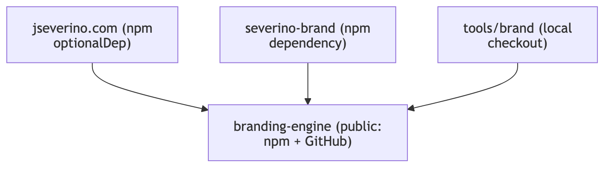
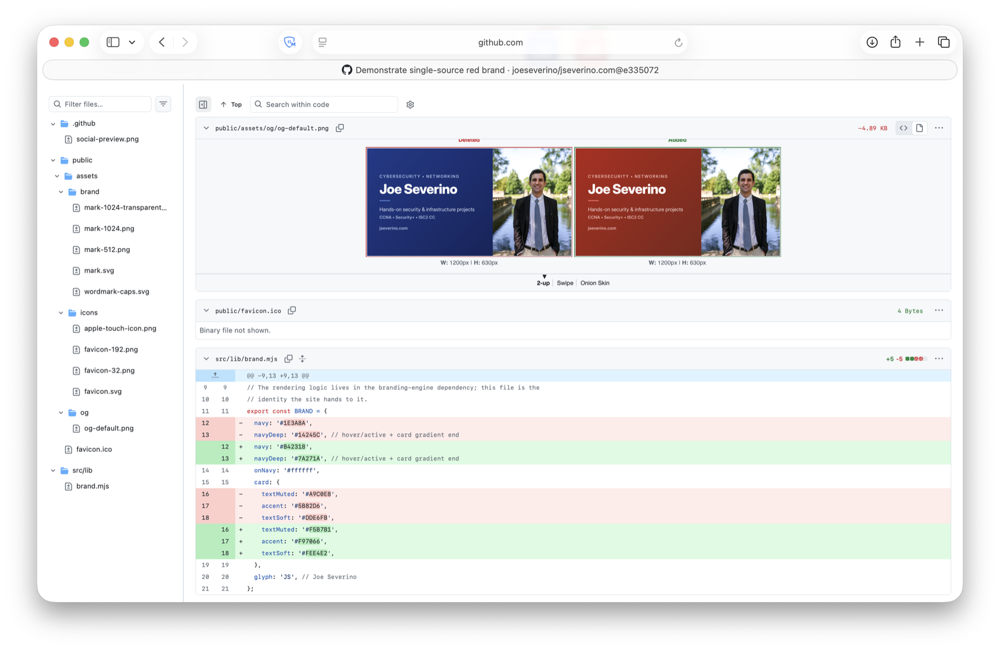
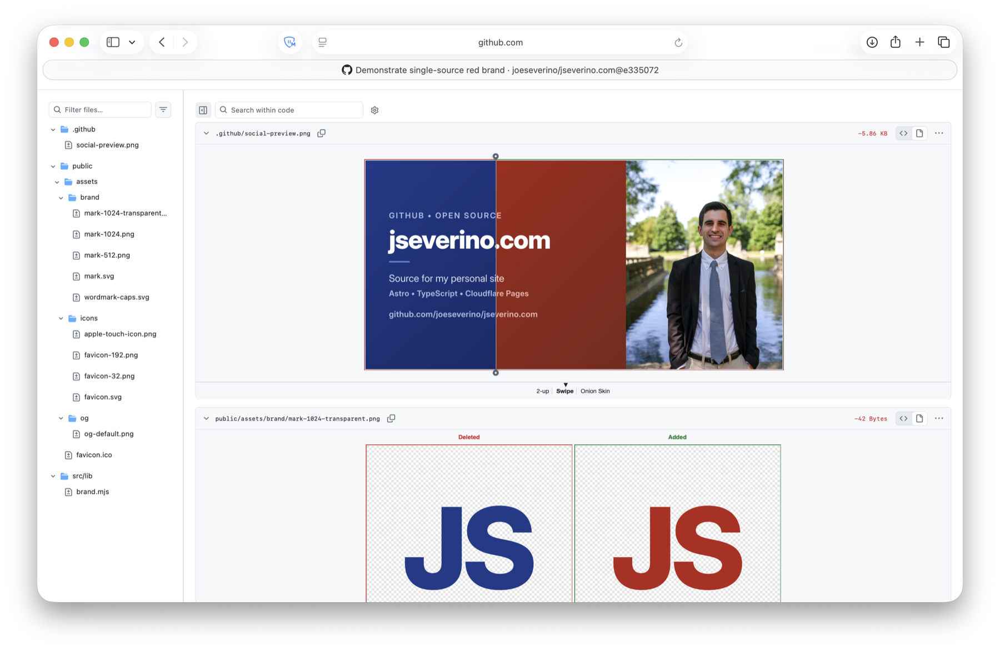
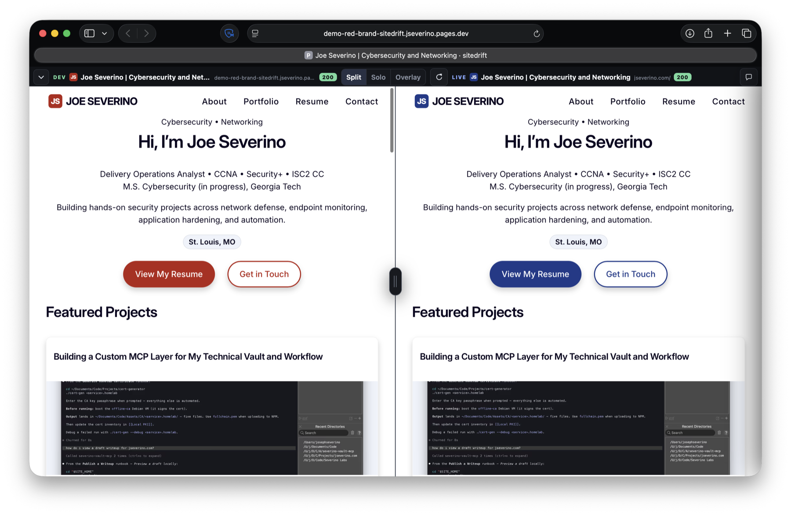
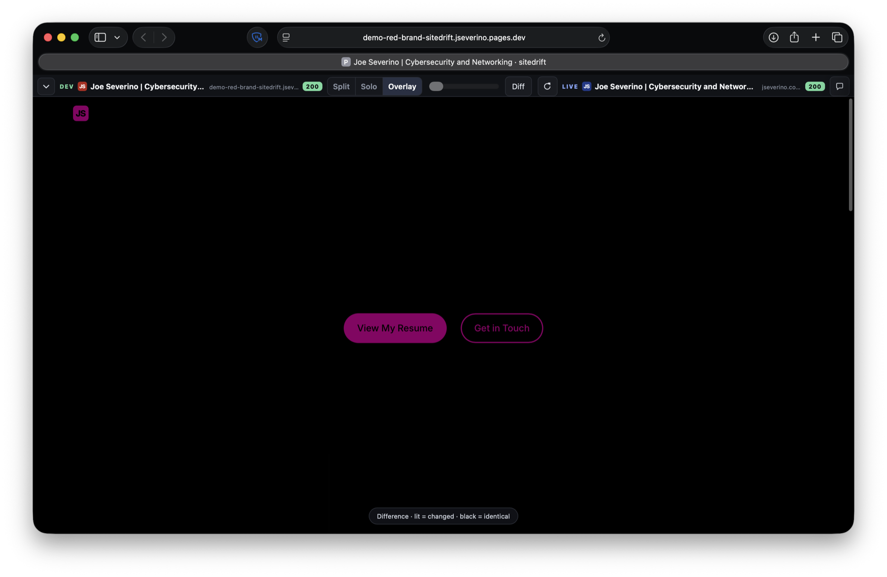

# Brand System

This document records how `jseverino.com` got a real brand, and how that brand
grew from a one-off script in this repository into a standalone engine that the
site, the brand kit, and the command-line tools all share. It is as much a story
as an architecture note: the interesting part is the path, not just the diagram.

## Two Colors That Never Agreed

The starting point was an accident, not a design.

The site ran on WordPress, and its accent color was purple. Nobody chose that
purple. It was the default of the WordPress theme, inherited the day the theme
was installed and never revisited. It showed up in links and headings because
that is simply what the theme shipped with.

Alongside it was a yellow `JS` logo. Its origin is unknown. There is no source
file, no design decision, and no record of where or how it was made. It was just
the logo, the way the purple was just the accent.

So the site had two brand colors, and they had nothing to do with each other.
The theme was purple by inheritance and the logo was yellow by mystery. Neither
was deliberate, and the two never matched. That mismatch is what started all of
this: once it becomes obvious the theme color and the logo are two different
colors that nobody ever actually picked, it cannot be un-noticed.

## Choosing A Real Color

The fix was to choose, once, on purpose.

The mark was rendered in a range of candidate colors and compared side by side.
Navy (`#1E3A8A`) won: it carries a trust-and-infrastructure register that fits a
security and networking portfolio, and it reads cleanly as a white glyph on a
solid tile at favicon sizes. Severino HQ, the private operations app, took its
own teal (`#1f4d57`) so the surfaces stay distinct while sharing one monogram.

The important move was applying the chosen color in **both** places at once. The
same navy became the favicon and mark tile *and* the site's theme color
(`--color-primary`, `<meta name="theme-color">`). For the first time the logo and
the interface were the same color, because they were now driven by the same
decision instead of two accidents.

## Generated, Not Drawn

Rather than save a static logo file, the mark became something the repository
generates.

The `JS` monogram is composed from real Inter (weight 800) glyph outlines and
laid out programmatically into an SVG. One token file, `src/lib/brand.mjs`, holds
the identity (the navy, the glyph), and three consumers read from it: the favicon
generator, the social-card renderer, and the CSS that sets the theme color. Change
the color in one place and the favicon, the Open Graph card, and the interface all
follow. The site, in effect, generates its own logo from a single source of truth,
so the "two colors that never agreed" problem cannot come back: there is only one
color, in one file.

## SVG-First

Tightening that pipeline surfaced a gap. The mark was a true vector built from
outlines, but the wordmark lockup (the tile plus the name) existed only as a
raster PNG, screenshotted from a browser. The fix made the wordmark vector-first
too: it is composed from the same Inter outlines into a `wordmark.svg`, and the
light/dark PNGs are rasterized from that SVG. A second, all-caps lockup was added
to match how the site sets the name in its header. The principle is simple:
geometry is vector; only things that must be raster (social cards, platform
icons) are raster.

## Out Of The Repo

The generators were generic from the start. The code that lays out a monogram and
renders a card knows nothing specific about Joe Severino; it takes a color, a set
of initials, and a name. But that generic code lived inside this site's
repository, which meant it could not be reused without copying it.

So it was lifted out in two moves. First, the brand *data* (the navy, the glyph,
the card copy, the portrait) moved into its own kit, `severino-brand`, separating
"who the brand is" from "how to render it." Then the rendering *engine* was
extracted into a standalone package, `branding-engine`, leaving behind only the
data and a dependency. The site stopped owning a private copy of the engine and
became a consumer of it, like everything else.

Each step was verified by regenerating every asset and diffing it against what was
already committed. The favicons, marks, social cards, and brand sheets all came
out byte-for-byte identical, which is how a refactor this deep avoids quietly
redrawing the logo.

## One Engine, Many Surfaces

The result is one engine with several consumers:

Diagram source: [`docs/diagrams/branding-engine-consumers.mmd`](./diagrams/branding-engine-consumers.mmd),
pre-rendered with [`diagram`](https://github.com/joeseverino/tools/blob/main/bin/diagram).

- **The site** depends on the engine to regenerate its favicons, social cards, and
  header wordmark, and commits the output. Its production build never runs the
  engine; the header inlines the committed `wordmark-caps.svg` so its glyphs pick
  up the link's hover color through `currentColor`.
- **The brand kit** (`severino-brand`) is pure data plus a dependency on the
  engine; building it renders the navy kit, the HQ teal kit, and one-off kits for
  other people.
- **The `brand` tool** wraps the engine for everyday use from the terminal.

The engine itself is the public, reusable piece:
[`branding-engine`](https://github.com/joeseverino/branding-engine). Anyone can
render their own kit from one accent color and a set of initials, with no
Severino-specific assumptions baked in.

## Proving A Brand Change Before Shipping It

A generator can make assets consistent, but consistency alone does not prove
that a redesign works once deployed. I used another tool I built,
[`sitedrift`](https://github.com/joeseverino/sitedrift), to test that second
half of the problem.

For a temporary Cloudflare branch deployment, the site's primary token changed
from navy to red. `branding-engine` regenerated the favicon, marks, wordmark,
Open Graph card, social preview, and interface-facing brand values from that
single edit. Sitedrift then loaded the red branch as DEV and the current navy
site as LIVE on the same route.

The commit diff makes the source-of-truth relationship concrete. A small set of
palette values changed in `src/lib/brand.mjs`; the generated Open Graph card
changed with them. The portrait, typography, dimensions, and content stayed
fixed because the rendering system did not need to be redesigned.

The same input propagated through the GitHub social preview and transparent
mark. This is why the generator matters: the repository does not rely on
someone remembering to recolor a collection of unrelated exported files.

The side-by-side view shows the value of a single source of truth: every
brand-colored surface moves together while the layout and content stay aligned.
Diff mode makes the same claim more rigorously by suppressing identical pixels
and exposing only the changed brand surfaces.

The immutable demonstration remains available at
[`6ef83545.jseverino.pages.dev`](https://6ef83545.jseverino.pages.dev/). The
working branch was restored to navy afterward, so the experiment remains
reviewable without becoming the site's active design.

## How The Site Consumes It

The site keeps its tokens local and borrows only the rendering:

- `severino-brand/brand/tokens.json` is the upstream source of truth — both the
  brand identity (`brand`: navy, glyph) and the design system (`designSystem`: the
  `:root` custom properties). The site never reads it at build time.
- `npm run sync:tokens` ([`bin/sync-tokens.mjs`](../bin/sync-tokens.mjs)) vendors it
  into two committed files, rewriting only the region between
  `tokens:start`/`tokens:end` markers: the `BRAND` export in `src/lib/brand.mjs`
  (from `brand`) and the `:root` block in `src/styles/base.css` (from
  `designSystem`). Same pattern as `sync:content` — an external source of truth,
  vendored to a committed artifact, so the build stays self-sufficient.
- `bin/make-icons.mjs`, `bin/make-og-image.mjs`, and `bin/make-github-social.mjs`
  import `markSvg` / `renderCard` from `branding-engine` instead of a local copy,
  and pass it the synced `BRAND`. The engine is generic; the tokens supply the color.
- The generated assets in `public/assets/` are committed. To restyle the brand,
  edit `tokens.json` upstream, run `npm run sync:tokens`, re-run the generators,
  and commit the new tokens + assets together.

The engine is an `optionalDependency`, pinned to a published, provenance-attested
`branding-engine` npm version (`^0.2.2`).
Because the rendered assets are committed, the deploy never needs the engine: if
CI cannot fetch it, the install skips it (non-fatal) and the static build runs
unchanged. The engine is only ever invoked locally, on demand, to regenerate.

## Related Docs

- [`docs/Architecture.md`](./Architecture.md)
- [`docs/WordPress-To-Astro-Migration.md`](./WordPress-To-Astro-Migration.md)
- [`branding-engine`](https://github.com/joeseverino/branding-engine) (the engine repo)
