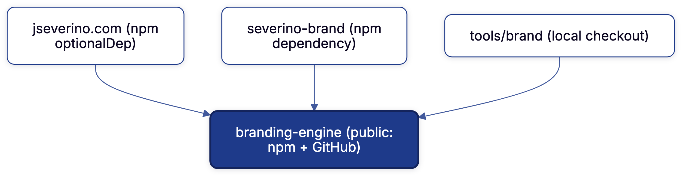
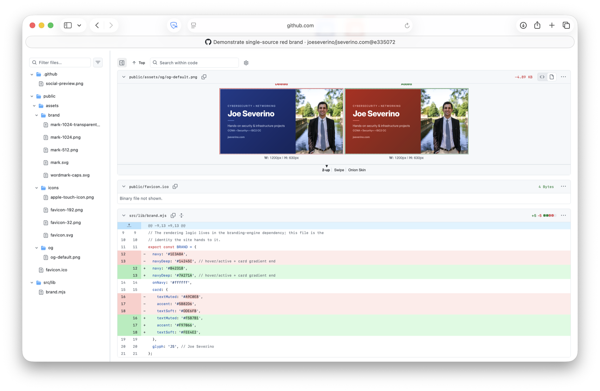
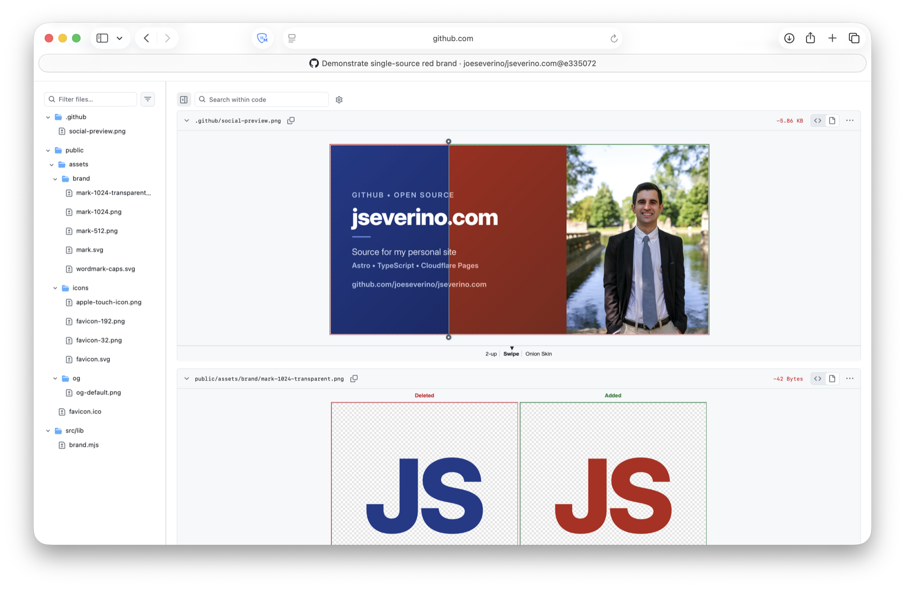
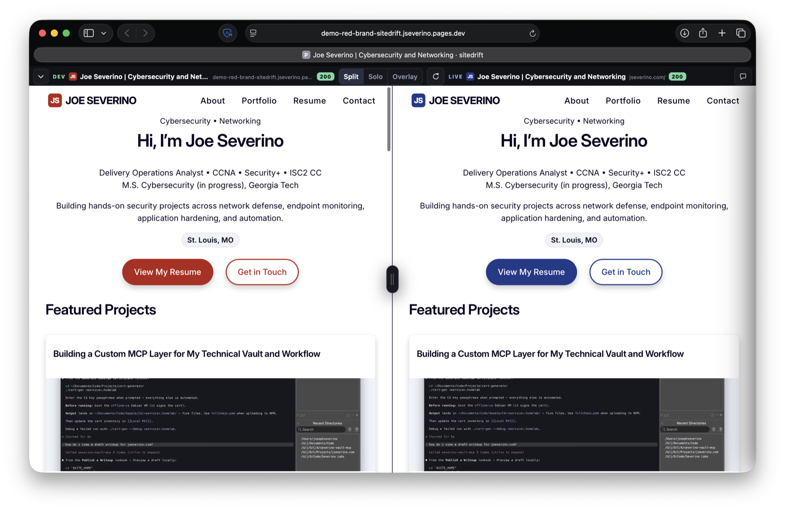
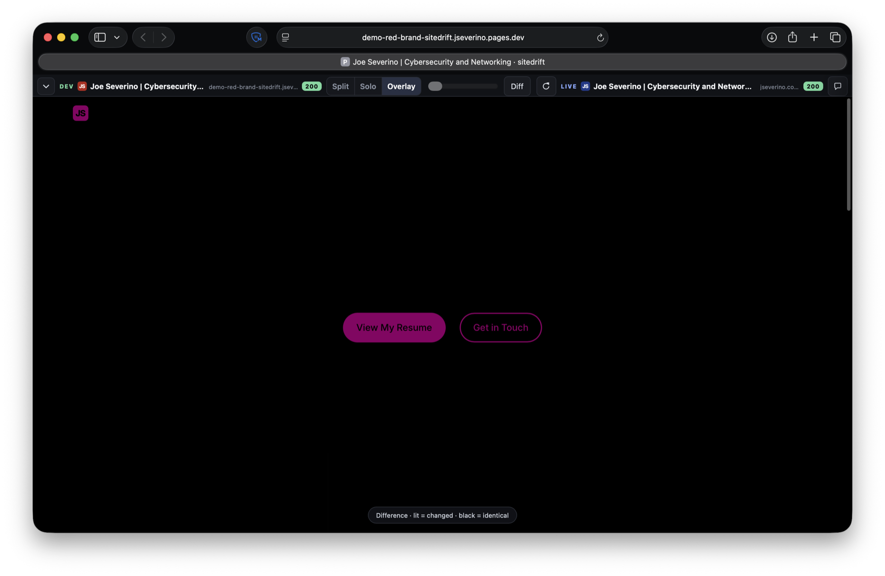

# Brand System

How `jseverino.com` got a deliberate brand, and how the code that renders it
moved from a script in this repository to a standalone engine shared by the
site, the brand kit, and the command-line tools.

## Two Colors

The site started on WordPress with a purple accent. The purple was the theme's
default, kept from the day the theme was installed. The logo was a yellow `JS`
with no source file and no record of how it was made. Neither color was chosen,
and they did not match.

## Choosing A Color

The mark was rendered in a range of candidate colors and compared side by side.
Navy (`#1E3A8A`) was picked: it suits a security and networking portfolio, and it
reads cleanly as a white glyph on a solid tile at favicon sizes. Severino HQ, the
private operations app, uses its own teal (`#1f4d57`) with the same monogram.

The navy went into both places at once: the favicon and mark tile, and the
site's theme color (`--color-primary`, `<meta name="theme-color">`). The logo and
the interface now come from the same value.

## Generated Assets

The mark is generated. The `JS` monogram is
built from Inter (weight 800) glyph outlines and laid out into an SVG. One token
file, [`src/lib/brand.ts`](../src/lib/brand.ts), holds the identity (the navy,
the glyph), and three consumers read it: the favicon generator, the social-card
renderer, and the CSS that sets the theme color. Changing the color in that file
changes the favicon, the Open Graph card, and the interface together.

## SVG First

The wordmark lockup (the tile plus the name) was once a PNG screenshotted from a
browser. It is now composed from the same Inter outlines into `wordmark.svg`, and
the light and dark PNGs are rasterized from that SVG. An all-caps lockup matches
how the header sets the name. Geometry is vector; only assets that must be raster
(social cards, platform icons) are raster.

## Out Of The Repo

The generators take a color, a set of initials, and a name, and know nothing else
about this site. They moved out in two steps. The brand data (the navy, the
glyph, the card copy, the portrait) moved into its own kit, `severino-brand`.
The rendering code moved into a standalone package, `branding-engine`. The site
keeps the data and a dependency.

Each step was checked by regenerating every asset and diffing it against the
committed copy. The favicons, marks, social cards, and brand sheets came out
byte-for-byte identical.

## One Engine, Many Surfaces

The result is one engine with several consumers:



<sup>Diagram source: [`docs/diagrams/branding-engine-consumers.mmd`](./diagrams/branding-engine-consumers.mmd),
pre-rendered with [`diagram`](https://github.com/joeseverino/tools/blob/main/bin/diagram).</sup>

- **The site** depends on the engine to regenerate its favicons, social cards, and
  header wordmark, and commits the output. Its production build never runs the
  engine; the header inlines the committed `wordmark-caps.svg` so its glyphs pick
  up the link's hover color through `currentColor`.
- **The brand kit** (`severino-brand`) is pure data plus a dependency on the
  engine; building it renders the navy kit, the HQ teal kit, and one-off kits for
  other people.
- **The `brand` tool** wraps the engine for everyday use from the terminal.

The engine itself is the public, reusable piece:
[`branding-engine`](https://github.com/joeseverino/branding-engine). Anyone can
render their own kit from one accent color and a set of initials.

## Proving A Brand Change Before Shipping It

Consistent assets do not show how a redesign looks once deployed. I used
[`sitedrift`](https://github.com/joeseverino/sitedrift), another tool I built,
to check that.

For a temporary Cloudflare branch deployment, the site's primary token changed
from navy to red. `branding-engine` regenerated the favicon, marks, wordmark,
Open Graph card, social preview, and interface-facing brand values from that
single edit. Sitedrift then loaded the red branch as DEV and the current navy
site as LIVE on the same route.

In the commit diff, a few palette values changed in `src/lib/brand.ts` and the
generated Open Graph card changed with them. The portrait, typography,
dimensions, and content stayed fixed.



The same input carried through the GitHub social preview and the transparent
mark, with no exported file recolored by hand.





Side by side, every brand-colored surface changes while the layout and content
stay aligned. Diff mode hides identical pixels and shows only the changed brand
surfaces.



The demonstration deployment is still at `6ef83545.jseverino.pages.dev`, behind
Cloudflare Access with every preview. The branch went back to navy afterward.

## How The Site Consumes It

The site keeps self-contained generated inputs while consuming one versioned
upstream contract:

- `severino-brand/brand/tokens.json` is the one editable source: the brand
  identity (`brand`: navy, glyph), the design system (`designSystem`: the `:root`
  custom properties), and the dark values for the themeable subset of those
  properties (`designSystemDark`). The package's `brand/contract.mjs` validates
  that data and derives the semantic web contract (surface, card, theme, and CSS
  roles) once.
- The signed `severino-brand` release is pinned by tag and resolved commit in
  `package-lock.json`; no neighboring checkout or mutable filesystem convention
  participates in synchronization or CI.
- `npm run sync:tokens` ([`bin/sync-tokens.ts`](../bin/sync-tokens.ts)) only
  serializes that normalized contract into `src/lib/brand.ts` and
  `src/styles/tokens.css`. `npm run sync:tokens -- --check` performs the same
  projection without writing and fails on drift. Each projection embeds the upstream token
  SHA-256 digest for provenance.
- `bin/make-icons.ts`, `bin/make-og-image.ts`, and `bin/make-github-social.ts`
  import `markSvg` / `renderCard` from `branding-engine` instead of a local copy,
  and pass it the synced `BRAND`. The engine is generic; the tokens supply the color.
- The generated assets in `public/assets/` are committed. To restyle the brand,
  edit `tokens.json` upstream, run `npm run sync:tokens`, re-run the generators,
  and commit the new tokens and assets together.

### Light And Dark From One Token Block

`designSystemDark` lists only the tokens whose value changes in dark. The renderer
folds the two maps together into a single `:root` block where each themeable token
holds both values at once:

```css
:root {
  color-scheme: light dark;
  --color-bg: light-dark(#ffffff, #131826);
  --color-text: light-dark(#0b0620, #e8eaf2);
  --color-border: color-mix(in oklch, var(--color-text) 8%, transparent);
}
```

There is no dark stylesheet, no `[data-theme]` selector, and no per-component
dark override. Consequences:

- **Derived tokens adapt for free.** `--color-border` is a `color-mix()` over
  `--color-text`, so it has no dark entry and follows the text color. Anything
  expressible as a mix of an already-themeable token should stay derived.
- **`light-dark()` only accepts colors.** `--shadow-sm` is geometry plus a color,
  so the color half was split into `--shadow-color-sm` and the shadow composes it.
  Apply the same split to any future token that isn't a bare color.
- **A dark key with no light counterpart throws.** `mergeThemes` in the
  versioned `severino-brand` contract refuses to emit a token that exists only in the
  dark map, so a typo there fails instead of dropping out of the output.

The terminal group (`--code-*`, `--term-*`) has no dark entries on purpose: it
represents a real terminal and stays dark in both themes. `--color-primary` is
dual-valued too, but from `brand.onDark` in `brandVarsCss()` rather than the
design-system block, since it is brand identity and lives in `src/styles/brand.css`. Navy is
unreadable on a dark page; `onDark.primary` is the readable counterpart, and
`onDark.primaryDeep` is *lighter* than it, because "deep" means more emphasis and
emphasis moves toward the far end of the page's contrast range in either theme.

The engine is an `optionalDependency`, pinned to a published, provenance-attested
`branding-engine` npm version (`^0.7.0`).
Because the rendered assets are committed, the deploy never needs the engine: if
CI cannot fetch it, the install skips it (non-fatal) and the static build runs
unchanged. The engine is only ever invoked locally, on demand, to regenerate.

## Embedding The Styles Elsewhere: Load Both

The site's writeup styling is two concerns in one stylesheet, and anything that
renders writeup HTML outside the site must carry both.

- **`src/styles/base.css`** is the ordered design-system entrypoint. It imports
  concern-based modules for tokens, brand, foundation, layout, content, forms,
  footer, software, responsive behavior (last, so its container rules override component
  defaults inside the layer), and accessibility; Astro inlines the result into
  every page as one `<style>` block, pinned by hash in the CSP.
- **`src/styles/brand.css`** is the brand identity: `--color-primary` and
  `--color-primary-deep`, generated by `npm run sync:tokens`. It is swappable
  (the sitedrift demo changes one token and regenerates everything).

The two stay in separate files because brand identity (`brand` in `tokens.json`)
is swappable and the design system (`designSystem`) is stable. The design
system's tinted tables, links, and buttons all read `--color-primary`, so
`base.css` pasted raw, without its imports expanded, renders without color.

The assembly is owned once so an embedder does not re-derive it:

- [`src/lib/brand.ts`](../src/lib/brand.ts) exports **`brandVarsCss()`**, the
  `:root` brand-vars string. `sync:tokens` writes exactly this into
  `src/styles/brand.css`, so the site and any embedder share one definition.
- [`src/lib/web-styles.ts`](../src/lib/web-styles.ts) exports
  **`previewStyles({ baseCss, fontUrl })`**: the expanded CSS entrypoint, the
  brand vars, and a resolvable Inter `@font-face`, as one `<style>` blob. An
  embedder calls this one function and gets the brand vars with it. `baseCss` and `fontUrl` are passed
  in because each embedder obtains them its own way (esbuild text/dataurl import,
  a fetch, a file read); only the assembly is shared.

The `severino-obsidian` plugin's preview pane is the first consumer: it imports
`previewStyles` (via an esbuild `@site/web-styles` alias) and hands it the
esbuild-inlined `base.css` and Inter woff2.

## Related Docs

- [`docs/Architecture.md`](./Architecture.md)
- [`docs/WordPress-To-Astro-Migration.md`](./WordPress-To-Astro-Migration.md)
- [`branding-engine`](https://github.com/joeseverino/branding-engine) (the engine repo)
