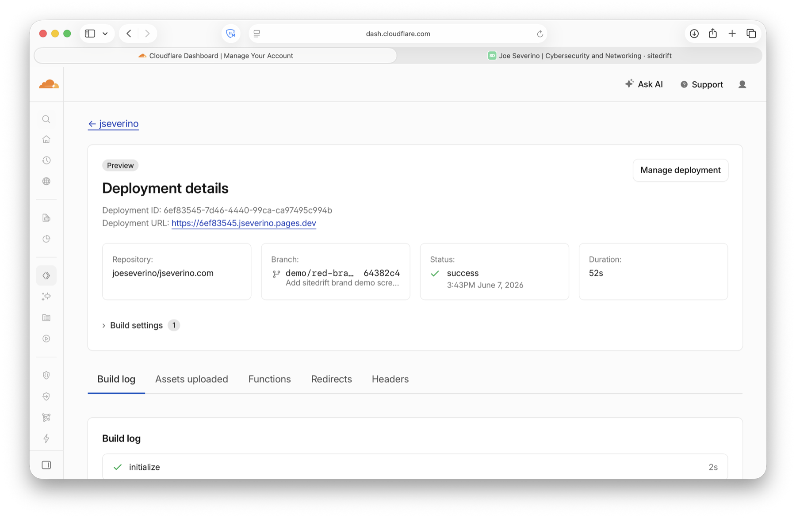
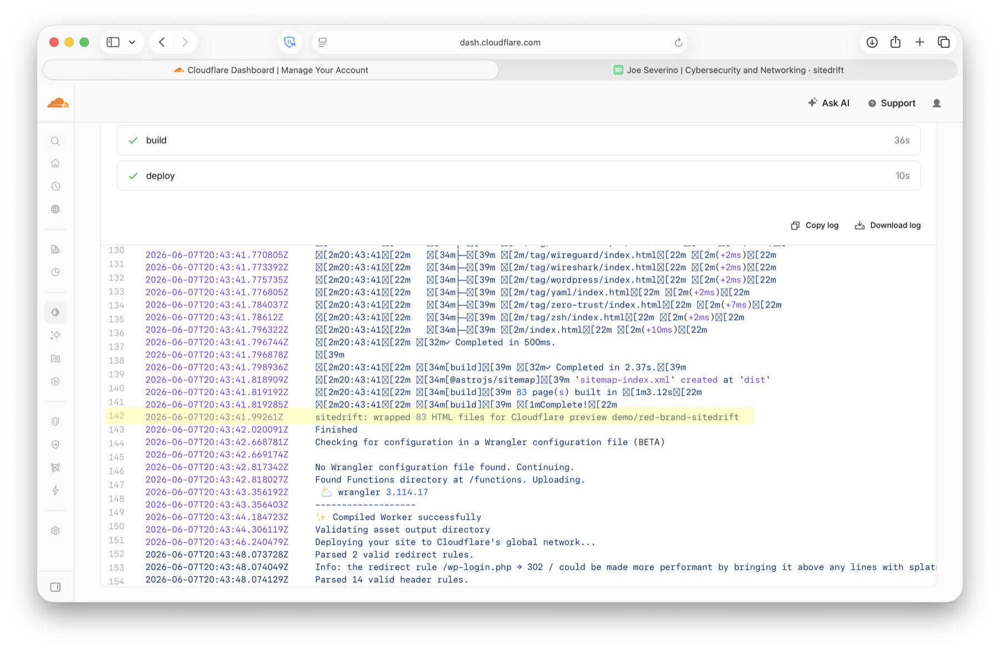
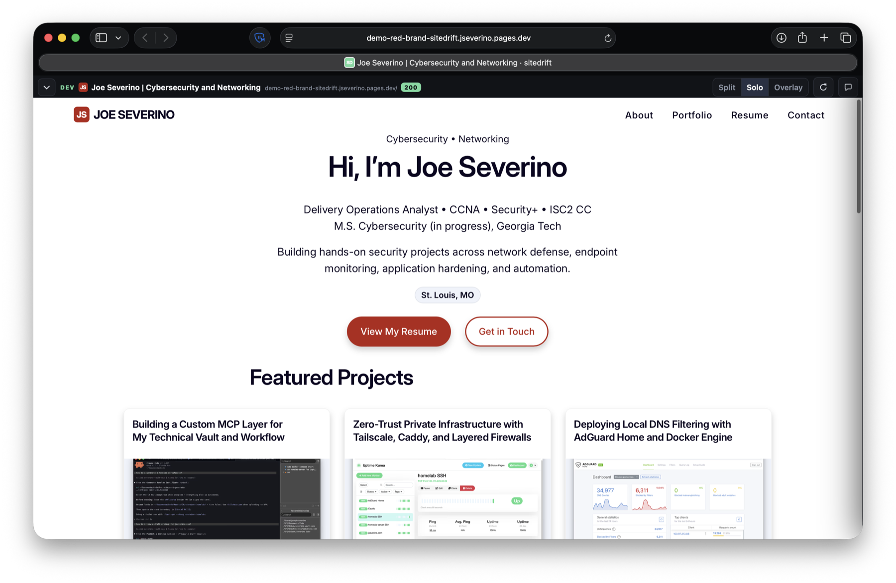
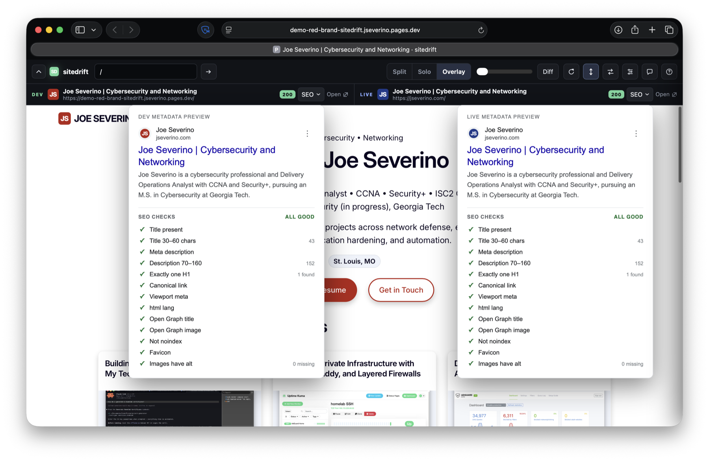
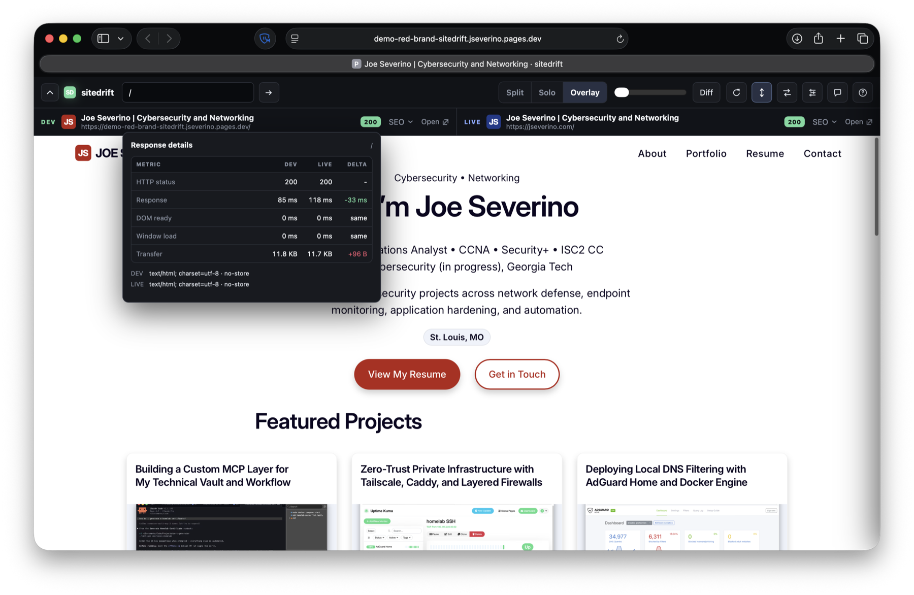
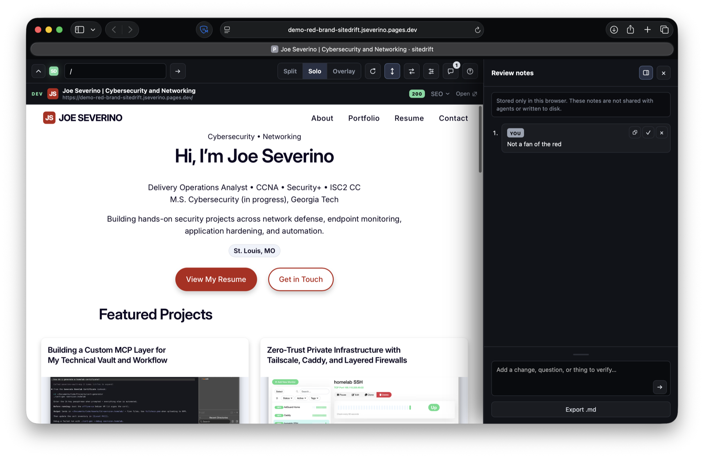
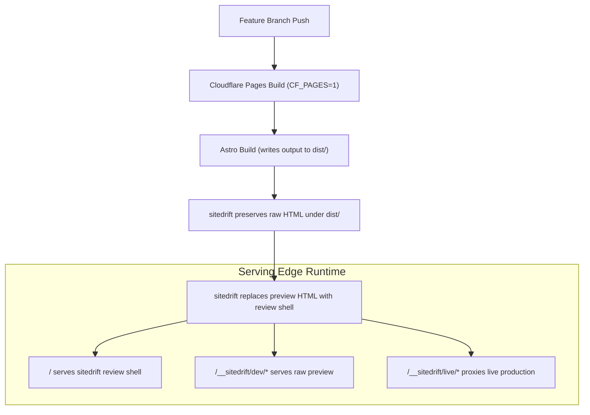

# Deployment Preview Review

Every non-production Cloudflare Pages deployment of `jseverino.com` carries a
compact [sitedrift](https://github.com/joeseverino/sitedrift) review layer. The
preview deployment is DEV; the current `https://jseverino.com` release is LIVE.
This turns each branch URL into a review environment instead of a standalone
copy that must be compared manually.

## Case Study: One Brand Change, Fully Reviewed

This case study connects two public tools I built:
[`branding-engine`](https://github.com/joeseverino/branding-engine) generates a
coherent brand system from structured inputs, and
[`sitedrift`](https://github.com/joeseverino/sitedrift) compares a development
deployment with the current live site.

For the demonstration, I temporarily changed the primary brand token in
`src/lib/brand.mjs` from navy to red. `branding-engine` propagated that one
decision through the favicon, marks, header wordmark, interface color, Open
Graph card, and GitHub social preview. The change was deployed only to a
Cloudflare branch preview; production stayed navy.


[Open the immutable red-brand comparison](https://6ef83545.jseverino.pages.dev/).
Unlike a moving branch alias, this URL remains pinned to the exact demonstration
build even though the source branch has since been restored to navy.

### 1. Turn A Git Commit Into A Reviewable Artifact

Cloudflare records the repository, branch, commit, deployment status, duration,
and immutable URL together. That provenance matters: a reviewer can identify
the exact code being evaluated, and the documentation can link to a deployment
that will not move when the branch receives another push.

[](https://6ef83545.jseverino.pages.dev/)

### 2. Add The Review Layer During The Normal Build

There is no separate review server to operate. The ordinary Cloudflare build
runs the repository's static build command, then the installed sitedrift
dependency wraps the 83 generated HTML files because this is a non-production
branch. Cloudflare uploads the resulting static assets and scoped Function as
part of the same successful deployment.



### 3. Confirm The Branch Works By Itself

Solo mode presents DEV as a normal, interactive website with a compact review
bar. This matters because a visual review tool is not useful if it breaks
navigation, menus, scrolling, or the responsive site it is evaluating.

[](https://6ef83545.jseverino.pages.dev/)

### 4. Compare The Complete Result With Production

Split mode places the red branch and navy production site on the same route and
scroll position. The page structure and content remain aligned; the coordinated
brand change appears in the mark, buttons, and other generated surfaces. This
is the useful connection between the tools: `branding-engine` creates the
systematic change, and `sitedrift` makes its deployed scope immediately visible.


### 5. Isolate Changed Pixels

Overlay Diff mode turns identical pixels black and leaves changed pixels lit.
The sparse result shows that the branch changed branding rather than layout or
content. It is a faster regression check than repeatedly switching browser tabs
and relying on memory.


### 6. Check More Than Appearance

Both deployments receive the same metadata preview and SEO checklist. In this
case the title, description, canonical URL, headings, Open Graph fields,
favicon, and image-alt coverage remain healthy. A visual redesign can therefore
be reviewed without silently accepting an SEO regression.



The response popover puts HTTP status, response time, transfer size, and deltas
in one compact comparison. These are lightweight same-session diagnostics, not
synthetic benchmarks, but they quickly expose a branch that fails, redirects,
or becomes unexpectedly heavier.



### 7. Leave Review Context Without Adding A Service

Review notes are attached to the preview workflow but stored only in that
browser's `localStorage`. The interface states that boundary directly. Teams
get a useful review scratchpad without creating an account system, public write
API, database, or new production security surface.



## What Reviewers Get

- **Solo** view by default, with one-click switching between DEV and LIVE.
- **Split** view with synchronized routes, links, and scrolling.
- **Overlay** and pixel-difference modes for visual drift.
- Per-side HTTP status plus response, DOM-ready, load, transfer, header, and
  delta details.
- A Google-style SEO preview for both sides.
- Metadata comparison for title, description, and canonical URL.
- SEO checks for title and description quality, H1 count, canonical, viewport,
  language, Open Graph metadata, indexing directives, favicon, and image alt
  coverage.
- Review notes stored only in that browser's `localStorage`.

The status and SEO panels are diagnostics, not synthetic performance
benchmarks. Their value is fast same-route comparison under the same browser
session.

## Repository Integration

The project has two integration points. The static build ends with:

```json
{
  "scripts": {
    "build:static": "ASTRO_TELEMETRY_DISABLED=1 astro build && sitedrift cloudflare --dir dist --live https://jseverino.com --brand \"Joe Severino\""
  }
}
```

The scoped Pages Function is:

```ts
// functions/__sitedrift/[[path]].ts
export { onRequest } from 'sitedrift/cloudflare';
```

`sitedrift` is pinned in `devDependencies` and the exact tarball is locked in
`package-lock.json`.

## Preview Build Flow



The branch alias and immutable deployment URL expose the same review interface.
The immutable URL is preferred for verification because it cannot move to a
newer build during testing.

## Production Invariant

The addon does not wrap production. `sitedrift cloudflare` exits without
changing the Astro output when `CF_PAGES_BRANCH=main`.

Cloudflare bundles the `functions/` tree separately, so the exported Function
still exists in production. The required generated configuration is absent,
therefore `/__sitedrift/*` fails closed with `404`. The normal site, contact
form, CSP report receiver, middleware, headers, and static assets follow their
existing production paths unchanged.

Run the project-level guard before release:

```sh
npm run check:preview
```

It builds small simulated outputs and asserts that a feature branch receives
the review wrapper while `main` remains the original Astro document.

## Security Boundary

- The Function owns only `/__sitedrift/*`.
- It allows only `GET` and `HEAD`.
- The LIVE destination is fixed at build time to `https://jseverino.com`.
- It does not forward contact-form writes or arbitrary origins.
- Hosted frames execute trusted first-party preview code so the deployed site
  remains interactive.
- Notes never leave the browser and are not available through the sitedrift MCP.
- Existing CSP middleware and application Functions retain their routes.
- Pages preview hostnames remain excluded from indexing through
  `X-Robots-Tag: noindex`.

This adds a read-only preview review surface. It does not add an account system,
production content API, database binding, secret, upload endpoint, or public
write path.

## Review Procedure

1. Open the immutable `########.jseverino.pages.dev` deployment.
2. Confirm DEV Solo mode renders the intended branch.
3. Switch DEV/LIVE and inspect the same route.
4. Use Split with linked scrolling for layout and content review.
5. Use Overlay/Diff for pixel-level changes.
6. Open each status badge and review response/load deltas.
7. Open SEO and compare title, description, canonical, snippet, and checks.
8. Check navigation, menus, scrolling, desktop Chromium, and mobile WebKit.
9. Keep browser-local notes free of sensitive information.
10. Confirm the production guard before merging to `main`.

## Dependency Updates

```sh
npm install --save-dev 'sitedrift@^<version>'
npm run check
npm run check:preview
```

Review upstream release notes and verify an immutable Pages deployment before
merging. Because preview HTML is transformed at build time and the proxy runs at
the edge, sitedrift updates are both build-tooling and preview-runtime changes.

## Related Docs

- [Architecture](./Architecture.md)
- [SEO And Metadata](./SEO.md)
- [Release Checklist](./Release-Checklist.md)
- [Security](../SECURITY.md)
