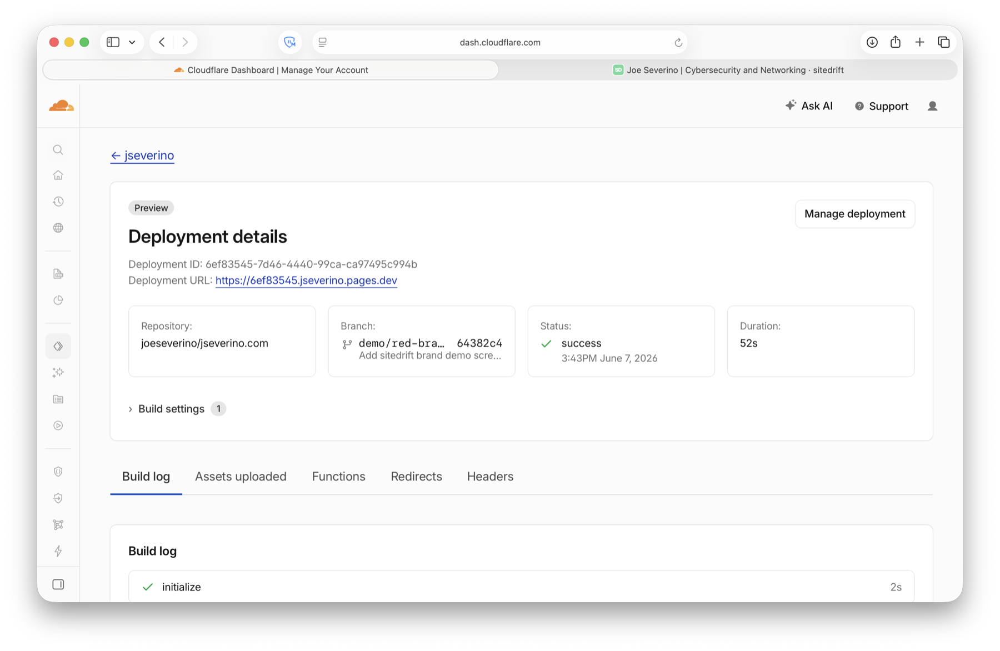
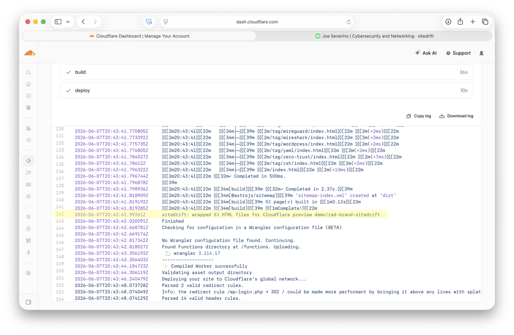
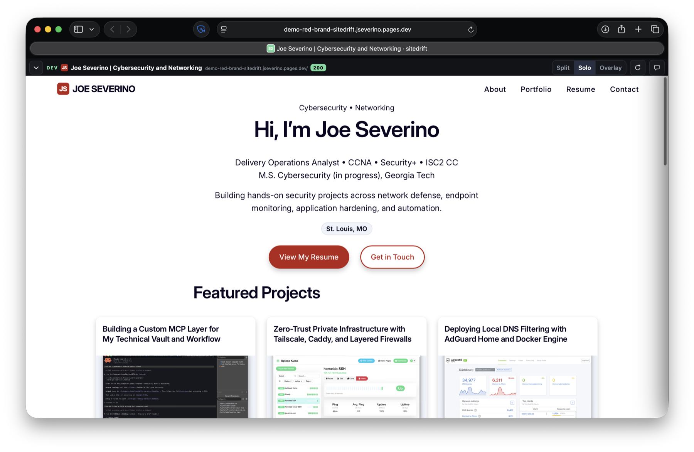
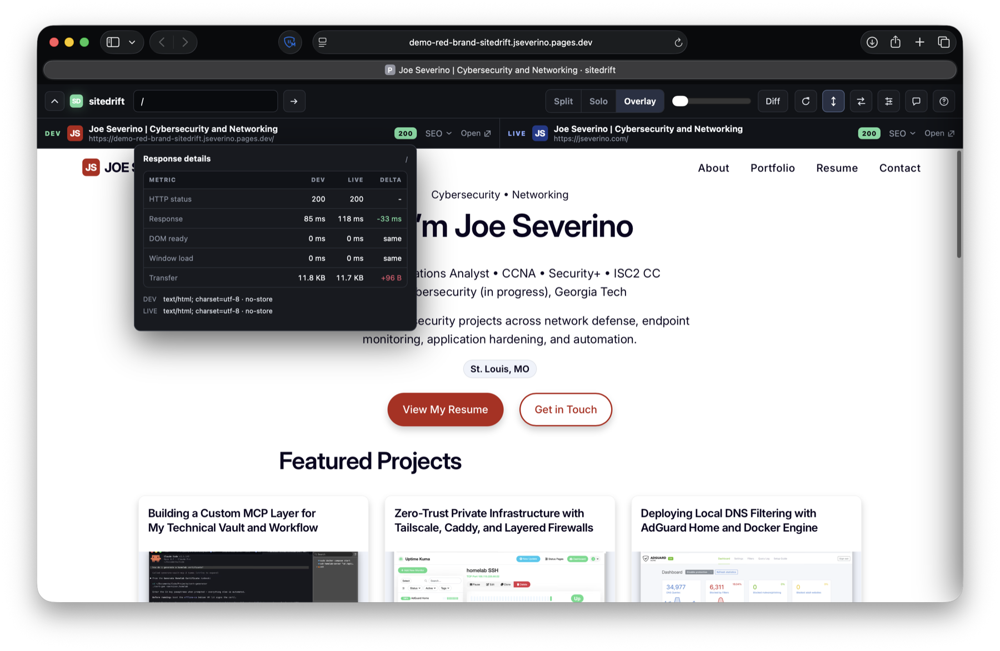
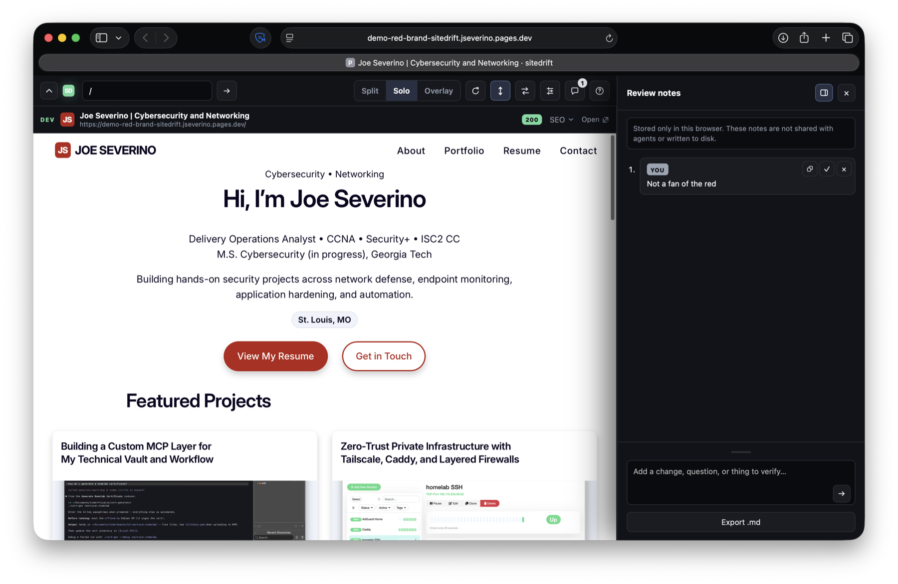
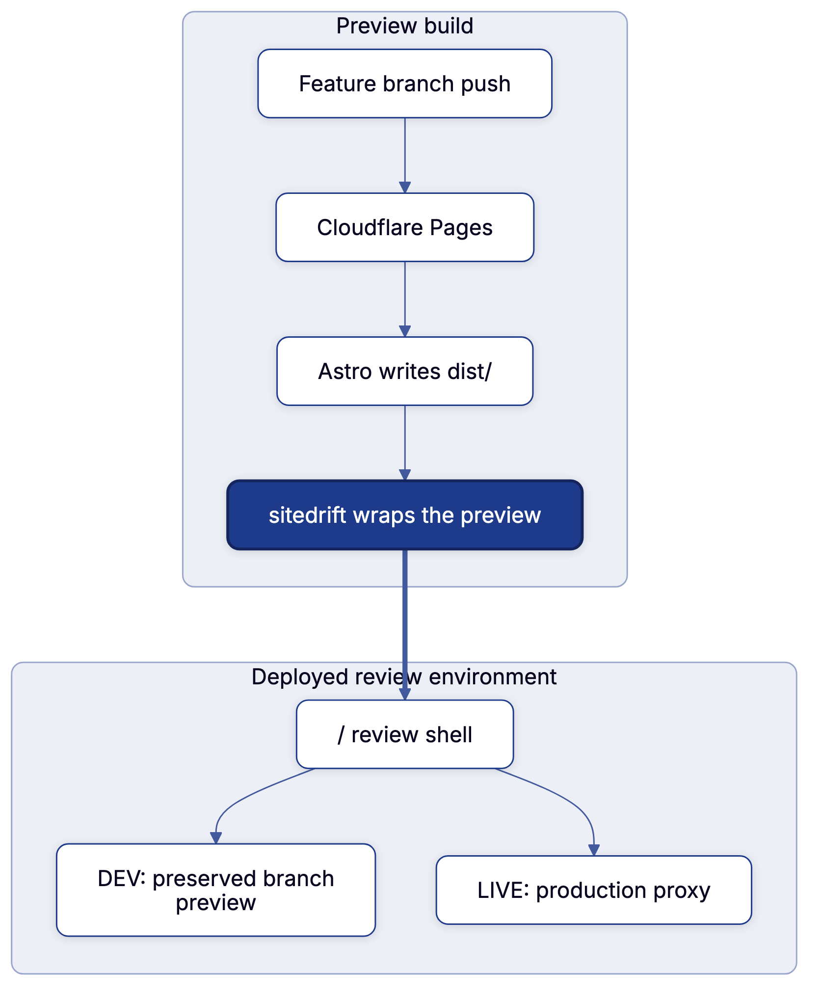

# Deployment Preview Review

Every non-production Cloudflare Pages deployment of `jseverino.com` carries a
compact [sitedrift](https://github.com/joeseverino/sitedrift) review layer. The
preview deployment is DEV; the current `https://jseverino.com` release is LIVE.

## Case Study: One Brand Change, Fully Reviewed

Two public tools: [`branding-engine`](https://github.com/joeseverino/branding-engine)
generates a brand system from structured inputs, and
[`sitedrift`](https://github.com/joeseverino/sitedrift) compares a development
deployment with the live site.

The demonstration changed the primary brand token in `src/lib/brand.ts` from
navy to red. `branding-engine` propagated that one decision through the favicon,
marks, header wordmark, interface color, Open Graph card, and GitHub social
preview. Only a Cloudflare branch preview received the change; production stayed
navy.


[Open the immutable red-brand comparison](https://6ef83545.jseverino.pages.dev/).
This URL stays pinned to the demonstration build. Preview deployments sit behind
Cloudflare Access (see [Cloudflare](./Cloudflare.md)), so the link opens only for
the owner.

### 1. Turn A Git Commit Into A Reviewable Artifact

Cloudflare records the repository, branch, commit, deployment status, duration,
and immutable URL together. A reviewer can identify the exact code under review,
and a doc can link to a deployment that does not move on the next push.

[](https://6ef83545.jseverino.pages.dev/)

### 2. Add The Review Layer During The Normal Build

No separate review server exists. The Cloudflare build runs the repository's
static build command, which wraps the 83 generated HTML files with the installed
sitedrift dependency on non-production branches. Cloudflare uploads the static
assets and the scoped Function in the same deployment.



### 3. Confirm The Branch Works By Itself

Solo mode presents DEV as a normal, interactive website with a compact review
bar. The layer must not break navigation, menus, scrolling, or responsive layout.

[](https://6ef83545.jseverino.pages.dev/)

### 4. Compare The Complete Result With Production

Split mode places the red branch and navy production site on the same route and
scroll position. Structure and content stay aligned; the brand change appears in
the mark, buttons, and other generated surfaces. `branding-engine` made the
change; `sitedrift` shows how far it reached.


### 5. Isolate Changed Pixels

Overlay Diff mode turns identical pixels black and leaves changed pixels lit.
The sparse result shows the branch changed branding, not layout or content.


### 6. Check More Than Appearance

Both deployments receive the same metadata preview and SEO checklist. Here the
title, description, canonical URL, headings, Open Graph fields, favicon, and
image-alt coverage all pass, so the redesign carries no SEO regression.


The response popover shows HTTP status, response time, transfer size, and
deltas. These are same-session diagnostics, not benchmarks, and expose a branch
that fails, redirects, or gets heavier.



### 7. Leave Review Context Without Adding A Service

Review notes live only in that browser's `localStorage`, and the interface says
so. They need no account system, write API, or database.



## What Reviewers Get

- **Solo** view by default, with one-click switching between DEV and LIVE.
- **Split** view with synchronized routes, links, and scrolling.
- **Overlay** and pixel-difference modes for visual drift.
- Per-side HTTP status plus response, DOM-ready, load, transfer, header, and
  delta details.
- A Google-style SEO preview for both sides.
- Metadata comparison for title, description, and canonical URL.
- SEO checks for title and description quality, H1 count, canonical, viewport,
  language, Open Graph metadata, indexing directives, favicon, and image alt
  coverage.
- Review notes stored only in that browser's `localStorage`.

## Repository Integration

`npm run build:static`
([`bin/build-static.ts`](../bin/build-static.ts)) runs `astro build`, then
`sitedrift cloudflare --dir <outDir> --live <origin> --brand <owner>`, with the
output directory from [`src/lib/build-output.ts`](../src/lib/build-output.ts)
and the origin and owner from [`src/lib/site-config.ts`](../src/lib/site-config.ts).
`--nonce __CSP_INLINE__` is a build-time marker on every tag the viewer writes;
`bin/build-csp.ts` hashes and strips it after the wrap, so the build's CSP covers
wrapped pages like any other.

The scoped Pages Function,
[`functions/__sitedrift/[[path]].ts`](../functions/__sitedrift/[[path]].ts), is
sitedrift's own `onRequest`. Its defaults are this route's guards:

- `404` on the production host (and its `www.`) and on any build without
  sitedrift's generated config;
- only content-negotiation headers (`accept`, `accept-language`, conditional and
  range headers, `user-agent`) reach production; cookies, `authorization`, and
  Access headers never do, and production's `set-cookie` is dropped;
- responses get the security headers back, and LIVE pages are served under a
  request-time CSP: a nonce for the bridge script sitedrift injects, plus a hash
  for each inline script and style of the fetched page.

`tests/unit/csp.test.ts` covers that request-time policy.

`sitedrift` is pinned in `devDependencies` and locked in `package-lock.json`.

## Preview Build Flow



<sup>Diagram source: [`docs/diagrams/preview-build-flow.mmd`](./diagrams/preview-build-flow.mmd),
pre-rendered with [`diagram`](https://github.com/joeseverino/tools/blob/main/bin/diagram).</sup>

The branch alias and immutable deployment URL expose the same interface. Verify
against the immutable URL, which cannot move to a newer build mid-test.

## Production Invariant

The addon does not wrap production. `sitedrift cloudflare` exits without
changing the Astro output when `CF_PAGES_BRANCH=main`.

Cloudflare bundles `functions/` separately, so the Function still exists in
production. It answers `404` there on the production host check and on the
missing generated config. The `sitedrift-production` WAF rule also blocks
`/__sitedrift*` on the production hosts at the edge. The site, contact form, CSP
report receiver, headers, and static assets are unchanged.

Run the guard before release:

```sh
npm run check:preview
```

It builds simulated outputs and asserts that a feature branch receives the
wrapper while `main` stays the original Astro document.

## Security Boundary

- The Function owns only `/__sitedrift/*`.
- It allows only `GET` and `HEAD`.
- The LIVE destination is fixed at build time to `https://jseverino.com`.
- It does not forward contact-form writes, arbitrary origins, cookies, or
  credentials.
- Hosted frames execute trusted first-party preview code.
- Notes never leave the browser and are not available through the sitedrift MCP.
- Application Functions keep their routes; static pages never invoke one.
- Preview hostnames carry `X-Robots-Tag: noindex` and sit behind Cloudflare
  Access.

The surface is read-only: no account system, production content API, database
binding, secret, upload endpoint, or public write path.

## Review Procedure

1. Open the immutable `########.jseverino.pages.dev` deployment.
2. Confirm DEV Solo mode renders the intended branch.
3. Switch DEV/LIVE and inspect the same route.
4. Use Split with linked scrolling for layout and content review.
5. Use Overlay/Diff for pixel-level changes.
6. Open each status badge and review response/load deltas.
7. Open SEO and compare title, description, canonical, snippet, and checks.
8. Check navigation, menus, scrolling, desktop Chromium, and mobile WebKit.
9. Keep browser-local notes free of sensitive information.
10. Confirm the production guard before merging to `main`.

## Dependency Updates

```sh
npm install --save-dev 'sitedrift@^<version>'
npm run check
npm run check:preview
```

Review upstream release notes and verify an immutable Pages deployment before
merging. A sitedrift update changes both build tooling (HTML transform) and the
preview runtime (edge proxy).

## Related Docs

- [Architecture](./Architecture.md)
- [SEO And Metadata](./SEO.md)
- [Release Checklist](./Release-Checklist.md)
- [Security](../SECURITY.md)
