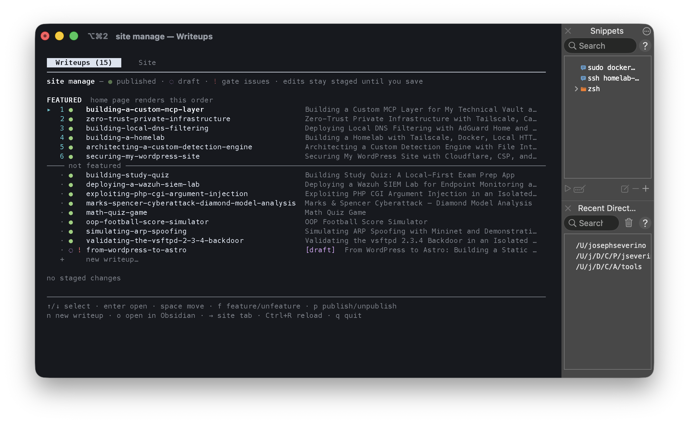
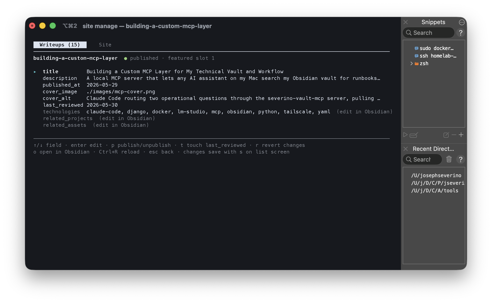
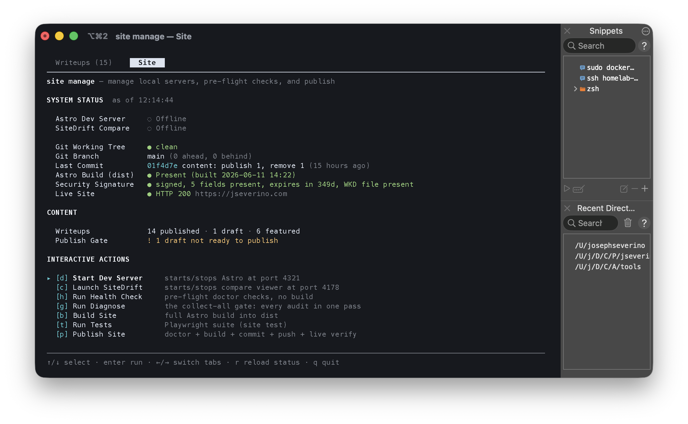
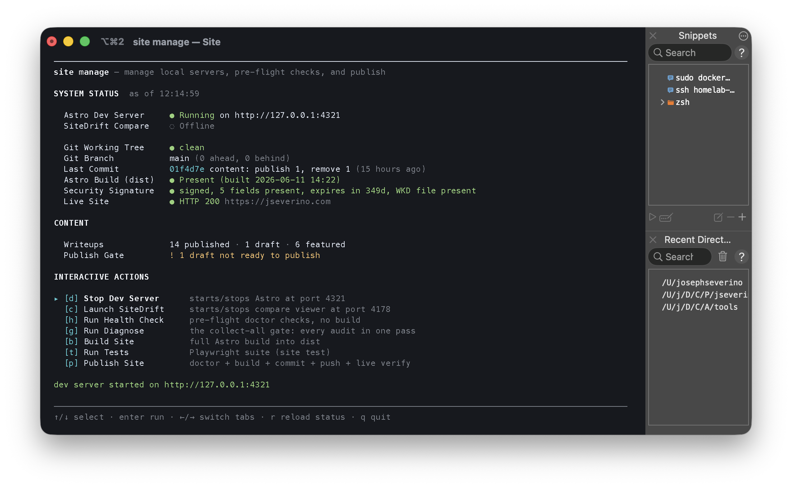

# Site CLI

`site` is the personal command-line wrapper that operates this repository day
to day. It lives in the public [`tools`](https://github.com/joeseverino/tools)
repo (`bin/site` plus the `site manage` TUI under `lib/site/`), not here. The
npm scripts in [`Commands.md`](./Commands.md) remain the canonical repo-local
interface — everything `site` does either shells into an `npm run` script in
this repo or talks to the vault/MCP layer that this repo deliberately cannot
see.

## How the layers relate

| Layer | Owns | Examples |
| :--- | :--- | :--- |
| npm scripts (this repo) | build, audits, tests | `npm run diagnose`, `npm run sync:content` |
| `site` CLI (tools repo) | the workflow across vault, repo, and live site | `site publish`, `site manage` |
| `severino-vault-mcp` | frontmatter reads/writes with gate guarantees | `update-writeup`, `reorder-featured` |

The split matters: the vault is private, so anything that reads or writes
writeup frontmatter (publish flags, featured order, field edits) goes through
the MCP's code path and inherits its guarantees — sequential `1..N` featured
order, format-preserving YAML edits, and the publish gate. The npm scripts
never touch the vault except through `sync:content`'s one-way snapshot.

## Everyday commands

| Command | Does |
| :--- | :--- |
| `site status` | Repo location, git state, build-output state |
| `site sync` | Vault → `src/content/` + public assets (wraps `npm run sync:content`) |
| `site dev [--drafts]` | Local Astro dev server, optionally with unpublished drafts |
| `site new-writeup <slug>` | Scaffold a vault writeup folder from the template |
| `site validate <slug> [--draft]` | Run the publish gate standalone — report only |
| `site featured [<slug> <slot\|up\|down\|top\|bottom\|off>]` | Show or reorder the home-page featured list |
| `site doctor` | Pre-flight health: security, contrast, parity, types, dependency audit — no build |
| `site diagnose [--fast\|--json]` | The collect-all gate (wraps `npm run diagnose`) |
| `site publish [--no-push]` | The ship command: gate every published writeup → build + audits → auto-commit + push → verify live |
| `site verify <slug>` | Post-publish live checks: page status, og:image, tag pages, home placement |
| `site manage` | The interactive manager — everything below on one screen |

`site -h` lists the rest (`seo`, `compare`, `test`, `release`, `tech`,
`scaffold-primer`, `og`, …); each subcommand answers `--help`.

## `site manage` — the TUI

One full-screen terminal app over the whole publishing surface: a
**Writeups** tab for content state and a **Site** tab for operations. `←`/`→`
(or Tab) switch between them. Nothing on the Writeups tab is written until
you press `s` — every change is staged locally and then applied through the
vault MCP, so the TUI cannot produce a frontmatter state the publish gate
would not. The terminal window title tracks where you are
(`site manage — Site`, `site manage — <slug>`) and restores the shell's title
on exit.

### Writeups tab



The featured list renders in the exact order the home page does, with
everything else below the divider. Per row: `●` published, `◌` draft, `▲`/`▼`
staged publish flips, red `!` where the publish gate would reject, `*` staged
field edits. `space` picks a writeup up to move it — crossing the divider
features or unfeatures it — and `f`/`p` toggle featured/published in place.
The trailing `+` row (or `n`) scaffolds a new writeup via
`site new-writeup`.

### Writeup detail



`enter` on a row opens the writeup: edit `title`, `description`,
`published_at`, cover fields, and `last_reviewed` in place (`t` stamps
`last_reviewed` with today), with the writeup's gate issues listed under the
fields. Relation fields (`technologies`, `related_projects`,
`related_assets`) are deliberately read-only here — they get edited in
Obsidian where wiki-links resolve.

### Site tab



The operations dashboard: local servers (Astro dev, SiteDrift compare), git
working tree / branch / last commit, build output freshness, the
`security.txt` signature, and a live HTTP probe of the production site —
plus content counts and a publish-gate summary that separates published
writeups failing the gate (red) from drafts that simply are not ready yet
(yellow).

Status is gathered once and cached — the `as of` timestamp shows freshness,
and `r` regathers on demand. Actions run inline: the TUI drops out of its
alternate screen, streams the real command output (`site doctor`,
`site diagnose`, `site build`, `site test`, `site publish`), and returns on a
keypress.



The server actions are toggles — the same key starts and stops, and the
action label follows the live state.

## Configuration

The CLI resolves this repo and its services from environment variables, all
with defaults:

```sh
export SITE_HOME="$HOME/Documents/Code/Projects/jseverino.com"
export SITE_DEV_PORT=4321          # Astro dev server
export SITE_COMPARE_PORT=4178      # SiteDrift compare viewer
export SITE_LIVE_URL=https://jseverino.com
```

Full install instructions, layout env vars, and the rest of the tool suite
are in the [`tools` repo's README](https://github.com/joeseverino/tools).
