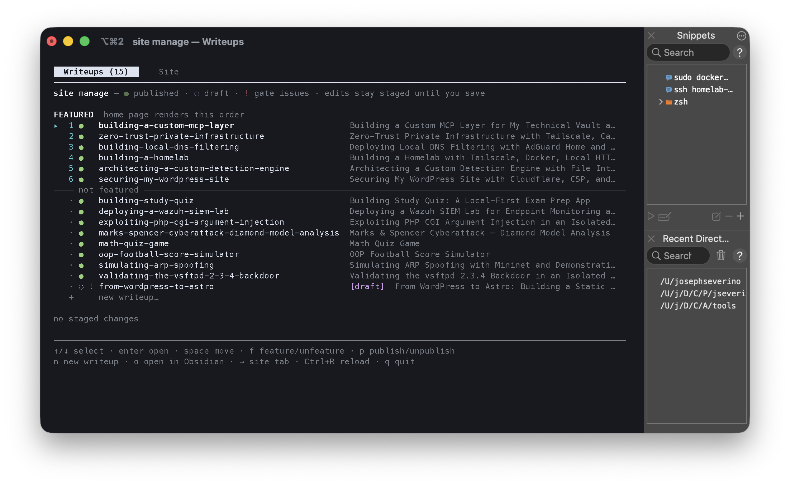
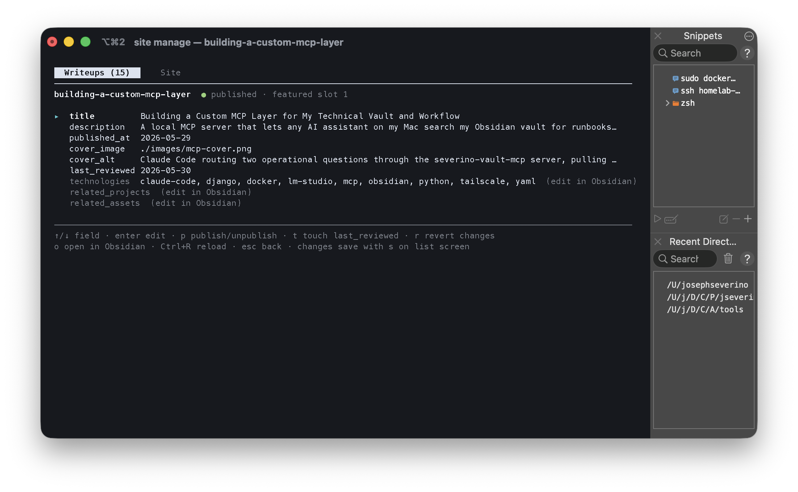
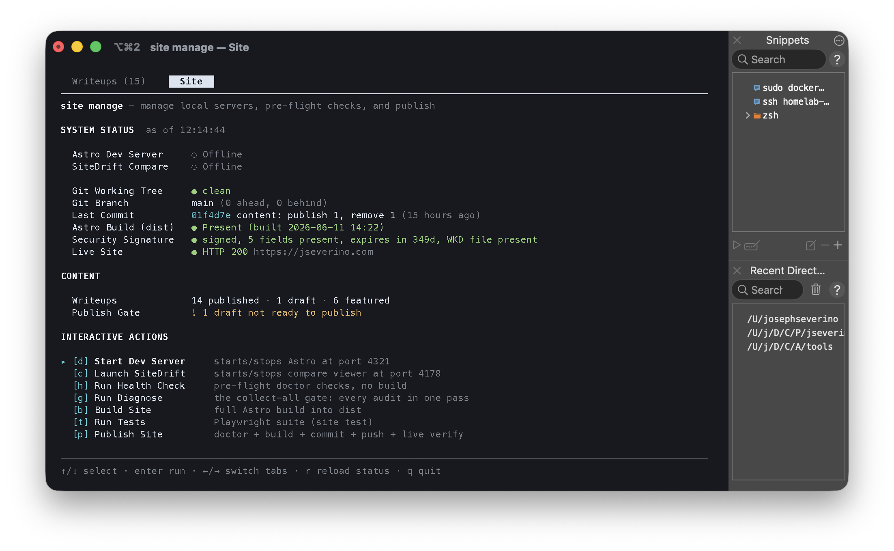

# Site CLI

`site` is this repository's publishing workflow: vault, repo snapshot, pull
request, production. It lives here, in [`bin/site.ts`](../bin/site.ts)
and [`bin/site/`](../bin/site/), on top of the same modules the npm scripts
use: the content sync ([`bin/content-sync/`](../bin/content-sync/)), the
content diff ([`bin/content-diff.ts`](../bin/content-diff.ts)), the shared
preflight ([`bin/lib/preflight.ts`](../bin/lib/preflight.ts)), and the
audit registry.

```sh
npm run site -- <command>     # or `npm link` once, then: site <command>
```

## Built for an agent caller

An AI agent runs these commands as often as a person does, so every
non-interactive command:

- answers `--help` and rejects unknown flags (exit 2);
- never prompts: a missing confirmation or argument is an error naming the
  flag;
- with `--json`, prints exactly one JSON document on stdout, progress on
  stderr:

  ```json
  { "ok": true, "command": "publish", "status": "pr-opened", "pr": "https://…", "next": "…" }
  { "ok": false, "command": "publish", "status": "failed",
    "error": { "message": "preflight failed: deps", "code": 3, "fix": "cd … && npm ci" } }
  ```

  The document's type is `SiteResult` in [`bin/site/types.ts`](../bin/site/types.ts),
  a union discriminated by `ok` and `command`, so a caller can import it.
  `site dev --json` sends Astro's own output to stderr; when Astro detects an
  agent and serves from a background process, the result carries
  `background: true` with the server's `url` and `pid`.
- with `--json`, sets `SITE_JSON=1` for every process the command starts.
  Under it, [`bin/build-static.ts`](../bin/build-static.ts) runs
  `astro build --json` and the astro-check audit runs `astro check --json`,
  so Astro logs one `{message,label,level}` JSON line per event.
  `@astrojs/check` still prints its diagnostics and the `Result (N files)`
  summary as text. Without `--json`, output is unchanged.
- with `--help --json` (or `site help [<command>] --json`), prints the usage
  as one `SiteHelp` document: usage, options, positional bounds, exit codes,
  and for `site help` every command with an `interactive` flag;
- exits `0` ok, `1` failed, `2` usage, `3` preflight (the environment is not
  ready), `4` timed out.

`site manage` is interactive and prints no result, so `site manage --json` is
a usage error (exit 2, with the JSON error document).

## Commands

| Command | Does |
| :--- | :--- |
| `site new <slug>` | Scaffold `05 Writeups/<slug>/` from the vault template (`published: false`) |
| `site validate [<slug>] [--draft]` | Resolve every reference, the frontmatter contract, and the catalog without writing (`sync-content --check`) |
| `site dev [--drafts] [--host <host>] [--port <port>]` | Astro dev server; drafts come from the gitignored `.cache/drafts` overlay, never the committed snapshot |
| `site publish [--dry-run] [--full] [--base <branch>] [--from <ref>]` | Preflight, a `content/<date>` branch from `origin/<base>` (default `main`, or `--from <ref>`) in a temporary worktree, sync, content diff, fast gate plus local-only audits (`--full`: the whole publish gate), a commit of exactly the declared outputs, push, open the PR. Never merges |
| `site land [<pr>] [--timeout <min>]` | Read the required checks from `main`'s ruleset and wait until each has reported and passed on the PR head, squash-merge, wait for the merge commit's Cloudflare Pages deploy, verify each published or edited writeup live (removed ones must 404), then `hq sync` if that CLI exists. Merges only when invoked |
| `site verify <slug> [--origin <url>]` | Live checks for one writeup (`bin/deploy-verify.ts --slug`), on production or on the deployment at `--origin` |
| `site status` | Repo, dependency, vault, build, and open content PR state |
| `site featured [<slug> <slot\|up\|down\|top\|bottom\|off>]` | Show or reorder the home-page featured list (renumbers `1..N`) |
| `site tech [<query>]` | Search the technology catalog |
| `site seo <page> [--result]` | Search-snippet preview from the last build |
| `site draft-alt <slug> [--apply]` | Draft `cover_alt` from the cover image (Claude API) |
| `site manage` | The interactive manager (below) |

The everyday loop: `site new`, write, `site validate <slug> --draft`, set
`published: true`, `site publish`, review the preview on the PR, `site land`.

## How publish behaves

- **The checkout stays as it is.** The branch is cut from `origin/main` (or
  the ref `--from` names) in a temporary worktree, whatever branch the
  checkout is on.
- **The commit is exactly what the sync owns.** The sync reports every file it
  wrote or removed (`--report`); publish stages that set and stops if anything
  else changed.
- **Fails in seconds.** Stale `node_modules`, an unfetchable remote,
  unauthenticated `gh`, an unreachable vault, or uncommitted tracked changes
  stop it before any work, with the fix.
- **Any `git`/`gh` failure is fatal**, with its stderr.
- **The PR body speaks in slugs**: published, edited, and removed writeups with
  their URLs; generated files as a count.

## How the layers relate

| Layer | Owns | Examples |
| :--- | :--- | :--- |
| npm scripts | build, audits, tests | `npm run diagnose`, `npm run sync:content` |
| `site` | the workflow across vault, repo, PR, and live site | `site publish`, `site land` |
| `severino-vault-mcp` | vault frontmatter writes with gate guarantees | `reorder-featured`, `apply-writeup-plan` |

Anything that writes writeup frontmatter (featured order, publish flags, field
edits in `site manage`) goes through the vault MCP's code path: sequential
`1..N` featured order and format-preserving YAML edits. The repo never writes
the vault except `site new`, which copies the template.

## `site manage`: the TUI

The one interactive command; it refuses to start without a terminal. One
full-screen terminal app over the whole publishing surface: a
**Writeups** tab for content state and a **Site** tab for operations. `←`/`→`
(or Tab) switch between them. Nothing on the Writeups tab is written until
you press `s`: changes are staged locally and then applied through the vault
MCP, so the TUI cannot produce a frontmatter state the publish gate would
not. The terminal window title tracks where you are and restores the shell's
title on exit.

### Writeups tab



The featured list renders in the exact order the home page does, with
everything else below the divider. Per row: `●` published, `◌` draft, `▲`/`▼`
staged publish flips, red `!` where the publish gate would reject, `*` staged
field edits. `space` picks a writeup up to move it (crossing the divider
features or unfeatures it), and `f`/`p` toggle featured/published in place.
The trailing `+` row (or `n`) scaffolds a new writeup via
`site new`.

### Writeup detail



`enter` on a row opens the writeup: edit `title`, `description`,
`published_at`, cover fields, and `last_reviewed` in place (`t` stamps
`last_reviewed` with today), with the writeup's gate issues (the same check `site validate --draft`
runs) listed under the fields. Relation fields (`technologies`, `related_projects`,
`related_assets`) are read-only here; they are edited in Obsidian, where
wiki-links resolve.

### Site tab



The operations dashboard: the Astro dev server, the git working tree, branch,
and last commit, build output freshness, the `security.txt` signature, a live
HTTP probe of the production site, content counts, and a publish-gate summary
that separates published writeups failing the gate (red) from drafts that are
not ready yet (yellow).

Status is gathered once and cached; the `as of` timestamp shows its age, and
`r` regathers it. Actions run inline: the TUI drops out of its
alternate screen, streams the real command output (`site status`,
`site validate`, `npm run diagnose`, `npm run build`, `npm run test:e2e`,
`site publish`), and returns on a keypress.


The dev server action is a toggle: the same key starts and stops it, and the
action label follows the live state. A stop sends SIGTERM to the process group
the start created (SIGKILL after three seconds) and touches nothing else: a
server on the port that this session did not start is named and left running.

## Configuration

Paths resolve through [`bin/lib/local-paths.ts`](../bin/lib/local-paths.ts)
(`VAULT_DIR`, `LIFE_VAULT_DIR`, `RESUME_ENGINE_DIR`, `VAULT_MCP_DIR`).
`SITE_CACHE_DIR` moves the sync caches and image encodes (default `.cache/`),
`SITE_CONTENT_ROOT` points the build or dev server at another content tree
(`site dev --drafts` sets it to `.cache/drafts`; `build:static` accepts only a
tree under `tests/fixtures` or that overlay), `SITE_JSON=1` switches Astro
to JSON logs (set by `--json`), and `SVMC_BIN` names the vault MCP binary
(default `severino-vault-mcp`).
