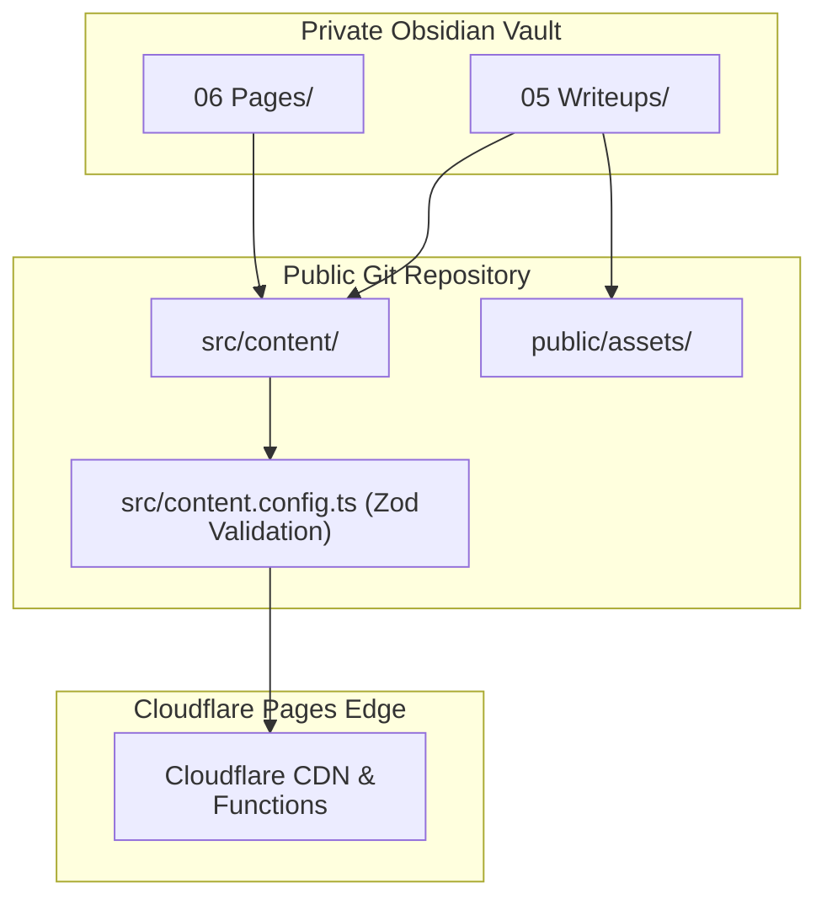

# Vault Workflow

The private Obsidian vault is the editorial system. This repository is the public build source. The sync step is the only bridge between them. This [operational shift](./WordPress-To-Astro-Migration.md#operational-shift) from a live-admin model to a private-first pipeline was a primary driver for the migration away from WordPress.




## Vault Layout

Pages live under:

```text
06 Pages/<slug>/index.md
```

Special page-level source files:

```text
06 Pages/_technology-groups.md
```

Portfolio writeups live under:

```text
05 Writeups/<slug>/index.md
05 Writeups/<slug>/images/
```

The folder slug becomes the public writeup slug.

## Publish Contract

Content is synced only when frontmatter includes:

```yaml
published: true
```

Unpublished content is skipped during normal sync. Draft preview is available through `npm run dev:drafts`, which is for local preview only.

## Metadata Boundary

The sync script uses allowlists. It writes only fields needed by the public site.

Public page fields:

- `title`
- `description`
- `path`
- `published`

Public writeup fields:

- `title`
- `description`
- `published`
- `published_at`
- `last_reviewed`
- `cover_image`
- `cover_alt`
- `technologies`
- `featured`
- `featured_order`

Vault-only fields such as internal IDs, system names, sensitivity labels, related projects, and operator notes are not copied.

## Site Identity

Site identity is repo configuration, not vault content. The display name, job title, summary, skills, social links, and navigation live in [`src/lib/site.ts`](../src/lib/site.ts), derived from the four instance primitives (`domain`, `owner`, `github`, `d1`) in [`src/lib/site-config.mjs`](../src/lib/site-config.mjs). The header, footer, and JSON-LD import that typed object directly, and `astro check` validates its shape at build time. This keeps the vault scoped to prose content; see [`Blueprint-Setup.md`](./Blueprint-Setup.md) for the per-instance values.

## Technology Taxonomy

`06 Pages/_technology-groups.md` syncs to [`src/content/technology-groups.md`](../src/content/technology-groups.md).

Writeups store technology slugs. The renderer resolves those slugs into labels and groups so display names stay consistent across the site.

## Assets

Writeup and page images should be referenced with local relative paths:

```md

```

The sync script:

- resolves the path against the source folder;
- refuses paths outside that folder;
- copies non-image assets as-is;
- optimizes image assets into responsive variants;
- writes the image manifest used by `Picture.astro`.

### What does NOT live in the vault

The vault is for editorial content and assets attached to a specific page or writeup. Site-wide chrome — favicons, web fonts, the default Open Graph image, downloadable documents like the resume PDF — lives in the repo under `public/assets/`, not in the vault. Those assets are referenced from vault markdown by their stable public URL:

```md
[Download Resume](/assets/docs/Joseph_Severino_Resume.pdf)
```

A vault page may link to a repo-managed asset, but the asset itself is not synced from anywhere — it is committed to the repo and hand-replaced when it changes. See [Architecture §11 Asset Organization](./Architecture.md#11-asset-organization) for the full convention (which bucket holds what, and the difference between vault-synced and repo-managed assets).

## Local Workflow

```sh
npm run sync:content
npm run check
npm run build:static
npm run publish:check
```

`npm run publish:check` is the preferred final local gate before committing generated content changes.

## Cloudflare Build Boundary

Cloudflare Pages builds from the committed repository. It does not read the private vault and does not run `sync:content`.

That means published content changes must be synced and committed before deploy.

## Related Docs

- [`docs/Architecture.md`](./Architecture.md)
- [`docs/WordPress-To-Astro-Migration.md`](./WordPress-To-Astro-Migration.md)
- [`docs/Authoring-Guide.md`](./Authoring-Guide.md)
- [`docs/SEO.md`](./SEO.md)
- [`docs/Accessibility.md`](./Accessibility.md)
- [`SECURITY.md`](../SECURITY.md)
