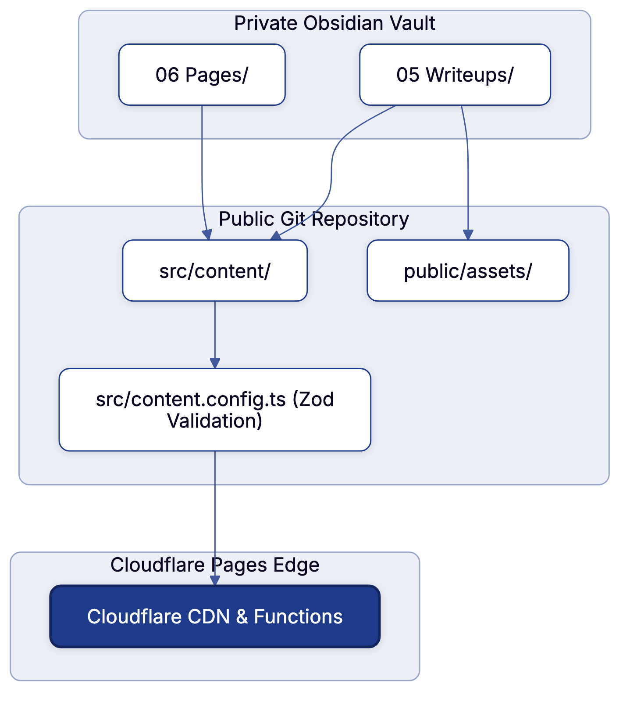

# Vault Workflow

The private Obsidian vault is the editorial system. This repository is the public build source. The sync step is the only bridge between them. The move from a live admin to this private-first pipeline is recorded in [WordPress to Astro](./WordPress-To-Astro-Migration.md#operational-shift).



<sup>Diagram source: [`docs/diagrams/vault-workflow.fig`](./diagrams/vault-workflow.fig),
pre-rendered with [`brand figure`](https://github.com/joeseverino/branding-engine).</sup>


## Vault Layout

Pages live under:

```text
06 Pages/<slug>/index.md
```

Special page-level source files:

```text
06 Pages/_technology-groups.md
```

Portfolio writeups live under:

```text
05 Writeups/<slug>/index.md
05 Writeups/<slug>/images/
```

The folder slug becomes the public writeup slug.

## Publish Contract

Content is synced only when frontmatter includes:

```yaml
published: true
```

Unpublished content is skipped during normal sync. Draft preview is available through `site dev --drafts` (`npm run dev:drafts`; see [`Site-CLI.md`](./Site-CLI.md)), which syncs into the gitignored `.cache/drafts` overlay the dev server reads through `SITE_CONTENT_ROOT`, so a draft never enters the committed snapshot. A gate audit fails if `src/content` ever holds `published: false`.

## Metadata Boundary

The sync writes only the fields [`contracts/content.v1.json`](../contracts/content.v1.json) marks `public`.

Public page fields:

- `title`
- `description`
- `intro`
- `path`
- `published`

Public writeup fields:

- `title`
- `description`
- `published`
- `published_at`
- `last_reviewed`
- `cover_image`
- `cover_alt`
- `technologies`
- `featured`
- `featured_order`

Vault-only fields such as internal IDs, system names, sensitivity labels, related projects, and operator notes are not copied.

## Site Identity

Site identity lives in repo configuration. The display name, job title, summary, skills, social links, and navigation live in [`src/lib/site.ts`](../src/lib/site.ts), derived from the five instance primitives (`domain`, `owner`, `github`, `d1`, `focus`) in [`src/lib/site-config.ts`](../src/lib/site-config.ts). The header, footer, and JSON-LD import that typed object directly, and `astro check` validates its shape at build time. This keeps the vault scoped to prose content; see [`Blueprint-Setup.md`](./Blueprint-Setup.md) for the per-instance values.

## Technology Taxonomy

`06 Pages/_technology-groups.md` syncs to [`src/content/technology-groups.md`](../src/content/technology-groups.md).

Writeups store technology slugs. The renderer resolves those slugs into labels and groups so display names stay consistent across the site.

## Assets

Writeup and page images should be referenced with local relative paths:

```md

```

The sync script:

- resolves the path against the source folder;
- refuses paths outside that folder;
- writes the image's master beside the synced document: at most 1600 pixels wide, sRGB, every metadata block removed, cached under `.cache/` (`SITE_CACHE_DIR` moves it);
- leaves the reference relative, so Astro's image pipeline encodes the AVIF and WebP variants at build time.

### What does NOT live in the vault

The vault is for editorial content and assets attached to a specific page or writeup. Site-wide chrome (favicons, web fonts, the default Open Graph image, downloadable documents) lives in the repo under `public/assets/`, not in the vault. Those assets are referenced from vault markdown by their stable public URL:

```md
[Download Resume](/assets/docs/joseph-severino-resume.pdf)
```

A vault page may link to a repo-managed asset, but the asset itself is not synced from anywhere: it is committed to the repo and replaced when it changes. Most are hand-replaced; the resume PDF is generated by the public [resume-engine](https://github.com/joeseverino/resume-engine) pipeline from the same canonical that drives the `/resume/` page, which lives in a second private vault (`Career/resume.md`) and is synced with per-line surface markers applied and contact frontmatter whitelisted away. See [Architecture §12 Asset Organization](./Architecture.md#12-asset-organization) for the full convention (which bucket holds what, and the difference between vault-synced and repo-managed assets).

## Local Workflow

```sh
npm run sync:content
npm run check
npm run build:static
npm run publish:check
```

`npm run publish:check` is the preferred final local gate before committing generated content changes.

The sync and the local-only audits find the vaults and sibling repos through [`bin/lib/local-paths.ts`](../bin/lib/local-paths.ts): an environment override, else a fixed path under the home directory, never a path relative to this checkout.

| Source | Override | Default |
| :--- | :--- | :--- |
| Labs vault | `VAULT_DIR`, then `NOTES_HOME` | `~/Documents/Code/Severino Labs` |
| Life vault | `LIFE_VAULT_DIR` | `~/Documents/Life` |
| resume-engine | `RESUME_ENGINE_DIR` | `~/Code/Assets/resume-engine` |
| severino-vault-mcp | `VAULT_MCP_DIR` | `~/Code/Assets/severino-vault-mcp` |

## Cloudflare Build Boundary

Cloudflare Pages builds from the committed repository. It does not read the private vault and does not run `sync:content`.

That means published content changes must be synced and committed before deploy. `site publish` does that on a fresh branch and opens the pull request; see [`Site-CLI.md`](./Site-CLI.md).

## Related Docs

- [`docs/Architecture.md`](./Architecture.md)
- [`docs/WordPress-To-Astro-Migration.md`](./WordPress-To-Astro-Migration.md)
- [`docs/Authoring-Guide.md`](./Authoring-Guide.md)
- [`docs/SEO.md`](./SEO.md)
- [`docs/Accessibility.md`](./Accessibility.md)
- [`SECURITY.md`](../SECURITY.md)
