# Validation Architecture (Full Reference)

This is the complete reference for how `jseverino.com` is verified. For a short,
visual tour start with [`tests/README.md`](./README.md); come here when you need
the exact assertion a check makes, the command that runs it, or how to fix a
failure.

Verification lives in two directories, plus orchestrators in `bin/` that sequence
them:

| Directory | What it holds | How it runs |
| :--- | :--- | :--- |
| [`tests/audits/`](./audits/) | Node scripts that read the source tree and assert invariants. No browser. | `node tests/audits/<name>.mjs` |
| [`tests/playwright/`](./playwright/) | Browser specs that drive the **built** site (`dist/` via the preview server). | `playwright test` |
| [`bin/`](../bin/) | Gate runners (`publish-check`, `release-check`, `diagnose`) and the post-push `deploy-verify`. | `npm run publish:check`, etc. |

## Naming: `audit-` vs `check-`

The prefix in `tests/audits/` is meaningful, not decorative:

- **`check-*`** asserts a binary invariant and **exits non-zero on violation**. These are gates.
- **`audit-*`** walks and **measures**, printing a report and only warning. There is exactly one (`audit-assets.mjs`), and it fails the build only when `STRICT_ASSET_AUDIT=1`.

---

## 1. The gate ladder

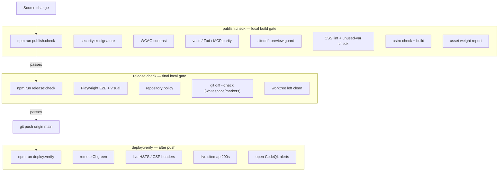

### The three gates

1. **`npm run publish:check`** — local build gate. Verifies content sync, CSS lint and the unused-variable check, design-token contrast, the signed `security.txt`, vault/Zod/MCP schema parity, the sitedrift preview guard, internal documentation integrity, then runs `astro check` and the production build, reports asset weight, and checks built-page SEO metadata.
2. **`npm run release:check`** — final local gate. Runs the cross-browser Playwright suite, the visual-regression snapshots, the repository-policy audit, and confirms the validation run did not mutate tracked or untracked files. **Requires macOS**, because the visual baselines are rasterized by macOS Chromium.
3. **`npm run diagnose`** — runs everything without short-circuiting, so one pass reports every problem in the worktree (console output plus a `.validation-report.md` on failure). See an [example report](./audits/examples/validation-report.md) captured from a failing run.
   - `npm run diagnose -- --fast` runs only the fast static checks (skips build + Playwright).
   - `npm run diagnose -- --no-tests` runs static checks and the build, skipping the browser tests.

### What you actually read

The design goal: a green run gives you nothing to read, and a red run gives you nothing *but* what to fix.

- **On success**, `diagnose` prints a terse list of `[PASS]` lines and deletes any stale report. There is nothing to act on. See a real run in [`examples/diagnose-pass.txt`](./audits/examples/diagnose-pass.txt): one command, the full surface (static audits, build, `check-seo`, the Playwright matrix including visual baselines, and an idempotence check), about 60 seconds.
- **On failure**, it does not stop at the first problem. It runs every check, then writes [`.validation-report.md`](./audits/examples/validation-report.md) with one row per failure and a concrete remediation action for each. The only output you ever read is the thing you need to fix.

---

## 2. Validation matrix

| Scope | Check | File / command | What it asserts |
| :--- | :--- | :--- | :--- |
| Security | [security.txt signature](#check-security-txtmjs) | `tests/audits/check-security-txt.mjs` | `security.txt` is PGP-signed, has required RFC 9116 fields, is not near expiry, and its `Encryption` URL resolves to a local WKD file. |
| Design | [color contrast](#check-contrastmjs) | `tests/audits/check-contrast.mjs` | Every text/background `--color-*` pairing meets WCAG AA (>= 4.5:1). |
| Parity | [schema parity](#check-vault-mcp-paritymjs) | `tests/audits/check-vault-mcp-parity.mjs` | Writeup frontmatter fields match across the vault schema, the Zod config, and the MCP server. |
| Routing | [preview guard](#check-sitedrift-previewmjs) | `tests/audits/check-sitedrift-preview.mjs` | The sitedrift review wrapper is present on preview branches and absent on `main`. |
| Styling | [unused CSS vars](#check-cssmjs) | `tests/audits/check-css.mjs` | No `--custom-property` is defined but never referenced. |
| Assets | [asset weight](#audit-assetsmjs) | `tests/audits/audit-assets.mjs` | Reports image count and total weight; warns past 1.5 MB (fails only when strict). |
| Policy | [repository policy](#check-repository-policymjs) | `tests/audits/check-repository-policy.mjs` | `.nvmrc` match, lockfile alignment, no committed secrets/build output/conflict copies, all Actions SHA-pinned. |
| Docs | [documentation integrity](#check-docsmjs) | `tests/audits/check-docs.mjs` | Every relative link and `npm run` reference in the engineering docs resolves to a real file or script. |
| E2E | [smoke + routing](#smokespects) | `tests/playwright/smoke.spec.ts` | Every URL in the sitemap returns 200; console stays clean; hero and header behave. |
| E2E | [mobile menu](#mobile-menuspects) | `tests/playwright/mobile-menu.spec.ts` | Drawer toggles, locks body scroll, closes on Escape and on link nav. |
| E2E | [CSS quality](#css-qualityspects) | `tests/playwright/css-quality.spec.ts` | Skip link, brand tokens, motion durations, reduced-motion, stable click targets, no narrow-viewport overflow. |
| E2E | [contact form](#contactspects) | `tests/playwright/contact.spec.ts` | HTML5 validation, Turnstile-gated error path, and a mocked successful submit + reset. |
| E2E | [private tooltips](#tooltipsspects) | `tests/playwright/tooltips.spec.ts` | Tailnet-link tooltips mount on click and dismiss on Escape / outside click. |
| Routes | [endpoints + 404](#routessinglespects) | `tests/playwright/routes.single.spec.ts` | `robots.txt`, `feed.xml`, and unknown-route 404 behavior the sitemap smoke test can't reach. |
| Images | [image resolution](#resourcessinglespects) | `tests/playwright/resources.single.spec.ts` | Every ``/`<source>` variant (AVIF/WebP/fallback) on key pages resolves. |
| Security | [new-tab links](#securitysinglespects) | `tests/playwright/security.single.spec.ts` | Every `target="_blank"` link carries `rel="noopener"`. |
| SEO | [page metadata](#check-seomjs) | `tests/audits/check-seo.mjs` | Every built page has title, canonical, og:title, og:image, and valid JSON-LD. |
| Visual | [visual regression](#5-visual-regression) | `tests/playwright/visual.spec.ts` | Page and component screenshots match committed macOS Chromium baselines. |
| Post-push | [deploy verification](#6-post-push-deploy-verification) | `bin/deploy-verify.mjs` | Remote CI status, prod dependency audit, live headers, live sitemap 200s, open CodeQL alerts. |
| CI | CodeQL | `.github/workflows/codeql.yml` | Semantic JS/TS scanning for injection, XSS, prototype pollution. |
| CI | dependency review | `.github/workflows/dependency-review.yml` | Blocks PRs adding high-severity advisories. |
| CI | OpenSSF Scorecard | `.github/workflows/scorecard.yml` | Supply-chain posture: branch protection, pinned actions, token scope. |

---

## 3. `tests/audits/` — local verifiers

### `check-security-txt.mjs`
Verifies `public/.well-known/security.txt`:
- It is PGP clear-signed and the signature verifies (`gpg --verify`, GOODSIG/VALIDSIG).
- All RFC 9116 required fields are present (`Contact`, `Encryption`, `Expires`, `Canonical`, `Policy`).
- `Expires` is a parseable future date at least 30 days out.
- `Canonical` matches the production URL and `Encryption` is a WKD URL whose key file exists under `public/.well-known/openpgpkey/hu/`.

Signing is a **separate** tool, [`bin/sign-security.mjs`](../bin/sign-security.mjs) (`npm run sign:security`), because it *writes* the file — verifiers never mutate. Both share the canonical strip/parse logic in [`src/lib/security-txt.mjs`](../src/lib/security-txt.mjs) so the signer and the checker can never disagree on what the signed body is.

### `check-contrast.mjs`
Reads `--color-*` declarations from [`src/styles/base.css`](../src/styles/base.css), computes relative luminance for the primary text/background pairings, and asserts each ratio meets WCAG 2.1 AA normal text (>= 4.5:1). New intentional pairs are registered in the `pairs` array.

### `check-vault-mcp-parity.mjs`
Asserts writeup frontmatter fields agree across three sources of truth:
1. the vault's `Frontmatter Schema.md`,
2. the Zod schema in [`src/content.config.ts`](../src/content.config.ts),
3. the `update_writeup_frontmatter` signature in the Python MCP server.

Any drift fails, so the authoring workflow can never silently desync.

### `check-sitedrift-preview.mjs`
Confirms the sitedrift review wrapper is injected when `CF_PAGES_BRANCH !== 'main'` and that production builds (`main`) ship as untampered Astro pages with `/__sitedrift` returning 404.

### `check-css.mjs`
Scans `src/styles/**/*.css` for `--variable: …` declarations and `var(--variable)` usages, and fails listing any custom property that is defined but never consumed. (Hard check — hence the `check-` prefix despite the historical "audit" name.)

### `audit-assets.mjs`
Walks `public/assets`, prints image count and total weight, and lists anything over `ASSET_WARN_MB` (default 1.5 MB). It only fails the build when `STRICT_ASSET_AUDIT=1`. This is the one true *audit*: it measures and reports rather than gating.

### `check-repository-policy.mjs`
Structural health:
- **Node version** matches [`.nvmrc`](../.nvmrc).
- **Lockfile** dependencies/versions align with `package.json`.
- **Clean tree** — no committed `.env` / `.dev.vars`, no `dist/` or `playwright-report/`, no iCloud conflict copies.
- **Action pinning** — every third-party GitHub Action is pinned to an immutable commit SHA, not a mutable tag.

### `check-docs.mjs`
Asserts internal documentation integrity across the engineering docs (`README.md`, `SECURITY.md`, `docs/**`, `tests/*.md`, and `AGENTS.md` when present):
- every relative markdown link and `` resolves to a real file,
- every `npm run <script>` reference names a script that exists in `package.json`.

Links inside fenced code blocks are treated as example syntax and skipped, so authoring examples like `` do not trip it; `npm run` references are validated everywhere, including command blocks. Site content under `src/content` is out of scope (it links to live routes and external URLs, not repo files). This is the check that catches a renamed script or moved file the moment a doc still points at the old name.

### `check-seo.mjs`
Runs **after the build**, over the emitted HTML in the local outDir (`dist.nosync`) or the CI outDir (`dist`). Every rendered page must carry a non-empty `<title>`, a canonical link, `og:title`, `og:image`, and only valid JSON-LD. Redirect stubs (`Astro.redirect`, detected by their `meta http-equiv="refresh"`) are skipped, since they are not indexable content. Wired into `publish:check` after the build and into `diagnose`'s post-build phase.

---

## 4. `tests/playwright/` — browser specs

The browser suite runs against the **compiled** static output (`dist/`) served by the preview server, never Astro's dev server. Config lives in [`playwright.config.ts`](../playwright.config.ts); `*mobile*` specs run on the mobile device projects, everything else on the desktop projects. Specs named `*.single.spec.ts` are engine-independent (route responses, file resolution, link attributes) and run only on `chromium-desktop` rather than the full matrix, so they cost one run, not six.

### `smoke.spec.ts`
- **Sitemap route health** — parses `sitemap-index.xml`, follows each sub-sitemap, and asserts a `200` for every `<loc>`. New writeups get coverage automatically.
- **Console health** — fails on browser console errors during navigation (with narrow allowances for preconnect noise).
- **Interactivity** — hero renders, header shadow toggles on scroll, primary links resolve.

```ts
test('every sitemap page returns 200', async ({ request }) => {
  const indexResponse = await request.get('/sitemap-index.xml');
  expect(indexResponse.status()).toBe(200);

  const sitemapUrls = [...(await indexResponse.text()).matchAll(/<loc>([^<]+)<\/loc>/g)]
    .map((match) => new URL(match[1]).pathname);

  for (const sitemapUrl of sitemapUrls) {
    const sitemapResponse = await request.get(sitemapUrl);
    expect(sitemapResponse.status()).toBe(200);
    const publicPaths = [...(await sitemapResponse.text()).matchAll(/<loc>([^<]+)<\/loc>/g)]
      .map((match) => new URL(match[1]).pathname);

    for (const path of publicPaths) {
      expect((await request.get(path)).status()).toBe(200);
    }
  }
});
```

### `mobile-menu.spec.ts`
- **Overlay logic** — the popover toggles open/closed, locks body overflow, and closes on `Escape`, on link navigation, or on a backdrop click.
- **Tap highlights** — touch targets suppress the title-only tap highlight on WebKit/Blink.

### `css-quality.spec.ts`
- **Accessibility** — the skip link focuses and becomes visible; forced-colors (high-contrast) outlines render.
- **Theme integrity** — brand token application, standard motion duration, and reduced-motion media queries that drop transitions to `0s`.
- **Interaction stability** — button/card click targets don't layout-shift between hover, press, and release.
- **Containment** — tables don't overflow a 320px viewport; images fill their boxes with `object-fit: cover`.

```ts
test('focus exposes the skip link', async ({ page }) => {
  await page.goto('/');
  const skipLink = page.locator('.skip-link');
  await skipLink.focus();
  await expect(skipLink).toBeFocused();
  await expect(skipLink).toBeVisible();
  await expect(skipLink).toHaveCSS('outline-style', 'solid');
});
```

```ts
test('buttons and cards keep a stable click target through press and release', async ({ page }) => {
  await page.goto('/404.html');
  const button = page.getByRole('link', { name: 'View Portfolio' });
  const buttonBox = await button.boundingBox();
  expect(buttonBox).not.toBeNull();

  await page.mouse.move(buttonBox!.x + buttonBox!.width / 2, buttonBox!.y + buttonBox!.height / 2);
  await expect(button).toHaveCSS('translate', '0px -2px'); // hover raises the button

  const raisedButtonBox = await button.boundingBox();
  await page.mouse.down();
  expect(await button.boundingBox()).toEqual(raisedButtonBox); // press must not shift it
  await page.mouse.up();
});
```

### `contact.spec.ts`
Drives the contact form with Cloudflare Turnstile in test-key mode (`PUBLIC_TURNSTILE_SITE_KEY=1x00000000000000000000AA`, set in `playwright.config.ts`). The `beforeEach` **aborts the Turnstile script** (`challenges.cloudflare.com`) so its always-pass test key cannot auto-solve mid-test; each test then controls the token state deterministically instead of racing the widget. Three paths: HTML5 required-field validation, the error shown when no token is present, and a fully mocked successful submit. The success case intercepts `POST /api/contact`, asserts the payload, and overrides `FormData.prototype.get` so the form reads a stubbed Turnstile token even though no real challenge ran:

```ts
test('submits successfully with simulated turnstile and mocked api', async ({ page }) => {
  await page.route('/api/contact', async (route) => {
    const payload = route.request().postDataJSON();
    expect(payload.name).toBe('Jane Doe');
    expect(payload.turnstileToken).toBe('mocked-turnstile-token');
    await route.fulfill({ status: 200, contentType: 'application/json', body: JSON.stringify({ ok: true }) });
  });

  await page.locator('#contact-name').fill('Jane Doe');
  await page.locator('#contact-email').fill('jane@example.com');
  await page.locator('#contact-message').fill('Mocked message content');

  // Stub the Turnstile token the form reads off the FormData on submit.
  await page.evaluate(() => {
    const originalGet = FormData.prototype.get;
    FormData.prototype.get = function (name) {
      if (name === 'cf-turnstile-response') return 'mocked-turnstile-token';
      return originalGet.call(this, name);
    };
  });

  await page.locator('.contact-submit').click();

  const status = page.locator('.contact-status');
  await expect(status).toHaveAttribute('data-kind', 'success');
  await expect(status).toContainText('Thanks, your message has been sent');
  await expect(page.locator('#contact-name')).toHaveValue('');
});
```

### `tooltips.spec.ts`
Verifies the private-link tooltips used for tailnet-only services. Clicking a `[data-private-tooltip]` trigger mounts a `.private-tooltip` (`role="status"`) into the DOM; `Escape` and an outside click each remove it:

```ts
test('renders, positions, and dismisses tooltips correctly', async ({ page }) => {
  await page.goto('/portfolio/building-a-custom-mcp-layer/');
  const trigger = page.locator('[data-private-tooltip]');

  await expect(page.locator('.private-tooltip')).toHaveCount(0);
  await trigger.click();
  await expect(page.locator('.private-tooltip')).toBeVisible();
  await expect(page.locator('.private-tooltip')).toContainText('this site only works on my tailnet');

  await page.keyboard.press('Escape');
  await expect(page.locator('.private-tooltip')).toHaveCount(0);
});
```

### `routes.single.spec.ts`
The endpoint and error routes the sitemap smoke test can't reach: `robots.txt` (200, plain text, contains the `Sitemap:` line), `feed.xml` (200, XML, valid RSS with at least one `<item>`), and an unknown route (returns a real `404` status and renders the not-found page).

### `resources.single.spec.ts`
Guards the responsive-image pipeline. On an image-light and an image-heavy page it collects every URL the page references (`` plus `<picture><source srcset>`, i.e. all the AVIF/WebP/fallback variants) and asserts each one resolves. A missing generated variant fails here, where the sitemap smoke test (which only watches the console) would miss it.

### `security.single.spec.ts`
Asserts every `target="_blank"` link across the key pages carries `rel="noopener"`, so an opened tab cannot reach back through `window.opener`.

### Running the suite

```sh
npm run test:e2e                 # functional specs across Chromium, Firefox, WebKit
npm run test:e2e:ui              # interactive Playwright runner
npm run test:e2e:visual          # visual regression (macOS Chromium)
npm run test:e2e:visual:update   # re-baseline after an intentional design change
```

The HTML report after a full run:

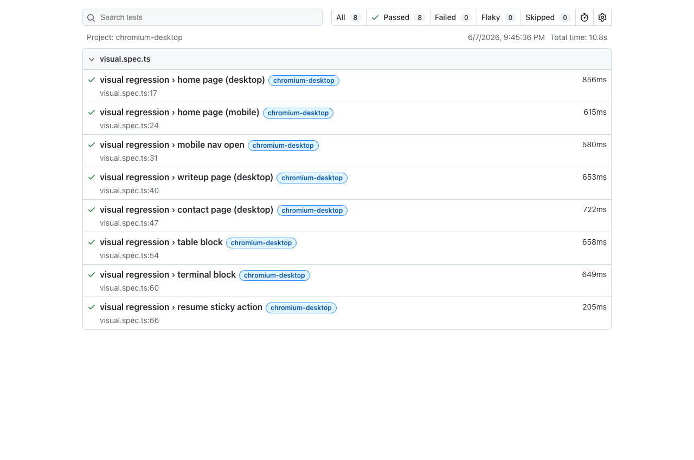

---

## 5. Visual regression

`visual.spec.ts` captures whole-page and element-level screenshots and diffs them against committed baselines. To avoid cross-platform font and rasterization noise, **baselines are owned by Chromium on macOS**. Failed runs write `expected`, `actual`, and `diff` images to `test-results/`; CI uploads them with the HTML report.

The committed PNGs under [`playwright/visual.spec.ts-snapshots/`](./playwright/visual.spec.ts-snapshots/) are review artifacts, not transient output — they are meant to be eyeballed in the diff before any visual change merges.

### What each baseline protects

| Baseline | Protects |
| :--- | :--- |
| Home (desktop / mobile) | Hero, header, primary CTAs, above-the-fold spacing; mobile narrow layout independently. |
| Mobile nav open | Overlay, close control, link spacing, body lock, viewport coverage. |
| Writeup (desktop) | Article typography, metadata, hero treatment, reading width, sticky action. |
| Contact (desktop) | Form layout, field spacing, labels, copy, submit control. |
| Table / terminal block | High-risk authored blocks isolated so a page change can't hide block regressions. |
| Resume action | The fixed, centered resume action relative to page content. |

### Committed baselines

These are the PNGs that ship in the repo and that every run is measured against.

**Home — desktop and mobile** (narrow layout is protected independently):


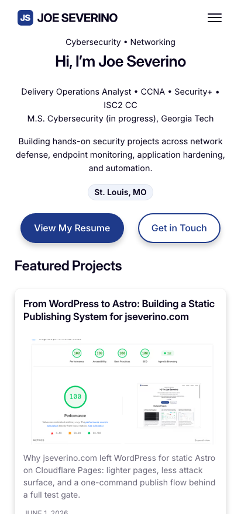

**Mobile navigation open** — overlay, close control, link spacing, body lock:

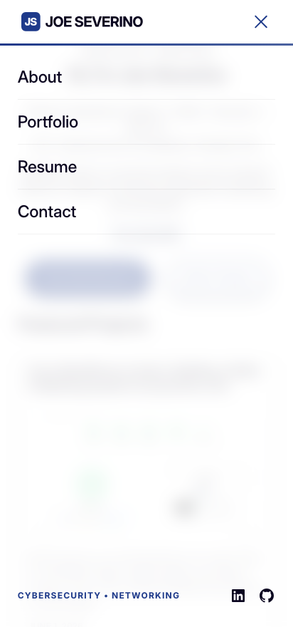

**Portfolio writeup** and **contact**:

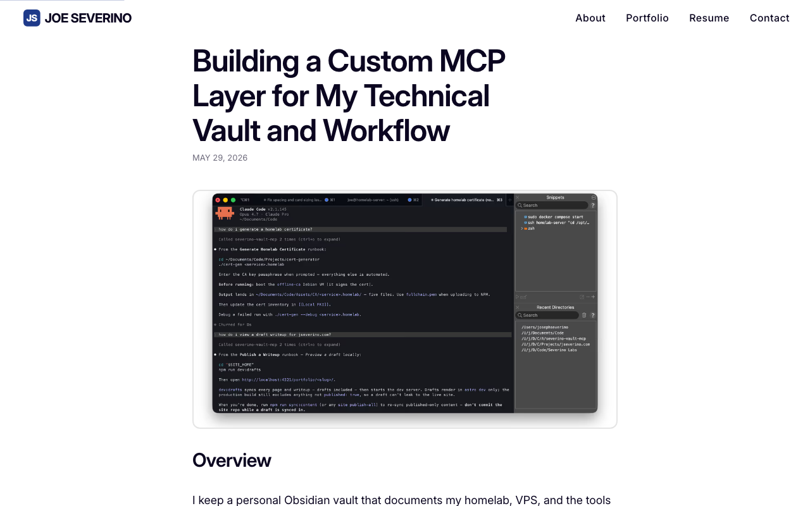

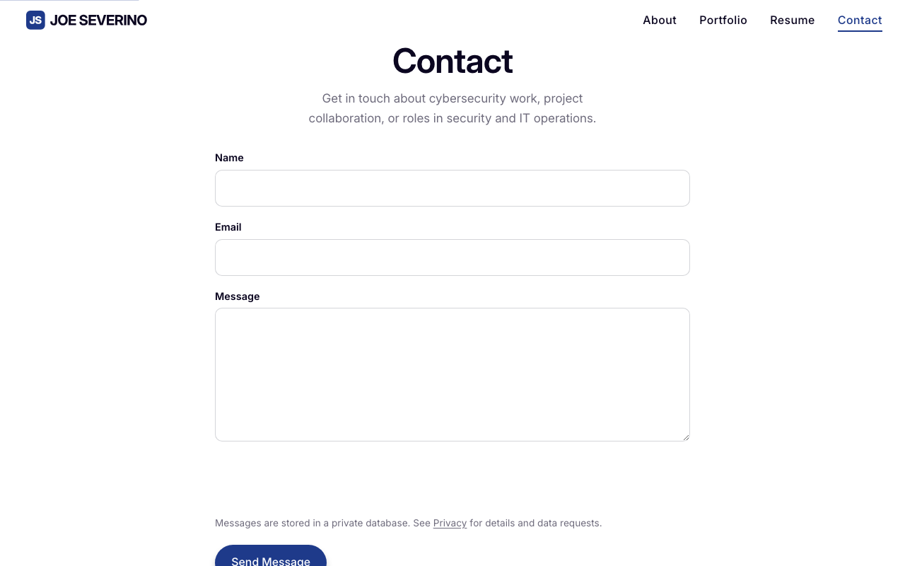

**Structured content** — table and terminal blocks isolated so a page-level change can't mask a block regression:

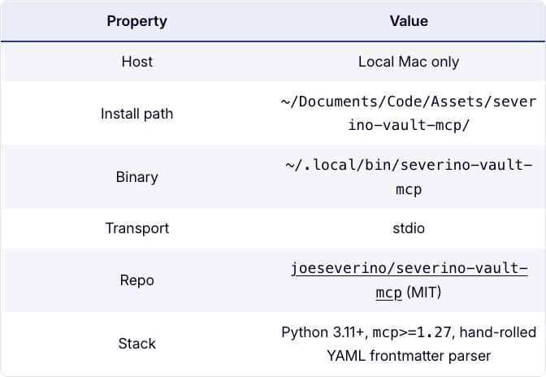


**Resume action** — the fixed, centered action relative to page content:

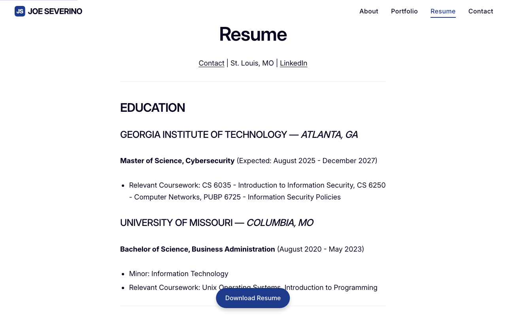

### Diff example: header height shift
Triggered by changing the header height (e.g. `3.6rem` → `8rem`), pushing the whole layout down:

| Expected | Actual | Diff |
| :---: | :---: | :---: |
| 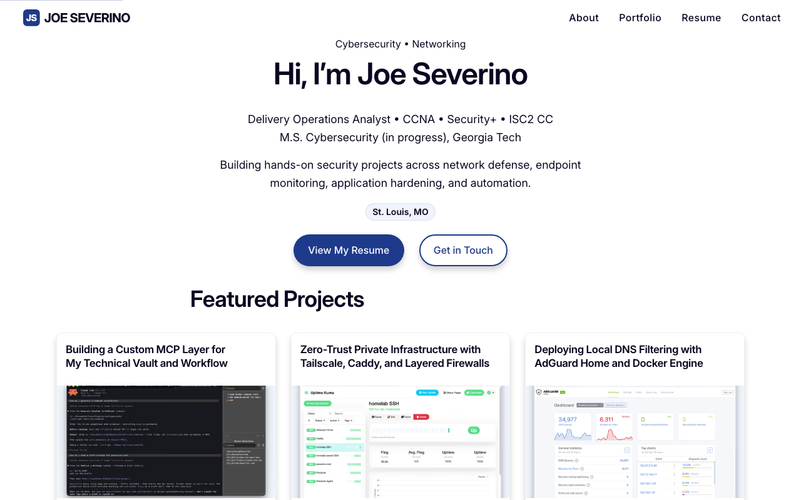 | 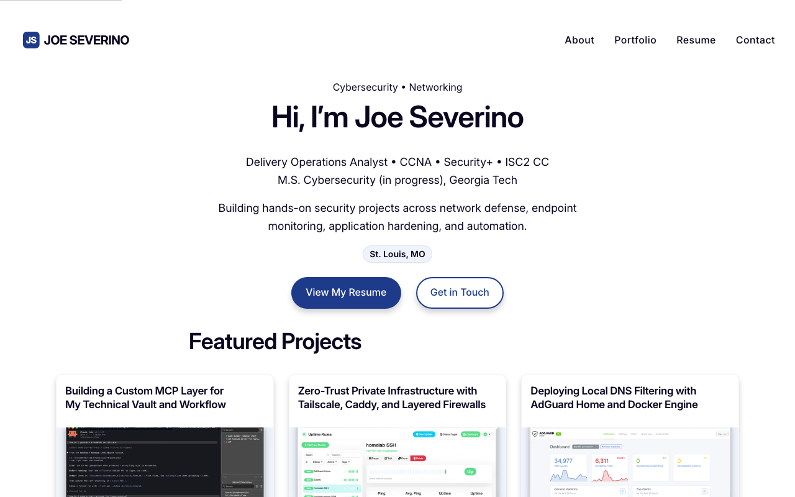 | 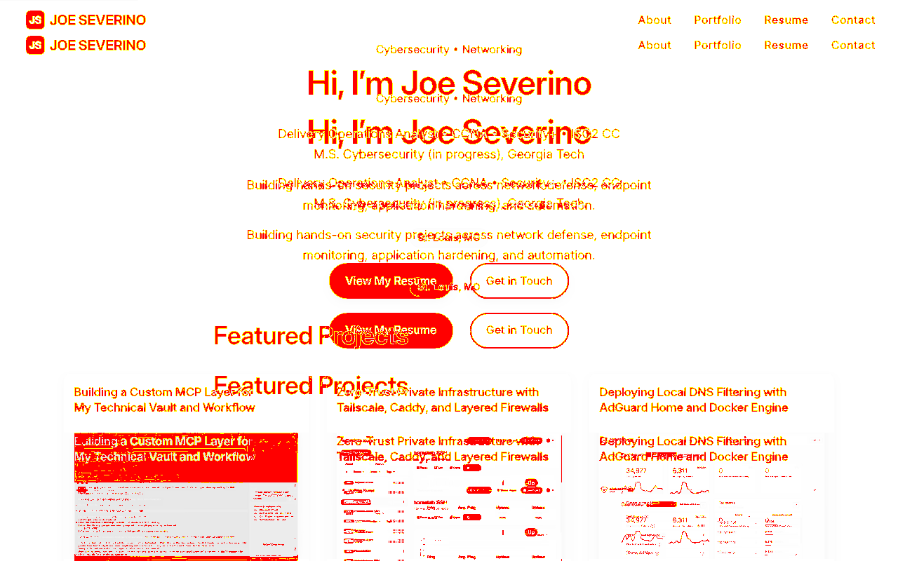 |

### Diff example: terminal block color shift
Triggered by changing the terminal block background (`#0b1220` → `#3b82f6`):

| Expected | Actual | Diff |
| :---: | :---: | :---: |
| 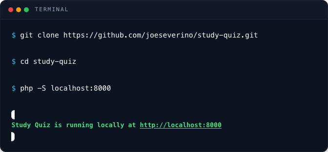 | 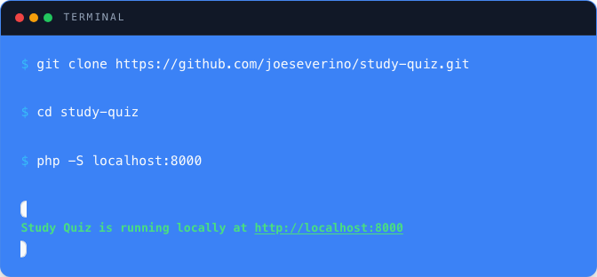 | 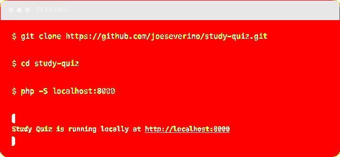 |

### Functional failure capture
When a functional assertion fails, Playwright screenshots the page at the moment of failure. Below: the contact form's error state when submitted without solving Turnstile.

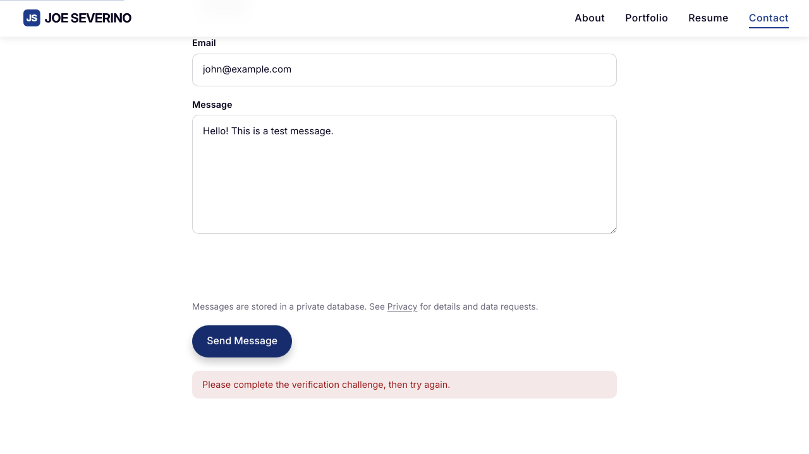

---

## 6. Post-push deploy verification

`bin/deploy-verify.mjs` (`npm run deploy:verify`) runs after a push to `main` and confirms the live deploy matches the local gate:

1. **Repo state** — local branch is `main`, clean, fully pushed.
2. **Production dependency audit** — `npm audit --omit=dev --audit-level=high`.
3. **Remote checks** — polls the GitHub API until `build`, `e2e`, `visual`, CodeQL, and Cloudflare Pages report success.
4. **Live response audit** against `https://jseverino.com/`:
   - HSTS present with `includeSubDomains`,
   - CSP active with no `'unsafe-inline'` script source,
   - `reporting-endpoints` / `report-uri` routed to `/api/csp-report`,
   - sitedrift proxy paths return `404`.
5. **Live sitemap traversal** — HEAD every route from `sitemap-index.xml`; zero dead links.
6. **CodeQL** — no open scanning alerts.

---

## 7. Remote CI/CD workflows

| Workflow | Trigger | Enforces |
| :--- | :--- | :--- |
| `codeql.yml` | push/PR to `main`, weekly | Semantic JS/TS scan (XSS, prototype pollution, insecure regex). Open alerts block merge. |
| `dependency-review.yml` | every PR | Fails PRs that add/update a dependency with a high-severity advisory. |
| `scorecard.yml` | weekly / branch-protection change | OpenSSF supply-chain posture; SARIF uploaded to code scanning. |
| `workflow-lint.yml` | workflow changes | `actionlint` on Action YAML; also gates SHA-pinning. |
| `link-check.yml` | docs changes | `lychee` audits internal/external markdown links. |
| `lighthouse.yml` | key routes | Performance / a11y / SEO / best-practice baselines. |
| `security-txt-expires.yml` | schedule | Opens an issue when `security.txt` nears expiry (runs `check-security-txt.mjs`). |

---

## 8. Troubleshooting

### Contrast check fails (`npm run check:contrast`)
A CSS variable change dropped a text/background ratio below 4.5:1. Adjust the tokens in `src/styles/base.css`, or register an intentional new pair in the `pairs` array of `tests/audits/check-contrast.mjs`.

### Parity check fails (`npm run check:parity`)
A frontmatter field changed in `src/content.config.ts` but not in the vault schema or the MCP server. Update the vault's `Frontmatter Schema.md` and the `update_writeup_frontmatter` signature. Never hand-edit synced frontmatter in `src/content/`.

### `check:css` fails
A `--custom-property` is defined but never used. Remove the declaration, or add the `var(--…)` usage that justifies it.

### `check:security` fails
`security.txt` is unsigned, expired, near expiry, or its WKD key file is missing. Bump `Expires`, run `npm run sign:security`, and commit the re-signed file plus any key change.

### `check:docs` fails
A doc links to a renamed or removed file, or references an `npm run` script that no longer exists. Fix the reference at the reported `file:line`, or restore the target. If the offender is example syntax, make sure it sits inside a fenced code block.

### Visual mismatch
If unintended, fix the layout/CSS. If it's an approved redesign:
1. `npm run test:e2e:visual:update -- --project=chromium-desktop` on macOS,
2. inspect the image diff under `tests/playwright/visual.spec.ts-snapshots/` to confirm only the expected pixels changed,
3. commit the updated baselines **with** the styling change.

### Unpinned GitHub Action
A workflow uses a tag (`@v4`) instead of a SHA. Replace it with the commit SHA for that release, e.g. `uses: actions/checkout@11bd71901bbe5b1630ceea73d27597364c9af683 # v4.2.2`.

### iCloud conflict copies remain
Working in an iCloud-synced tree created numbered duplicates (`home 2.md`). Run `npm run clean:conflicts`; for source files, merge by hand and delete the duplicate.
