# Validation Architecture (Full Reference)

This is the complete reference for how `jseverino.com` is verified. For a short,
visual tour start with [`tests/README.md`](./README.md); come here for the exact
assertion a check makes, the command that runs it, or how to fix a failure.

Verification lives in three directories, plus orchestrators in `bin/` that sequence
them:

| Directory | What it holds | How it runs |
| :--- | :--- | :--- |
| [`tests/audits/`](./audits/) | Node scripts that read the source tree and assert invariants. No browser. | `node tests/audits/<name>.ts` |
| [`tests/unit/`](./unit/) | `node:test` specs for pure logic: the Markdown DSL, the Cloudflare functions, the gate harness, registry shape, and registry/docs parity. No browser, no build. | `npm run test:unit` |
| [`tests/playwright/`](./playwright/) | Browser specs that drive the **built** site (`dist/` via the preview server). | `playwright test` |
| [`tests/edge/`](./edge/) | Request specs against the build served through `wrangler pages dev`. | `npm run test:edge` |
| [`bin/`](../bin/) | Gate runners (`gate-check`, `publish-check`, `release-check`, `diagnose`) and the post-deploy `deploy-verify`. | `npm run publish:check`, etc. |

### The audit registry

Which audits exist, what each runs, its phase (before/after the build), and which
gates run it are all defined once in [`tests/audits/registry.ts`](./audits/registry.ts).
Every gate derives its check list from that one module:

- **`gate:check`** runs the `gate` audits (fast pre-build invariants, collect-all; the first step of CI's `build` job).
- **`publish:check`** runs the `publish` audits (the fast build gate).
- **`diagnose`** runs the `diagnose` audits (everything: the complete gate).
- **`release:check`** runs `publish:check` plus the `release` audits.

So a check added to the registry is automatically picked up by every gate that
claims it; a check can never live in one gate but be silently missing from
another. Each gate keeps its own *orchestration* (ordering around sync/build,
fail-fast vs. collect-all, the report); the registry holds the inventory, the
gates hold the run logic. The [audit table](#2-audits) is generated from the registry, so what
it says each audit asserts is what runs.

The gates also share one process harness, [`bin/lib/run.ts`](../bin/lib/run.ts):
every spawned check gets a timeout (a hung Playwright run fails instead of
stalling the gate forever; per-check overrides live in the registry's `timeout`
field), a missing binary surfaces as a failed check rather than a hang, and
output is either captured for terse summaries or streamed live.

## Naming: `audit-` vs `check-`

The prefix in `tests/audits/` says how a script fails:

- **`check-*`** asserts a binary invariant and **exits non-zero on violation**. These are gates.
- **`audit-*`** walks and **measures**, printing a report. There is exactly one (`audit-assets.ts`); the gates run it with `STRICT_ASSET_AUDIT=1`, so an image over 1.5 MB fails the gate. Run it bare (`node tests/audits/audit-assets.ts`) for a warn-only report.

## Adding a new audit

Six steps; the gates enforce most of them, so a missed step fails a gate:

1. **Write the script** in `tests/audits/check-<thing>.ts`. Resolve paths from `siteRoot` in [`src/lib/site-root.ts`](../src/lib/site-root.ts), never the cwd, and list files with `walkFiles()` from [`src/lib/walk.ts`](../src/lib/walk.ts) rather than a private recursion. Post-build audits get the built pages from `builtPages()` in [`lib.ts`](./audits/lib.ts) rather than re-resolving the outDir; the outDir decision itself is single-sourced in [`src/lib/build-output.ts`](../src/lib/build-output.ts). End through `finish()`: exit non-zero on violation, or print one summary line in the aligned form `ok␣␣␣␣␣␣␣<detail>`, which the gates show as the audit's status (`summarize()` in [`bin/lib/audit-summary.ts`](../bin/lib/audit-summary.ts)). Export the pure logic and guard the run with `import.meta.main` so a unit spec can import it.
2. **Register it** in [`registry.ts`](./audits/registry.ts): id, label, name, the one-line `asserts`, phase (`pre-build`/`post-build`), exec, gates, the one-line `fix`. The unit suite ([`registry.test.ts`](./unit/registry.test.ts)) validates the entry shape and that the exec target exists; every gate picks the audit up from here automatically.
3. **Add the npm script** in `package.json` for targeted runs. The naming rule: the script suffix matches the registry `label` (`check:<label>`, e.g. label `edge` → `check:edge`), while the file name stays long and descriptive (`check-functions-parity.ts`).
4. **Add the help line** in [`bin/help.ts`](../bin/help.ts); an uncategorized script shows under "Other" with a nudge until it is categorized.
5. **Regenerate the docs**: `npm run sync:docs` writes the audit's rows in the gate-coverage and audit tables here; the gate refuses a stale copy. Add a `### check-<thing>.ts` section below only when there is more to say than the one-line `asserts`, and add the label to the expected gate output in [`docs/Release-Checklist.md`](../docs/Release-Checklist.md) if it runs under `publish` ([`docs-parity.test.ts`](./unit/docs-parity.test.ts) checks that).
6. **Run `npm run diagnose -- --fast`**: `check-docs` verifies the new links, script references, and paths, and the unit suite verifies the registry entry.

---

## 1. The gate ladder

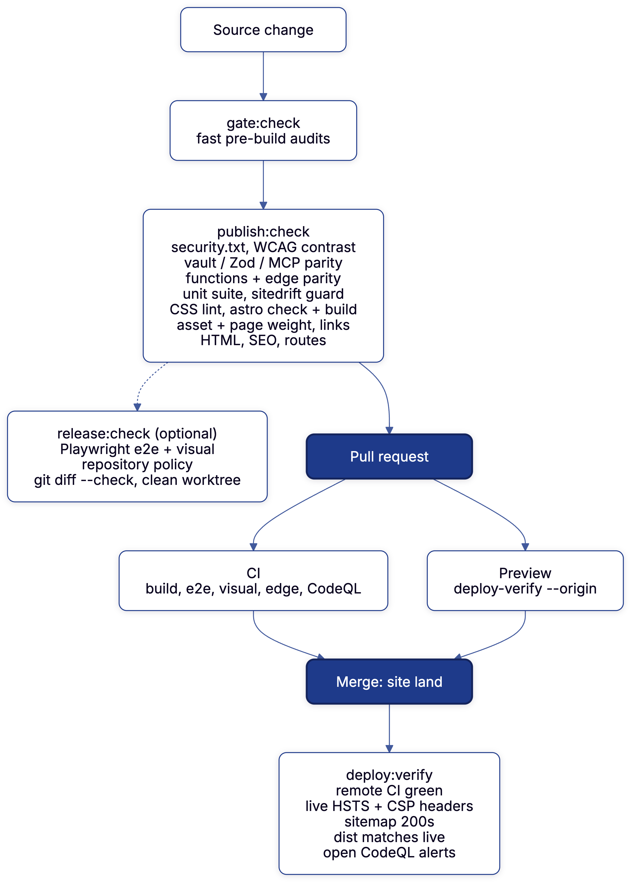

<sup>Diagram source: [`docs/diagrams/gate-ladder.mmd`](../docs/diagrams/gate-ladder.mmd),
pre-rendered with [`diagram`](https://github.com/joeseverino/tools/blob/main/bin/diagram).</sup>

### The gates

Which audits each gate runs is the [gate coverage](#gate-coverage) table below.

0. **`npm run gate:check`**: the fast pre-build invariants, collect-all, concurrently. CI runs it as the first step of the `build` job, so a misaligned lockfile or an unpinned action fails in seconds.
1. **`npm run publish:check`**: local build gate. Content sync, the pre-build audits, the production build (`build:static`), then the post-build audits, stopping at the first failure. The same gate runs in CI on every push (the `build` job in `ci.yml`, with `--no-sync`), so the green badge proves what a green local run proves, except the vault parity check, which verifies sources that only exist on the authoring machine (registry `localOnly`) and is skipped where `CI` is set.

   `npm run publish:check:ci` ([`bin/ci-rehearsal.ts`](../bin/ci-rehearsal.ts)) rehearses the runner's conditions locally (`CI=1` plus a scratch GPG keyring seeded only from the committed WKD key), so a gate that leans on authoring-machine state (the vault, the personal keyring) fails here instead of after a push.
2. **`npm run release:check`**: final local gate. Runs `publish:check`, then the `release` audits (the browser suites, the edge runtime suite, repository policy), and confirms the validation run did not mutate tracked or untracked files. **Requires macOS**, because the visual baselines are rasterized by macOS Chromium.
3. **`npm run diagnose`**: runs everything without short-circuiting, so one pass reports every problem in the worktree (console output plus a `.validation-report.md` on failure). See an [example report](./audits/examples/validation-report.md) captured from a failing run.
   - `npm run diagnose -- --fast` runs only the fast static checks (skips build + Playwright).
   - `npm run diagnose -- --no-tests` runs static checks and the build, skipping the browser tests.
   - `npm run -s diagnose -- --json` emits a single JSON document (per-check status, durations, rerun commands for failures) instead of console output, for agents and CI to consume without parsing prose.

   `diagnose` builds once via `build:static` and passes `PREBUILT=1` to the
   Playwright and edge suites, so both serve that artifact instead of
   rebuilding it inside their `webServer`.

### Gate coverage

Which registry audit runs under which gate, rendered from [`tests/audits/registry.ts`](./audits/registry.ts) by `npm run sync:docs` (the gate refuses a stale copy):

<!-- generated:start gate-coverage (npm run sync:docs) -->

| Audit | Label | Phase | gate | publish | diagnose | release |
| :--- | :--- | :--- | :--- | :--- | :--- | :--- |
| Source Integrity | `source` | pre-build | ✓ | ✓ | ✓ |  |
| No Duplicated Code | `dupes` | pre-build | ✓ | ✓ | ✓ |  |
| Generated Contract Projections | `contracts` | pre-build |  | ✓ | ✓ | ✓ |
| Image Manifest Coverage | `manifest` | pre-build | ✓ | ✓ | ✓ |  |
| No Drafts in the Snapshot | `drafts` | pre-build | ✓ | ✓ | ✓ |  |
| Security Signatures | `security` | pre-build |  | ✓ | ✓ |  |
| WCAG Color Contrast | `contrast` | pre-build |  | ✓ | ✓ |  |
| Vault/MCP/Code Parity (authoring machine only) | `parity` | pre-build |  | ✓ | ✓ |  |
| TypeScript Type Check | `types` | pre-build | ✓ | ✓ | ✓ |  |
| Functions/Schema Parity | `edge` | pre-build |  | ✓ | ✓ |  |
| Sitedrift Preview Guard | `preview` | pre-build |  | ✓ | ✓ |  |
| Unit Test Suite | `unit` | pre-build |  | ✓ | ✓ |  |
| Generated Documentation Blocks | `docs-sync` | pre-build | ✓ | ✓ | ✓ |  |
| Docs Reference Integrity | `docs` | pre-build | ✓ | ✓ | ✓ |  |
| Stylelint CSS Check | `css-lint` | pre-build | ✓ | ✓ | ✓ |  |
| CSS Unused Variables | `css-vars` | pre-build |  | ✓ | ✓ |  |
| Astro Compiler Diagnostics | `check` | pre-build |  | ✓ | ✓ |  |
| Repository Policy | `repo-policy` | pre-build | ✓ |  | ✓ | ✓ |
| Playwright Browser Revisions | `browsers` | pre-build |  |  | ✓ | ✓ |
| Git Formatting/Conflicts | `git-diff` | pre-build |  |  | ✓ | ✓ |
| Asset Weight Limits | `assets` | post-build |  | ✓ | ✓ |  |
| Internal Link Integrity | `links` | post-build |  | ✓ | ✓ |  |
| Page Weight Budget | `weight` | post-build |  | ✓ | ✓ |  |
| Structural HTML | `html` | post-build |  | ✓ | ✓ |  |
| Functions Routing | `routes` | post-build |  | ✓ | ✓ |  |
| SEO Metadata | `seo` | post-build |  | ✓ | ✓ |  |
| Edge Runtime Tests | `edge-runtime` | post-build |  |  | ✓ | ✓ |
| Playwright Browser Tests | `e2e` | post-build |  |  | ✓ | ✓ |
| Visual Regression (fixture content) | `visual` | post-build |  |  | ✓ | ✓ |

<!-- generated:end gate-coverage -->

### What there is to read

- **On success**, `diagnose` prints a terse list of `[PASS]` lines and deletes any stale report. See a real run in [`examples/diagnose-pass.txt`](./audits/examples/diagnose-pass.txt): one command, the full surface (static audits, build, `check-seo`, the Playwright matrix including visual baselines, and an idempotence check), about 60 seconds.
- **On failure**, it does not stop at the first problem. It runs every check, then writes [`.validation-report.md`](./audits/examples/validation-report.md) with one row per failure, a concrete remediation action, and the exact command to rerun that check alone. Long failure output (a cross-browser Playwright run can produce thousands of lines) is clipped to its head and tail in the report; the rerun command shows the full output.

---

## 2. Audits

Every registry audit: what a pass guarantees, how to run it alone, and the fix
for a failure. Rendered from [`tests/audits/registry.ts`](./audits/registry.ts)
by `npm run sync:docs`; edit the registry, and this table follows.

<!-- generated:start audit-reference (npm run sync:docs) -->

| Audit | Asserts | Run alone | Fix |
| :--- | :--- | :--- | :--- |
| [Source Integrity](./audits/check-source-integrity.ts) | Every .ts file under bin/, src/, and tests/ parses, and no file declares the same top-level function twice. | `node tests/audits/check-source-integrity.ts` | Fix the reported parse error or duplicate top-level function. The duplicate is legal JavaScript, so no compiler step reports it. |
| [No Duplicated Code](./audits/check-duplication.ts) | No run of 30+ identical tokens over 3+ lines appears twice in the tracked TypeScript (40/4 between two test files). | `node tests/audits/check-duplication.ts` | Two places carry the same run of code. Extract one shared primitive (bin/lib, src/lib, functions/lib, or a test helper) and import it from both; generated files and test content are exempt in tests/audits/check-duplication.ts. |
| [Generated Contract Projections](./audits/check-contract-projections.ts) | Each generated projection (brand tokens, contact OpenAPI, content schemas, embed CSS, edge site identity) matches what its script derives from the canonical source. | `node tests/audits/check-contract-projections.ts` | Regenerate the stale projection with the `run:` command it names (sync:tokens, sync:contract, sync:contact-openapi, make:embed, or sync:edge-site); generated artifacts must exactly match their canonical inputs. |
| [Image Manifest Coverage](./audits/check-image-manifest.ts) | Every synced png/jpg under public/assets/writeups and public/assets/pages has a manifest entry, and every variant and fallback an entry names exists. | `node tests/audits/check-image-manifest.ts` | A synced image under public/assets has no entry in src/lib/image-manifest.json, or the manifest names a variant that does not exist. Run `npm run sync:content` and commit everything it wrote; a production build refuses a synced image without an entry. |
| [No Drafts in the Snapshot](./audits/check-no-drafts.ts) | No document under src/content is `published: false`. | `node tests/audits/check-no-drafts.ts` | A `published: false` document is in src/content, where it would deploy. Re-run `npm run sync:content`; preview drafts with `site dev --drafts`, which writes to the gitignored overlay. |
| [Security Signatures](./audits/check-security-txt.ts) | `security.txt` is clear-signed with a valid signature, carries the RFC 9116 fields, expires at least 30 days out, and its Encryption URL names a committed WKD key. | `npm run check:security` | Run `npm run sign:security` to sign or re-sign `public/.well-known/security.txt` with the security@ key. |
| [WCAG Color Contrast](./audits/check-contrast.ts) | Every registered text/background color pairing in the tokens meets WCAG AA (4.5:1). | `npm run check:contrast` | The colors come from severino-brand through `npm run sync:tokens` (the token block in `src/styles/tokens.css` is generated): change the color upstream or the pairing in `src/styles/`. Register a new intended pair in `pairs` in `tests/audits/check-contrast.ts`. |
| [Vault/MCP/Code Parity](./audits/check-vault-mcp-parity.ts) | The content contract, its generated Astro schema, the MCP projection, and the `site manage` TUI agree on one fingerprint. | `npm run check:parity` | Edit `contracts/content.v1.json`, run `npm run sync:contract` (it also writes the projection in the vault MCP checkout), and commit every generated projection in both repos. Never hand-edit a projection. |
| TypeScript Type Check | Every TypeScript file compiles under one strict program, and functions/ again under the Workers lib. | `npm run -s typecheck` | Run `npm run typecheck`. One strict program covers bin/, src/, tests/, and the configs; functions/ compiles again under the Workers lib, with Cloudflare-runtime globals declared in `functions/cloudflare.d.ts`. `astro check` covers the .astro files. |
| [Functions/Schema Parity](./audits/check-functions-parity.ts) | The contact contract projects exactly to the API Shield schema, the handler consumes the contract, and every INSERT names only columns db/schema.sql defines. | `npm run check:edge` | The contact handler, `db/contact-openapi.json` (API Shield), and `db/schema.sql` (D1) disagree on fields, limits, or INSERT columns. Change all three together. |
| [Sitedrift Preview Guard](./audits/check-sitedrift-preview.ts) | The sitedrift review wrapper is present on preview branches and absent on main. | `npm run check:preview` | The sitedrift wrapper must be present on preview branches and absent on main. Check the build-static sitedrift step and `tests/audits/check-sitedrift-preview.ts`. |
| Unit Test Suite | The `node:test` specs under tests/unit pass. | `npm run test:unit` | Run `npm run test:unit` and reconcile the code or the expected behavior in the failing spec under `tests/unit/`. |
| Generated Documentation Blocks | The generated blocks in docs/Commands.md and tests/ARCHITECTURE.md match bin/help.ts and this registry. | `node bin/sync-docs.ts --check` | A generated block in docs/Commands.md or tests/ARCHITECTURE.md lags its source (the groups in bin/help.ts, the entries in tests/audits/registry.ts). Run `npm run sync:docs` and commit the result. |
| [Docs Reference Integrity](./audits/check-docs.ts) | Every relative link and its #anchor, `npm run` script, and backticked repo path in the engineering docs resolves. | `npm run check:docs` | A doc links to a renamed/removed file or heading, names an npm script that no longer exists, or backticks a repo path git neither tracks nor ignores. Fix the reference at the reported file:line, or restore the target; an intentional example path goes in EXAMPLE_PATHS in tests/audits/check-docs.ts. |
| Stylelint CSS Check | Stylelint passes over src/styles. | `npm run lint:css` | Fix the reported Stylelint violations under `src/styles/`. |
| [CSS Unused Variables](./audits/check-css.ts) | Every CSS custom property defined in src/styles is referenced somewhere in src/. | `npm run check:css-vars` | Remove the reported custom property from `src/styles/`, or add the `var(...)` use that needs it. |
| Astro Compiler Diagnostics | `astro check` reports no errors or warnings in the .astro files, content schemas, or imports. | `ASTRO_TELEMETRY_DISABLED=1 NODE_OPTIONS=--max-old-space-size=4096 npx astro check --minimumSeverity warning --tsconfig tsconfig.astro.json` | Run `npm run check` and fix the reported .astro type, content-schema, or import error. |
| [Repository Policy](./audits/check-repository-policy.ts) | Node, npm, and lockfile pins agree; no secrets or build output tracked; stylesheet rules hold; TypeScript only, no explicit any or unexplained suppressions; actions SHA-pinned, runners fixed, every job time-boxed. | `npm run check:repo-policy` | Fix the reported rule: the Node and npm pins (.nvmrc, engines, packageManager), the lockfile, a tracked forbidden file, a stylesheet rule, a JavaScript file or explicit any, or a workflow (SHA pin, fixed runner, timeout-minutes). |
| [Playwright Browser Revisions](./audits/check-playwright-browsers.ts) | The installed Chromium, Firefox, and WebKit revisions match the locked Playwright package. | `node tests/audits/check-playwright-browsers.ts` | Install the browser revisions required by the lockfile with `npx playwright install chromium firefox webkit`. |
| Git Formatting/Conflicts | `git diff --check` finds no whitespace errors or conflict markers. | `git diff --check` | Fix trailing whitespace, missing end-of-lines, or unresolved git conflict markers reported by `git diff --check`. |
| [Asset Weight Limits](./audits/audit-assets.ts) | No image under public/assets exceeds 1.5 MB (strict mode); reports the count and total weight. | `STRICT_ASSET_AUDIT=1 node tests/audits/audit-assets.ts` | Shrink the reported image under `public/assets/` below 1.5 MB. Run the audit without `STRICT_ASSET_AUDIT=1` for a warn-only report. |
| [Internal Link Integrity](./audits/check-links.ts) | Every internal href, src, poster, and srcset in the built HTML resolves to an emitted file or a Function route. | `npm run check:links` | A built page references an internal URL or asset the build did not emit. Fix the link at the reported page, or restore the missing target. |
| [Page Weight Budget](./audits/check-page-weight.ts) | Per-page HTML (150 KB), CSS (75 KB), and total JS (25 KB) stay within budget. | `npm run check:weight` | A page or bundle exceeded its byte budget (per-page HTML, total CSS, total JS). Reduce it, or raise the budget in `tests/audits/check-page-weight.ts` in its own commit. |
| [Structural HTML](./audits/check-html.ts) | No built page repeats an id, every  has alt, and no literal `::name` directive reaches the page text. | `npm run check:html` | A built page repeats an id attribute, ships an  without alt, or shows a literal `::name` directive. Fix the component or content at the reported page; decorative images use alt="", never a missing attribute; a leaked directive is a typo or one the page's renderer does not support. |
| [Functions Routing](./audits/check-routes.ts) | public/_routes.json stays inside the Pages limits and excludes no built HTML page or Function route; every exclude is a prefix with its static fallback page or an exact built file, and carries the static CSP in _headers. | `npm run check:routes` | public/_routes.json excludes a path that serves HTML or a Function route, breaks the Pages limits, or lacks its static CSP or fallback page. Narrow the exclude (an excluded HTML page ships without the middleware CSP), add the static CSP rule for it to public/_headers, and rebuild so bin/build-static.ts writes the fallback. |
| [SEO Metadata](./audits/check-seo.ts) | Every built page has a title, canonical link, og:title, og:image, and only valid JSON-LD; zero pages fails. | `npm run check:seo` | A built page is missing a `<title>`, canonical link, og:title/og:image, or has invalid JSON-LD. Check `src/components/SeoHead.astro` and the page frontmatter. |
| Edge Runtime Tests | Served through `wrangler pages dev`: the CSP nonce, the _headers rules, _routes.json, a real 404, the contact refusals, and security.txt parity. | `ASTRO_TELEMETRY_DISABLED=1 npx playwright test -c playwright.edge.config.ts --reporter=line` | The build failed under the Cloudflare runtime (`wrangler pages dev`): a rule in public/_headers, the CSP middleware, or a Pages Function regressed. Run `npm run test:edge`; `npm run edge:serve` reproduces the served responses by hand. |
| Playwright Browser Tests | The functional Playwright specs pass across the browser matrix. | `ASTRO_TELEMETRY_DISABLED=1 npx playwright test --reporter=line` | Run `npx playwright test --ui` to debug the functional specs. |
| Visual Regression (fixture content) | Screenshots of the fixture build match the committed macOS Chromium baselines. | `ASTRO_TELEMETRY_DISABLED=1 npx playwright test -c playwright.visual.config.ts --reporter=line` | Inspect expected/actual/diff under test-results/visual/. If the layout or a fixture changed on purpose, re-baseline with `npm run test:e2e:visual:update` and review every PNG in the diff. |

<!-- generated:end audit-reference -->

### Other checks

The unit specs, the browser specs, and the checks that run outside the gates.

| Scope | Check | File / command | What it asserts |
| :--- | :--- | :--- | :--- |
| Logic | [markdown DSL](#the-unit-layer) | `tests/unit/markdown-dsl.test.ts` | Every custom block (`::terminal`, `::figure`, `::table`, `::split`, `::buttons`, `::button`, `::cta`, `::center`, `::hero`), inline rewrite, image directive, writeup-chrome transform, and the raw-HTML allow-list renders to the expected HTML. |
| Logic | [contact API](#the-unit-layer) | `tests/unit/contact-api.test.ts` | The contact function's validation ladder, honeypot, Turnstile verification (hostname and action included), rate limit, and D1 persistence paths behave, with D1 and siteverify stubbed. |
| Logic | [CSP report API](#the-unit-layer) | `tests/unit/csp-report-api.test.ts` | Both CSP report formats normalize correctly; foreign-document/extension noise is dropped; batches cap at ten; D1 failures return 500. |
| Logic | [middleware](#the-unit-layer) | `tests/unit/middleware.test.ts` | HTML responses get a fresh per-request CSP nonce, `report-to` plus the `report-uri` fallback Firefox needs, the report-only policy staging `'strict-dynamic'` under the same nonce, and reporting endpoints; non-HTML and bodyless responses pass through untouched. |
| Logic | [content sync](#the-unit-layer) | `tests/unit/content-sync.test.ts` | Reference collection and rewriting (titles, angle brackets, link definitions, raw `src=`), the path-traversal guard, the writer's declared outputs and prune, the document rows, the education join, and a whole sync and `--check` against a temp vault. |
| Logic | [publish/land orchestration](#the-unit-layer) | `tests/unit/site-orchestration.test.ts` | `site publish` and `site land` against a bare git remote and a stubbed `gh`: a stale checkout is irrelevant, nothing-changed stops, gh failures are fatal, `--dry-run` leaves no branch, and only declared outputs are committed. |
| Logic | [manage TUI](#the-unit-layer) | `tests/unit/site-manage.test.ts` | `site manage` refuses to start without a terminal, and its frames render the featured order, drafts, and gate issues. |
| Logic | [gate harness](#the-unit-layer) | `tests/unit/run-harness.test.ts`, `tests/unit/run-audits.test.ts` | The shared runner resolves (never hangs) on non-zero exits, missing binaries, and timeouts; audits run concurrently, report in registry order, honor locks, and append `jsonArgs` only under `SITE_JSON=1`. |
| Logic | [audit logic](#the-unit-layer) | `tests/unit/check-docs.test.ts`, `tests/unit/check-html.test.ts`, `tests/unit/duplication.test.ts` | The pure halves of the docs, HTML, and duplication audits: path extraction and resolution, directive leaks, clone detection. |
| Logic | [registry shape](#the-unit-layer) | `tests/unit/registry.test.ts` | Registry entries are well-formed: unique ids, known gates/phases, exec targets that exist, every audit visible to `diagnose`. |
| Docs | [registry/docs parity](#the-unit-layer) | `tests/unit/docs-parity.test.ts` | Every audit is documented here, every publish label appears in the release checklist, every script in `docs/Commands.md`, every gate command in the README. |
| E2E | [smoke + routing](#smokespects) | `tests/playwright/smoke.spec.ts` | Console stays clean; hero, navigation, and header behave in every engine. |
| E2E | [mobile menu](#menumobilespects) | `tests/playwright/menu.mobile.spec.ts` | Drawer toggles, locks body scroll, closes on Escape and on link nav. |
| E2E | [CSS quality](#css-qualityspects) | `tests/playwright/css-quality.spec.ts` | Skip link, brand tokens, motion durations, reduced-motion, stable click targets, no narrow-viewport overflow. |
| E2E | [contact form](#contactspects) | `tests/playwright/contact.spec.ts` | HTML5 validation, Turnstile-gated error path, and a mocked successful submit + reset. |
| E2E | [portfolio software tab](#portfolio-softwaresinglespects) | `tests/playwright/portfolio-software.single.spec.ts` | The Writeups/Software tab toggle (default, swap, `#software` deep-link, both panels in the DOM), a published package's badge + install line + copy button, the More-projects list, and writeup cross-links. |
| Routes | [routes + 404](#routessinglespects) | `tests/playwright/routes.single.spec.ts` | Every URL in the sitemap returns 200, plus `robots.txt`, `feed.xml`, and unknown-route 404 behavior. |
| Security | [new-tab links](#securitysinglespects) | `tests/playwright/security.single.spec.ts` | Every `target="_blank"` link carries `rel="noopener"`. |
| A11y | [axe sweep](#a11ysinglespects) | `tests/playwright/a11y.single.spec.ts` | Key page archetypes pass the full axe WCAG A/AA ruleset in a real browser. |
| Post-deploy | [deploy verification](#post-deploy-verification) | `bin/deploy-verify.ts` | Remote CI status, prod dependency audit, live headers and HSTS, live sitemap 200s, nonce parity and rotation, cache rules, the contact gate, `security.txt` parity, open CodeQL alerts. The response predicates are the edge suite's, from `src/lib/edge-expectations.ts`. |
| CI | CodeQL | `.github/workflows/codeql.yml` | Semantic JS/TS scanning for injection, XSS, prototype pollution. |
| CI | dependency review | `.github/workflows/dependency-review.yml` | Blocks PRs adding high-severity advisories. |
| CI | npm audit | `.github/workflows/npm-audit.yml` | The weekly lockfile audit, with accepted advisories in `security/audit-allowlist.json`. |
| CI | OpenSSF Scorecard | `.github/workflows/scorecard.yml` | Supply-chain posture: branch protection, pinned actions, token scope. |

---

## 3. `tests/audits/`: audit detail

The audits whose rules need more than the one line in the [audit table](#2-audits).

### `check-security-txt.ts`
Verifies `public/.well-known/security.txt`:
- It is PGP clear-signed and the signature verifies (`gpg --verify`, GOODSIG/VALIDSIG).
- All RFC 9116 required fields are present (`Contact`, `Encryption`, `Expires`, `Canonical`, `Policy`).
- `Expires` is a parseable future date at least 30 days out.
- `Canonical` matches the production URL and `Encryption` is a WKD URL whose key file exists under `public/.well-known/openpgpkey/hu/`.

Signing is a **separate** tool, [`bin/sign-security.ts`](../bin/sign-security.ts) (`npm run sign:security`), because it *writes* the file and verifiers never write. Both share the canonical strip/parse logic in [`bin/lib/security-txt.ts`](../bin/lib/security-txt.ts) so the signer and the checker read the signed body the same way.

### `check-contrast.ts`
Expands the ordered [`src/styles/base.css`](../src/styles/base.css) entrypoint, reads its `--color-*` declarations, computes relative luminance for the primary text/background pairings, and asserts each ratio meets WCAG 2.1 AA normal text (>= 4.5:1). New intentional pairs are registered in the `pairs` array.

### `check-vault-mcp-parity.ts`
Asserts that [`contracts/content.v1.json`](../contracts/content.v1.json) is the
one content-field definition and that its generated Astro schema, MCP package
projection, contract-derived CLI/tool schemas, and the `site manage` TUI agree on
the same fingerprint and capabilities. Any stale projection or reintroduced
hardcoded field table fails the gate.

### `check-image-manifest.ts`
Every png/jpg the sync wrote under `public/assets/writeups` and `public/assets/pages` has an entry in [`src/lib/image-manifest.json`](../src/lib/image-manifest.json), and every AVIF/WebP variant and fallback an entry names exists on disk. A production build refuses a synced image without an entry ([`src/lib/images.ts`](../src/lib/images.ts)), so this catches a half-committed sync before the build does.

### `check-no-drafts.ts`
No markdown document under `src/content` carries `published: false`. The committed snapshot is what deploys; `site dev --drafts` writes drafts to the gitignored `.cache/drafts` overlay instead.

### TypeScript type check

`npm run typecheck`: `tsc -p .` then `tsc -p functions`. Every script in the repo is TypeScript that Node runs directly by stripping types, so this is the only place types are checked. The root [`tsconfig.json`](../tsconfig.json) is one strict program over `bin/`, `src/`, `tests/`, and the configs (`noUncheckedIndexedAccess`, `exactOptionalPropertyTypes`, and `erasableSyntaxOnly`, so nothing needs a build step). [`functions/tsconfig.json`](../functions/tsconfig.json) compiles the Pages functions again under the `WebWorker` lib with no Node types; the Cloudflare-runtime globals that lib doesn't know (`HTMLRewriter`, the sitedrift module) are declared in [`functions/cloudflare.d.ts`](../functions/cloudflare.d.ts), deliberately narrower than `@cloudflare/workers-types`. `astro check` reads [`tsconfig.astro.json`](../tsconfig.astro.json), which narrows the same options to `src/`, for the `.astro` files.

### `check-duplication.ts`

Tokenizes every tracked `.ts` file with the TypeScript scanner (so formatting and comments never matter, and import lines are skipped) and fails on any run of 30 identical tokens spanning 3 or more lines that appears twice; between two test files the bar is 40 tokens over 4 lines, since specs repeat a little setup. The fix is always one shared primitive both sites import. Generated projections (`src/generated/`, `functions/generated/`) and the fixture content are exempt; nothing else is. It is a small audit rather than a jscpd dependency: the scanner is already here through `typescript`, and the rule fits in one file.

### `check-functions-parity.ts`

The deploy-side sibling of the content parity check. It verifies that
[`contracts/contact.v1.json`](../contracts/contact.v1.json) exactly projects to
[`db/contact-openapi.json`](../db/contact-openapi.json), that the Pages Function
consumes the contract rather than restating its fields and limits, and that
every handler `INSERT` names only columns the D1 schema defines with matching
bind counts. A stale API Shield document or persistence mismatch fails before
deployment.

### `check-sitedrift-preview.ts`
Confirms the sitedrift review wrapper is injected when `CF_PAGES_BRANCH !== 'main'` and that production builds (`main`) ship as untampered Astro pages with `/__sitedrift` returning 404.

### `check-css.ts`
Scans `src/styles/**/*.css` for `--variable: …` declarations, collects `var(--variable)` usages from the stylesheets **and** from every `.astro` and `.ts` file under `src/` (a token consumed only in a template or script still counts), and fails listing any custom property that is defined but never consumed.

### `audit-assets.ts`
Walks `public/assets`, prints image count and total weight, and lists anything over `ASSET_WARN_MB` (default 1.5 MB). The registry runs it with `STRICT_ASSET_AUDIT=1`, so an oversized image fails `publish:check`/`diagnose`; run it bare (`node tests/audits/audit-assets.ts`) for a warn-only report. It is still the one *audit* by construction (it measures and reports), but the gates opt into strict so weight regressions can't slip through.

### `check-repository-policy.ts`
Structural health:
- **Node version** matches [`.nvmrc`](../.nvmrc) on major.minor (patch drift is allowed, so a Node security patch doesn't block the gates); `engines.node` and the exact `packageManager` npm pin agree with it.
- **Lockfile** is version 3 and its root entry aligns with `package.json`.
- **Clean tree**: no committed `.env` / `.dev.vars`, no `dist/` or `playwright-report/`.
- **Stylesheets**: component styles live in `src/styles` modules, and no literal color appears outside the generated token block.
- **No client-side HTML sinks** (`innerHTML` and kin) and no Astro View Transition hooks.
- **Public sources** (`src/content`, `src/pages`, `src/components`) carry no private-link markers or internal hostnames.
- **Workflows**: every third-party action is pinned to a commit SHA, no runner uses a floating `-latest` label, and every job sets `timeout-minutes`.
- **No ambiguous module siblings**: no two tracked files share a basename with both a JS-like (`.mjs`/`.js`) and a TS-like (`.ts`/`.mts`) extension. Such a pair resolves differently in Vite (which tries `.mjs` first) than in the TS compiler (which tries `.ts` first), so a build can break while `astro check` passes. Declaration files (`foo.d.ts`) keep a distinct stem and are fine.
- **TypeScript only**: no tracked `.js`/`.mjs`/`.cjs` outside the explicit allow-list in the audit (empty today; an entry needs a tool that cannot read TypeScript).
- **No explicit `any`**: a `: any`, `<any>`, or `as any` in code (comments aside) fails; `unknown` and narrowing say what the code knows.
- **No unexplained suppressions**: no `@ts-ignore` or `@ts-nocheck` in any `.ts` or `.astro` file; `@ts-expect-error` must carry a reason.

### `check-playwright-browsers.ts`

Fails before the build and browser matrix when any Playwright executable path is missing. The remediation installs the lockfile-matched Chromium, Firefox, and WebKit revisions once instead of discovering the mismatch after a long partial run.

### `check-docs.ts`
Asserts internal documentation integrity across the engineering docs (`README.md`, `SECURITY.md`, `CONTRIBUTING.md`, `docs/**`, `tests/*.md`, and `AGENTS.md` when present):
- every relative markdown link and `` resolves to a real file, and a `#fragment` on a link to a markdown file (or an in-page link) names a heading there, slugged as GitHub does, or an explicit `id`,
- every `npm run <script>` reference names a script that exists in `package.json`,
- every backticked repo path resolves. A token in inline code is a repo path when its first segment is a top-level entry (`bin/site.ts`, `docs/`, `dist/`); it resolves when `git ls-files` tracks it or a file under it, or when `git check-ignore` reports it ignored (generated output such as `dist/` and `.cache/`). A placeholder (`tests/audits/<name>.ts`, `src/styles/**/*.css`) is checked up to the directory before it. Intentional example paths go in `EXAMPLE_PATHS` in the audit.

Links and paths inside fenced code blocks are example syntax and skipped; `npm run` references are validated everywhere, including command blocks. Site content under `src/content` is out of scope (it links to live routes and external URLs, which this audit does not resolve).

### `check-links.ts`
Runs **after the build**. The sitemap smoke test proves every page exists; this proves every internal reference *inside* the pages resolves. It walks the emitted HTML, collects `href`/`src`/`poster`/`srcset` references (including same-origin absolute URLs like the canonical link), and asserts each one maps to a file the build emitted. Routes served by Pages functions (`/api/…`, `/cdn-cgi/…`) are allowlisted. A typo'd in-content link fails here, before deploy, instead of surfacing in the live traversal after.

### `check-page-weight.ts`
Runs **after the build**. The deterministic complement to the CI Lighthouse run. Three byte budgets over the emitted output: per-page HTML (150 KB), CSS (75 KB: the stylesheet every page inlines, plus any external `.css`), and total JS (25 KB), set from the measured baseline (~115 KB worst page carrying the ~36 KB inlined stylesheet, ~5 KB JS) with headroom. A failure means a page, the stylesheet, or the scripts grew past budget. Raising a budget is a commit to `tests/audits/check-page-weight.ts`.

### `check-html.ts`
Runs **after the build**. Structural assertions over every emitted page, statically: no `id` value appears twice on a page (duplicate ids silently break fragment links, label association, and `aria-*` references), every `` carries an `alt` attribute (empty `alt` is valid and marks a decorative image; a missing attribute is always an authoring bug), and no literal `::name` directive reaches the page text. A leaked directive is a typo (`::termnial`) or a directive the page's renderer does not support; text inside `<pre>`, `<code>`, `<script>`, `<style>`, and comments is ignored, and `a::b` or `::1` never counts. The all-pages static complement to the browser-side [axe sweep](#a11ysinglespects), which runs deeper rules on fewer pages.

### `check-routes.ts`
Runs **after the build**. [`public/_routes.json`](../public/_routes.json) keeps static assets (`/_astro/*`, `/assets/*`, and the other flat files) out of Pages Functions, so an image request never spends the free plan's daily Functions quota. The CSP is issued by the middleware, so an exclude that matches a built HTML page would serve that page with no policy. The audit maps every emitted `.html` file to the URLs Pages serves it at and every file in `functions/` to its route, and fails if any of them would skip Functions, or if the file breaks the Pages limits (100 rules, 100 characters each). The edge suite proves the same routing under `wrangler pages dev`.

### `check-seo.ts`
Runs **after the build**, over the emitted HTML in the outDir (`dist`). Every rendered page must carry a non-empty `<title>`, a canonical link, `og:title`, `og:image`, and only valid JSON-LD. Redirect stubs (`Astro.redirect`, detected by their `meta http-equiv="refresh"`) are skipped, since they are not indexable content. It also **fails on zero pages**: an empty or stale outDir is a broken build.

### The unit layer

A third pre-build layer beside the audits and browser specs: `node:test` suites under [`tests/unit/`](./unit/) that exercise pure logic directly: input in, output out, no browser and no build. The [other checks](#other-checks) table lists every spec; the main surfaces:

- **The markdown DSL** ([`markdown-dsl.test.ts`](./unit/markdown-dsl.test.ts)), described below.
- **The Cloudflare Pages functions**, the production code that otherwise first runs on Cloudflare. [`contact-api.test.ts`](./unit/contact-api.test.ts) drives the full contact ladder (content-type/size/JSON validation, honeypot, field limits, Turnstile verification, the per-IP rate limit, D1 persistence and failure) with D1 and the siteverify call stubbed. [`csp-report-api.test.ts`](./unit/csp-report-api.test.ts) covers both report formats, the noise filters (foreign documents, browser extensions, extension-injected inline violations), batch capping, and D1 failure. [`middleware.test.ts`](./unit/middleware.test.ts) verifies per-request CSP nonce generation, header rewriting, and the pass-through rules, with a recording stub standing in for Cloudflare's `HTMLRewriter`.
- **The gate harness** ([`run-harness.test.ts`](./unit/run-harness.test.ts), [`run-audits.test.ts`](./unit/run-audits.test.ts)): the failure modes a green run never exercises (non-zero exits, missing binaries, and hung commands must all resolve as failed results, never hang the gate), plus the concurrent runner's ordering, locks, and `jsonArgs`.
- **The audits' pure logic** ([`check-docs.test.ts`](./unit/check-docs.test.ts), [`check-html.test.ts`](./unit/check-html.test.ts), [`duplication.test.ts`](./unit/duplication.test.ts)): each audit exports its rule and runs only under `import.meta.main`, so the rule is tested without a repo or a build.
- **The registry itself** ([`registry.test.ts`](./unit/registry.test.ts)), the inventory every gate trusts: unique ids, known gate/phase values, exec targets that exist on disk, and every audit visible to `diagnose`.
- **Registry/docs parity** ([`docs-parity.test.ts`](./unit/docs-parity.test.ts)): coverage between the machine inventory and the hand-written docs: every audit appears in this file, every publish label in the release checklist's expected output, every script in [`docs/Commands.md`](../docs/Commands.md), every gate command in the README. Prose accuracy stays human; coverage is enforced.

[`tests/unit/markdown-dsl.test.ts`](./unit/markdown-dsl.test.ts) exercises the custom Markdown renderer in [`src/lib/markdown.ts`](../src/lib/markdown.ts) directly: markdown in, HTML out, no browser and no build.

That module is the pure, Astro-free half of the content layer: the block DSL (`::terminal`, `::figure`, `::table`, `::split`, `::buttons`, `::cta`, `::center`, `::hero`) and the inline rewrites (standalone-link buttons, writeup chrome stripping), with the image directives in [`src/lib/image-directives.ts`](../src/lib/image-directives.ts). It depends only on `markdown-it`, so a `node:test` suite can import it and assert the exact HTML for each block. [`content.ts`](../src/lib/content.ts) keeps the Astro-coupled glue (content collections, `<picture>` enhancement) and imports `renderPageHtml`/`renderWriteupHtml` from it.

Runs on Node's test runner via type stripping, with no extra dependency:

```sh
npm run test:unit
```

The specs double as executable documentation of the block grammar: each case pairs a markdown input with the HTML it must produce, so a parser change either keeps the contract or fails loudly. Registered in the audit registry as a `pre-build` gate, so `publish:check` and `diagnose` run it automatically.

---

## 4. `tests/playwright/`: browser specs

The browser suite runs against the **compiled** static output (`dist/`) served by the preview server, never Astro's dev server. Config lives in [`playwright.config.ts`](../playwright.config.ts); routing is by filename suffix, so a spec's project matrix is always an explicit choice: `*.mobile.spec.ts` runs on the mobile device projects, everything else on the desktop projects. Specs named `*.single.spec.ts` are engine-independent (route responses, file resolution, link attributes) and run only on `chromium-desktop` rather than the full matrix, so they cost one run, not six.

The functional specs do not pin writeup slugs. [`helpers/writeups.ts`](./playwright/helpers/writeups.ts) resolves URLs from the synced content snapshot by capability (for example, the writeup with a table or the most images), so renaming a writeup in the vault cannot break the code gates. The visual suite is separate: it never renders real content. It builds the synthetic tree in [`fixtures/content/`](./fixtures/content/) and pins the fixture slugs, so a publish cannot move a baseline.

### `smoke.spec.ts`
- **Console health**: fails on browser console errors during navigation (with narrow allowances for preconnect noise).
- **Interactivity**: hero renders, header shadow toggles on scroll, primary links resolve.

Sitemap route health moved to `routes.single.spec.ts`: it uses only `request`, so running it per engine tripled the work for no coverage.

### `menu.mobile.spec.ts`
- **Overlay logic**: the popover toggles open/closed, locks body overflow, and closes on `Escape`, on link navigation, or on a backdrop click.
- **Tap highlights**: touch targets suppress the title-only tap highlight on WebKit/Blink.

### `css-quality.spec.ts`
- **Accessibility**: the skip link focuses and becomes visible; forced-colors (high-contrast) outlines render.
- **Theme integrity**: brand token application, standard motion duration, and reduced-motion media queries that drop transitions to `0s`.
- **Interaction stability**: button/card click targets don't layout-shift between hover, press, and release.
- **Containment**: tables don't overflow a 320px viewport; images fill their boxes with `object-fit: cover`.

```ts
test('focus exposes the skip link', async ({ page }) => {
  await page.goto('/');
  const skipLink = page.locator('.skip-link');
  await skipLink.focus();
  await expect(skipLink).toBeFocused();
  await expect(skipLink).toBeVisible();
  await expect(skipLink).toHaveCSS('outline-style', 'solid');
});
```

```ts
test('buttons and cards keep a stable click target through press and release', async ({ page }) => {
  await page.goto('/404.html');
  const button = page.getByRole('link', { name: 'View Portfolio' });
  const buttonBox = await button.boundingBox();
  expect(buttonBox).not.toBeNull();

  await page.mouse.move(buttonBox!.x + buttonBox!.width / 2, buttonBox!.y + buttonBox!.height / 2);
  await expect(button).toHaveCSS('translate', '0px -2px'); // hover raises the button

  const raisedButtonBox = await button.boundingBox();
  await page.mouse.down();
  expect(await button.boundingBox()).toEqual(raisedButtonBox); // press must not shift it
  await page.mouse.up();
});
```

### `contact.spec.ts`
Drives the contact form with Cloudflare Turnstile in test-key mode (`PUBLIC_TURNSTILE_SITE_KEY=1x00000000000000000000AA`, set in `playwright.config.ts`). The `beforeEach` **aborts the Turnstile script** (`challenges.cloudflare.com`) so its always-pass test key cannot auto-solve mid-test; each test then controls the token state deterministically instead of racing the widget. Three paths: HTML5 required-field validation, the error shown when no token is present, and a fully mocked successful submit. The success case intercepts `POST /api/contact`, asserts the payload, and overrides `FormData.prototype.get` so the form reads a stubbed Turnstile token even though no real challenge ran:

```ts
test('submits successfully with simulated turnstile and mocked api', async ({ page }) => {
  await page.route('/api/contact', async (route) => {
    const payload = route.request().postDataJSON();
    expect(payload.name).toBe('Jane Doe');
    expect(payload.turnstileToken).toBe('mocked-turnstile-token');
    await route.fulfill({ status: 200, contentType: 'application/json', body: JSON.stringify({ ok: true }) });
  });

  await page.locator('#contact-name').fill('Jane Doe');
  await page.locator('#contact-email').fill('jane@example.com');
  await page.locator('#contact-message').fill('Mocked message content');

  // Stub the Turnstile token the form reads off the FormData on submit.
  await page.evaluate(() => {
    const originalGet = FormData.prototype.get;
    FormData.prototype.get = function (name) {
      if (name === 'cf-turnstile-response') return 'mocked-turnstile-token';
      return originalGet.call(this, name);
    };
  });

  await page.locator('.contact-submit').click();

  const status = page.locator('.contact-status');
  await expect(status).toHaveAttribute('data-kind', 'success');
  await expect(status).toContainText('Thanks, your message has been sent');
  await expect(page.locator('#contact-name')).toHaveValue('');
});
```

### `a11y.single.spec.ts`
Runs axe-core's full WCAG A/AA ruleset (`wcag2a`, `wcag2aa`, `wcag21a`, `wcag21aa`) against the key page archetypes: home, the portfolio listing, a writeup (resolved via `helpers/writeups.ts`), the contact form, and the resume. This is where label association, landmark structure, and *computed* color contrast actually resolve; the static audits cover the cheap structural rules on every page, this covers the deep rules on the representative ones. Failures print the rule id, impact, and an offending node.

### `routes.single.spec.ts`
Route-level responses, engine-independent so chromium only: every URL in the sitemap index returns 200 (request-only, no page render); `robots.txt` (200, plain text, contains the `Sitemap:` line), `feed.xml` (200, XML, valid RSS with at least one `<item>`), and an unknown route (returns a real `404` status and renders the not-found page).

### `security.single.spec.ts`
Asserts every `target="_blank"` link across the key pages carries `rel="noopener"`, so an opened tab cannot reach back through `window.opener`.

### `portfolio-software.single.spec.ts`
Covers the Software tab of `/portfolio`. Asserts the tab toggle behaviour: defaults to Writeups, swaps panels on click while updating `aria-selected` and the `#software` hash, deep-links straight to Software via the hash, and keeps **both** panels in the DOM (so the content is present without JS and for crawlers). Then checks the derived content renders: a published package's registry badge, install line, and copy button; the "More projects" compact list; and that a software writeup cross-link resolves to a real writeup page. Engine-independent DOM, so it runs `chromium-desktop` only (`.single`).

### Running the suite

```sh
npm run test:e2e                 # functional specs across Chromium, Firefox, WebKit
npm run test:e2e:ui              # interactive Playwright runner
npm run test:e2e:visual          # visual regression (macOS Chromium)
npm run test:e2e:visual:update   # re-baseline after an intentional design change
```

The HTML report after a full run:

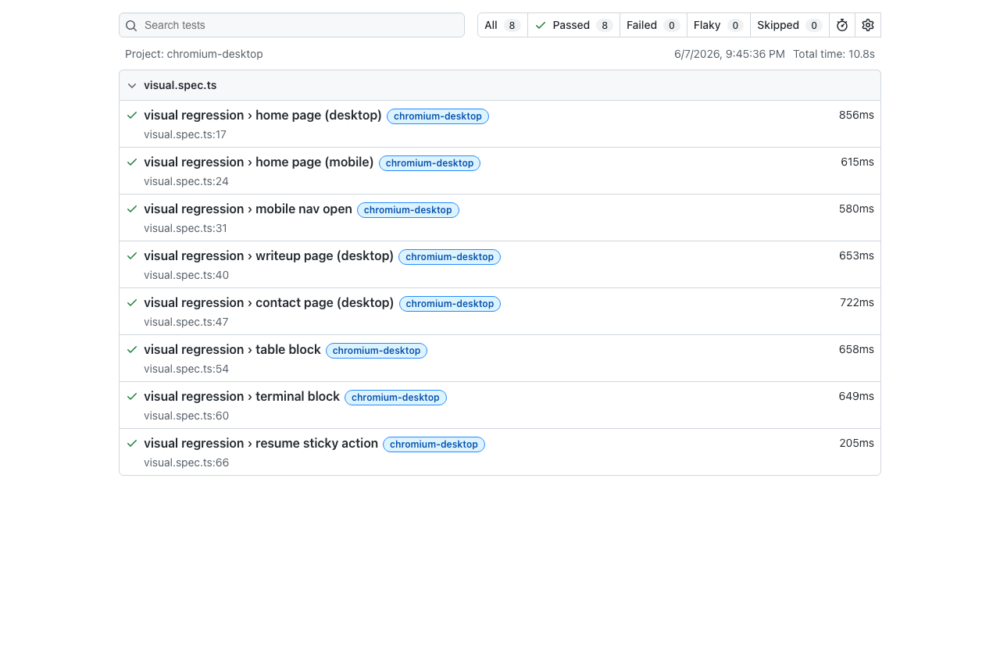

---

## 5. Visual regression

`visual.spec.ts` captures whole-page and element-level screenshots and diffs them against committed baselines. To avoid cross-platform font and rasterization noise, **baselines are owned by Chromium on macOS**. It runs under [`playwright.visual.config.ts`](../playwright.visual.config.ts), which builds [`fixtures/content/`](./fixtures/content/) (four synthetic writeups with a fixed featured order, a shared tag, a table, a terminal block, and a figure; the pages the build renders; a fixed GitHub snapshot; fixture images from [`fixtures/make-images.ts`](./fixtures/make-images.ts)) into `dist-visual/` with `SITE_CONTENT_ROOT` set. That build is hermetic (no GitHub or package-registry calls), so a baseline moves only when a layout or a fixture does; real content stays covered by the functional suite and the build audits. Retries are off, and readiness is deterministic (fonts and eager images settled, overlays polled to full opacity) rather than `networkidle` or sleeps. Failed runs write `expected`, `actual`, and `diff` images to `test-results/visual/`; CI uploads them with the HTML report.

The committed PNGs under [`playwright/visual.spec.ts-snapshots/`](./playwright/visual.spec.ts-snapshots/) are review artifacts, meant to be checked in the diff before any visual change merges.

### What each baseline protects

| Baseline | Protects |
| :--- | :--- |
| Home (desktop / mobile) | Hero, header, primary CTAs, above-the-fold spacing; mobile narrow layout independently. |
| Mobile nav open | Overlay, close control, link spacing, body lock, viewport coverage. |
| Writeup (desktop) | Article typography, metadata, hero treatment, reading width, sticky action. |
| Contact (desktop) | Form layout, field spacing, labels, copy, submit control. |
| Table / terminal block | High-risk authored blocks isolated so a page change can't hide block regressions. |
| Resume action | The fixed, centered resume action relative to page content. |
| Portfolio Software (desktop / mobile) | Full-page Software tab: featured cards, install lines, the More-projects list, and mobile stacking. Live versions, downloads, and dates are masked so the baseline pins layout, not numbers. |

### Committed baselines

These are the PNGs that ship in the repo and that every run is measured against.

**Home, desktop and mobile** (narrow layout is protected independently):

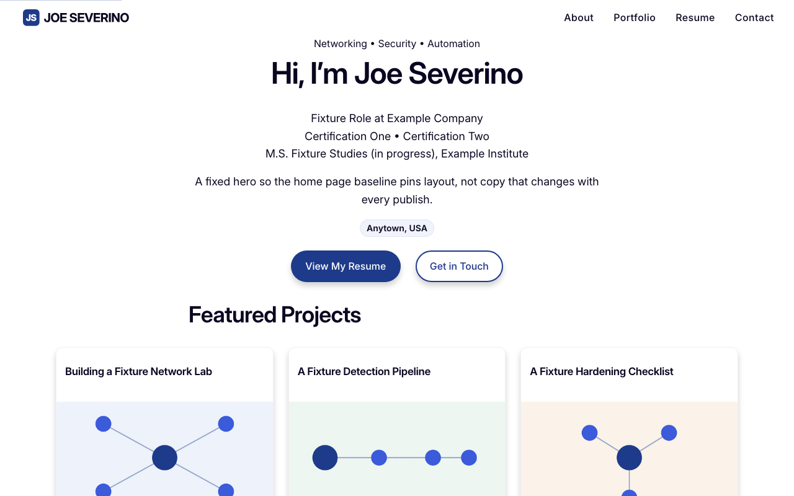

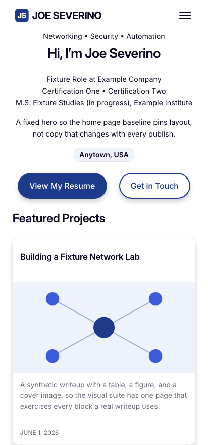

**Mobile navigation open**: overlay, close control, link spacing, body lock:


**Portfolio writeup** and **contact**:

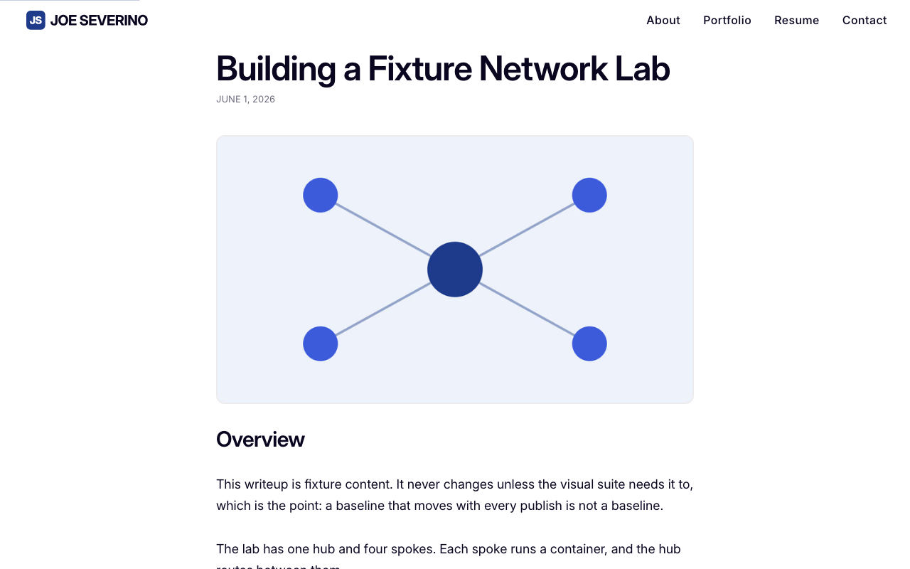

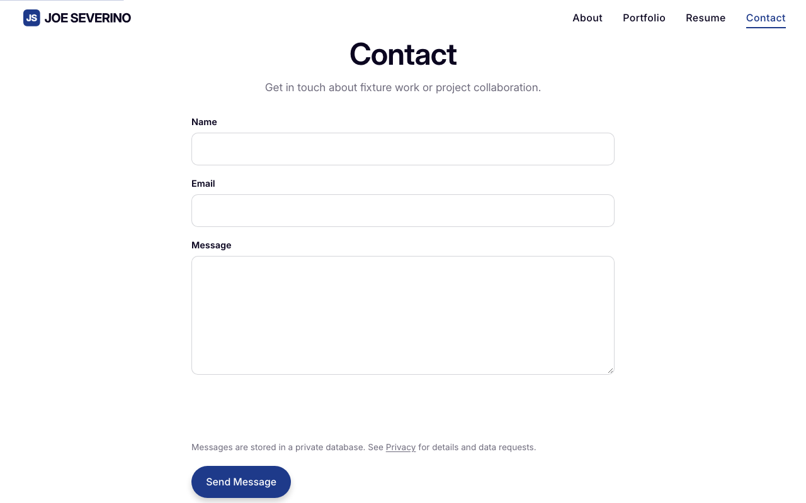

**Structured content**: table and terminal blocks isolated so a page-level change can't mask a block regression:

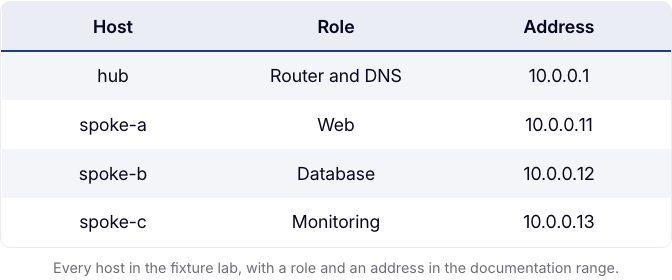

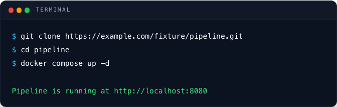

**Resume action**: the fixed, centered action relative to page content:

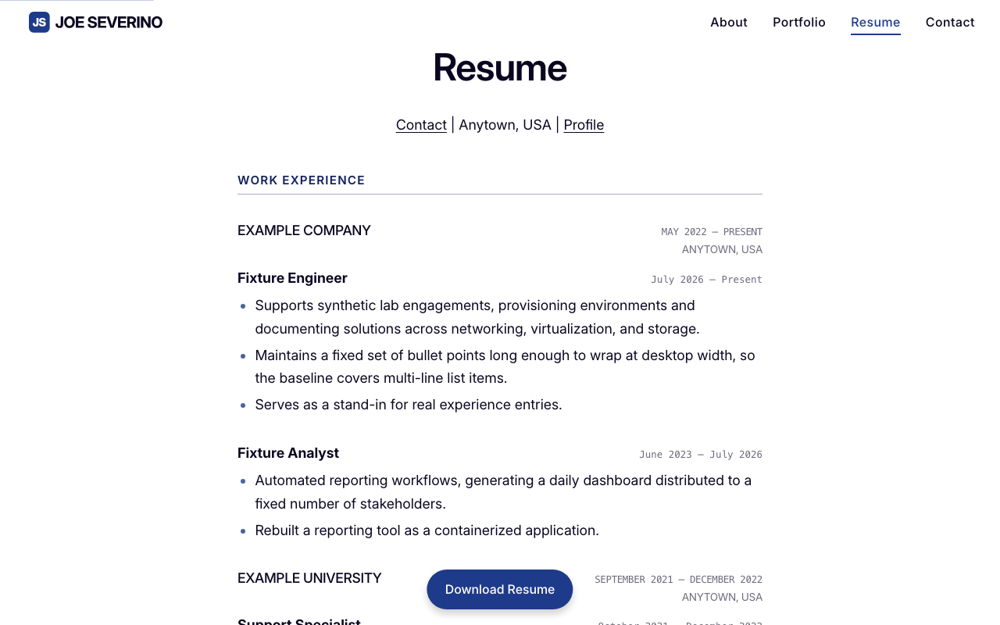

**Portfolio Software tab, desktop and mobile** (full page; live versions, downloads, and dates are masked so the baseline pins only the layout):

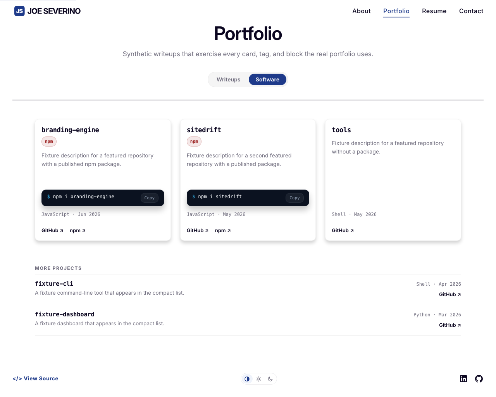

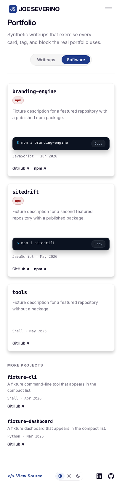

### Diff example: header height shift
Triggered by changing the header height (e.g. `3.6rem` → `8rem`), pushing the whole layout down:

| Expected | Actual | Diff |
| :---: | :---: | :---: |
| 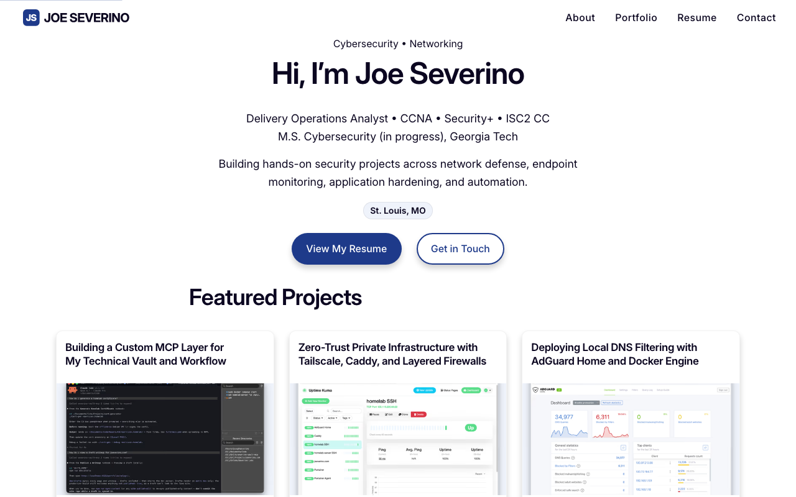 | 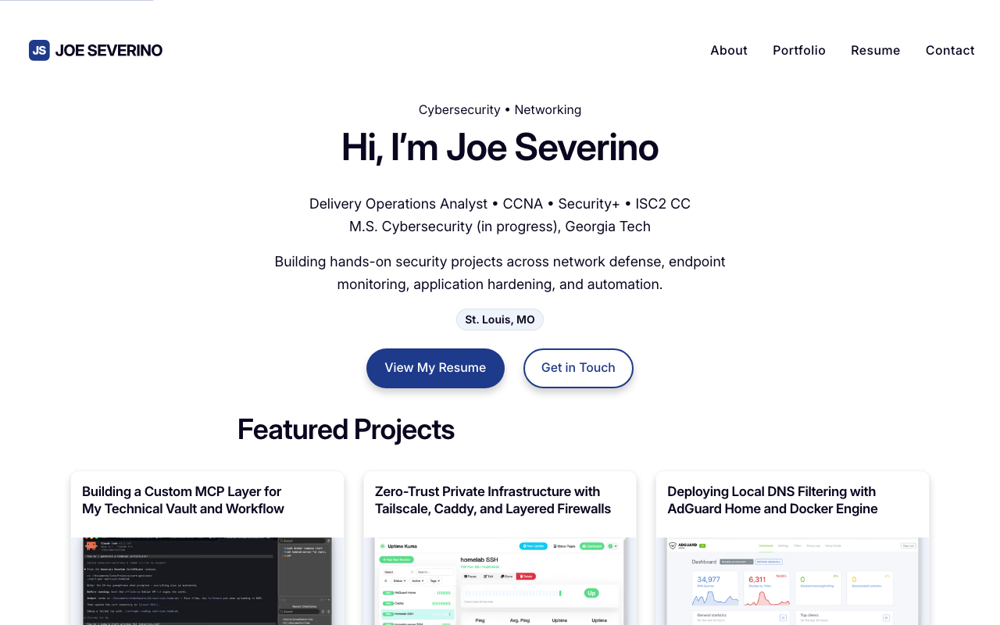 | 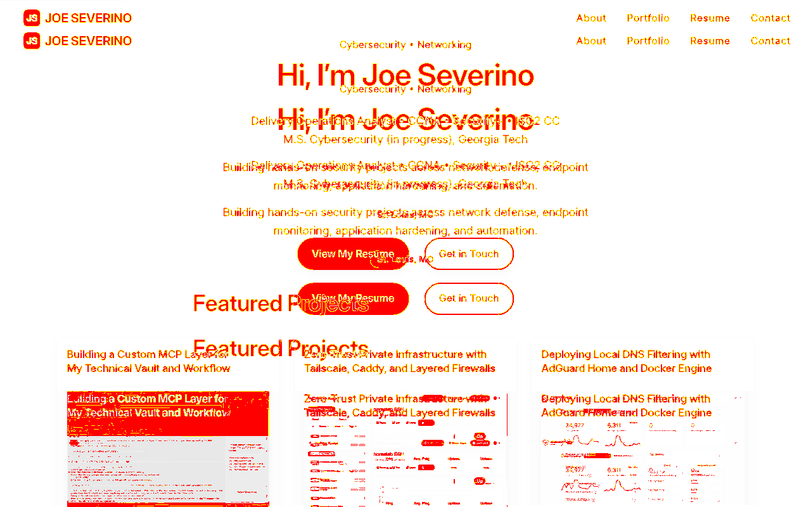 |

### Diff example: terminal block color shift
Triggered by changing the terminal block background (`#0b1220` → `#3b82f6`):

| Expected | Actual | Diff |
| :---: | :---: | :---: |
| 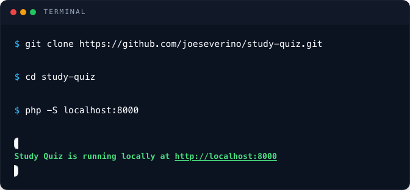 | 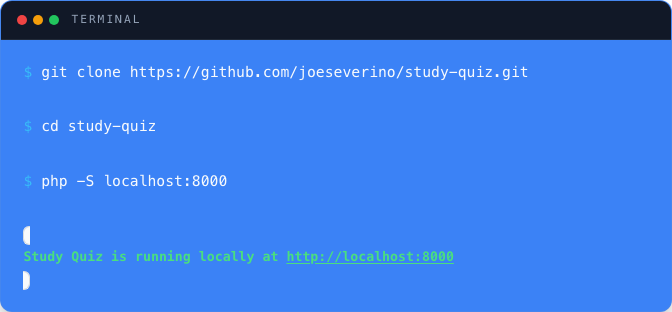 | 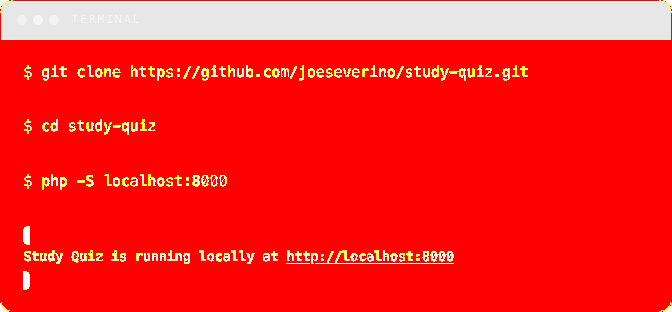 |

### Functional failure capture
When a functional assertion fails, Playwright screenshots the page at the moment of failure. Below: the contact form's error state when submitted without solving Turnstile.

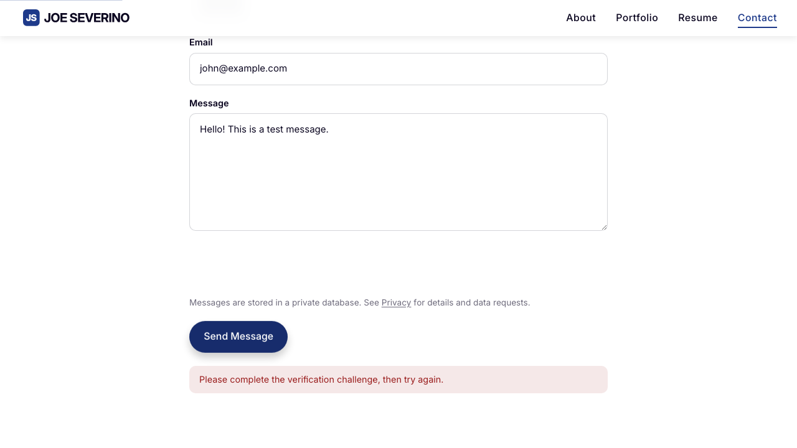

---

## 6. Edge runtime and post-deploy verification

### The edge runtime suite (`tests/edge/`)

`astro preview` serves static files only. The CSP middleware
([`functions/_middleware.ts`](../functions/_middleware.ts)), the Pages Functions,
and the [`public/_headers`](../public/_headers) rules exist only on Cloudflare's
runtime, so the browser suite cannot see them. The edge suite serves the built
output through `wrangler pages dev` (Cloudflare's `workerd`, bundled with the
`wrangler` devDependency; no account or token involved) and asserts the served
responses. Config lives in [`playwright.edge.config.ts`](../playwright.edge.config.ts);
the port and the compatibility date live in
[`browser-test-env.ts`](./browser-test-env.ts), and the date must match the
Pages project's runtime setting. The specs use Playwright's request fixture
only, so no browser is launched.

[`runtime.spec.ts`](./edge/runtime.spec.ts) asserts, against `/` and one writeup
page picked from the build rather than a pinned slug:

- the per-request CSP carries a nonce, `default-src 'none'`, `object-src 'none'`, `base-uri 'self'`, `frame-ancestors 'self'`, `report-to csp-endpoint` with the `report-uri` fallback, and no `'unsafe-inline'` script source; the report-only policy stages `'strict-dynamic'` under the same nonce plus Trusted Types, and `Reporting-Endpoints` is present. The predicates live in [`src/lib/edge-expectations.ts`](../src/lib/edge-expectations.ts), shared with `deploy:verify`;
- every `<script>` tag carries the header nonce, and the nonce rotates between requests;
- the static security headers from `public/_headers` are present and no CORS header leaks onto HTML;
- fingerprinted `/_astro/` assets are `immutable` for a year while chrome assets under `/assets/icons/` are short-lived and never immutable;
- an unknown route returns a real `404`, and the sitedrift review proxy is absent from a production build;
- `POST /api/contact` refuses a submission without a Turnstile token, a non-JSON body (`415`), malformed JSON, and fields outside the contract, all before Turnstile or D1 are touched;
- `security.txt` is served byte-for-byte from the committed, signed file, and the WKD key is served as `application/octet-stream`.

```sh
npm run test:edge      # build, serve through wrangler pages dev, run the suite
npm run edge:serve     # the same runtime on http://127.0.0.1:8788, for checks by hand
```

CI runs this as the `edge` leg of the `playwright` matrix; locally it is part of
`release:check` and `diagnose` through the registry (`edge-tests`).

### Post-deploy verification

`bin/deploy-verify.ts` (`npm run deploy:verify`) runs after a deploy to production, from a residential IP, and confirms the live deploy matches the local gate. Against `jseverino.com` it is not run from CI, because Cloudflare Bot Fight Mode challenges GitHub-hosted runners. The `deploy` workflow instead runs `deploy-verify --origin <url>` against each deployment's own `*.pages.dev` URL, which is outside the zone: the response checks below minus the repo state, audit, remote checks, code scanning, and HSTS (zone-level). `--preview` skips the sitedrift guard and the page-markup checks (nonce, cache rules) on branch previews, where sitedrift wraps every HTML route; `--slug <writeup>` checks one writeup after a publish (listed, served with headers, images resolve).

1. **Repo state**: local branch is `main`, clean, fully pushed.
2. **Production dependency audit**: `npm audit --omit=dev --audit-level=high`.
3. **Remote checks**: polls the GitHub API until `build`, `e2e`, `visual`, `edge`, CodeQL, and Cloudflare Pages report success.
4. **Live response audit** against `https://jseverino.com/` and one deep writeup page (picked from the live sitemap, not a pinned slug, so renaming a writeup can't break verification):
   - HSTS present with `includeSubDomains`,
   - CSP active with no `'unsafe-inline'` script source,
   - `reporting-endpoints` and `report-to` routed to `/api/csp-report`, the report-only policy staging `'strict-dynamic'`,
   - sitedrift proxy paths return `404`.
5. **Live sitemap traversal**: HEAD every route from `sitemap-index.xml`; zero dead links.
6. **CodeQL**: no open scanning alerts.

---

## 7. Remote CI/CD workflows

| Workflow | Trigger | Enforces |
| :--- | :--- | :--- |
| `ci.yml` | push/PR to `main` | Independent jobs, so a failure reports on its own required check: `build` (`gate:check`, then `publish:check -- --no-sync`, plus a CycloneDX SBOM on `main`) and the `playwright` matrix (`e2e` on three workers, `visual` against `tests/fixtures/content` on macOS, and `edge`, which serves the build through `wrangler pages dev` and asserts the CSP nonce, `_headers` rules, real 404, contact refusals, and `security.txt` parity). The Linux legs install browser system packages while the site builds, then serve that build. Every job writes a summary. |
| `deploy.yml` | Cloudflare Pages check-run completed; `ci` completed | `verify` runs the default branch's `bin/deploy-verify.ts --origin` against the deployment's `*.pages.dev` URL, with the Access service token and no branch code; `report` keeps one PR comment current (CI summaries and the deployment, in whichever order they finish); `recover-main-ci` dispatches the CI run GitHub suppresses after a Dependabot auto-merge. |
| `codeql.yml` | push/PR to `main`, weekly | Semantic JS/TS scan (XSS, prototype pollution, insecure regex). Open alerts block merge. Skipped on content-only PRs (`changes.yml` classifies the paths). |
| `dependency-review.yml` | every PR | Fails PRs that add/update a dependency with a high-severity advisory. Skipped on content-only PRs. |
| `npm-audit.yml` | weekly | `npm run audit` ([`bin/audit.ts`](../bin/audit.ts)) over the lockfile: fails on a high or critical advisory that [`security/audit-allowlist.json`](../security/audit-allowlist.json) does not accept, or accepts past its `reviewBy` date. |
| `scorecard.yml` | weekly / branch-protection change | OpenSSF supply-chain posture; SARIF uploaded to code scanning, and a JSON pass rendered by `bin/scorecard-summary.ts` into the job summary: the aggregate plus every check with Scorecard's reason. |
| `workflow-lint.yml` | workflow changes | `actionlint` on Action YAML; also gates SHA-pinning. |
| `link-check.yml` | docs changes, weekly | `lychee` audits repository documentation links and public content links (self-domain links excluded; 403/429/999 accepted as answered) and writes both reports into the job summary. |
| `lighthouse.yml` | weekly | `bin/lighthouse-check.ts` runs the lockfile's Lighthouse against the URLs in `.lighthouserc.json` with its thresholds (accessibility 95 and SEO 90 fail; performance 85 and best practices 70 warn), writes the per-page scores to the job summary, and uploads the reports. |
| `security-txt-expires.yml` | schedule | Opens an issue when `security.txt` nears expiry (runs `check-security-txt.ts`). |
| `dependabot-auto-merge.yml` | Dependabot PRs | Enables squash auto-merge for non-major updates except `sitedrift`; GitHub merges after every required check passes. |
| `dependabot-stale.yml` | weekly | Opens a self-closing issue listing Dependabot PRs open past seven days. |

---

## 8. Troubleshooting

Each audit's one-line fix is in the [audit table](#2-audits); `diagnose` prints the same text with the rerun command. Two failures need more than a line:

### Visual mismatch
If unintended, fix the layout/CSS. If it's an approved redesign:
1. `npm run test:e2e:visual:update` on macOS,
2. inspect the image diff under `tests/playwright/visual.spec.ts-snapshots/` to confirm only the expected pixels changed,
3. commit the updated baselines **with** the styling change.

### Unpinned GitHub Action
A workflow uses a tag (`@v4`) instead of a SHA. Replace it with the commit SHA for that release, e.g. `uses: actions/checkout@11bd71901bbe5b1630ceea73d27597364c9af683 # v4.2.2`.
