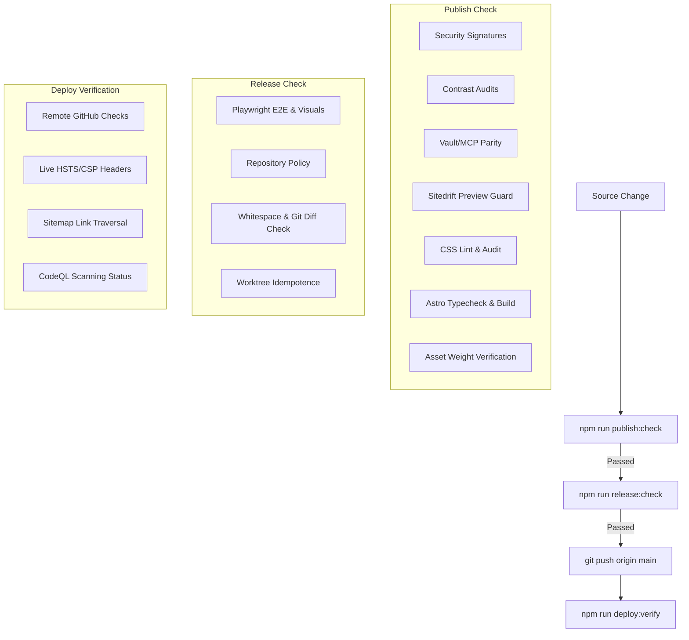

# Validation & Testing Suite

This repository is designed around a **zero-drift, self-healing, and highly-audited release workflow**. Every contribution is verified across multiple layers—from formatting and styling standards to security header signatures, metadata parity, functional browser paths, and pixel-perfect visual regression.

## Executive Summary: Unified Verification Architecture

To guarantee the site remains production-ready and highly secure, the repository employs a multi-tiered verification framework. This document serves as the **single source of truth** for all testing, validation, and compliance policies in this codebase.

The testing footprint spans three core operational horizons:

1. **Static Analysis & Local Policy Gates (Pre-Build)**: Executed locally via `npm run diagnose` (or `npm run publish:check`). These checks lint styles (`stylelint`), verify color contrast ratios (`tests/audits/check-contrast.mjs`), validate schema metadata parity between the Obsidian vault and Zod schemas (`tests/audits/check-vault-mcp-parity.mjs`), audit repository files and workflow tags (`tests/audits/check-repository-policy.mjs`), and verify GPG security disclosures (`tests/audits/security-txt.mjs`).
2. **Browser-Level E2E & Visual Regressions (Integration)**: Automated Playwright tests (`tests/playwright/`) checking cross-browser functional flows (`smoke.spec.ts`), mobile interactive drawers (`mobile-menu.spec.ts`), accessibility standards and motion behaviors (`css-quality.spec.ts`), and pixel-by-pixel regression checks (`visual.spec.ts`).
3. **Continuous Integration & Post-Deploy Audits (Continuous Trust)**: Remote GitHub Actions checks (CodeQL vulnerability scanning, OpenSSF Scorecard, dependency reviews) and live post-deployment checks (`deploy-verify.mjs`) auditing production headers, package health, and live sitemap link traversals.

---

## 1. Validation Philosophy & Pipeline

To keep the codebase production-ready, validations are categorized into two primary local gates:



### The Verification Gates
1. **`npm run publish:check` (Local Validation & Build)**: Verifies content synchronization, styling limits, design tokens, security signatures, Astro typechecking, and image asset bounds.
2. **`npm run release:check` (Final Local Release Gate)**: Runs the cross-browser E2E suite, visual regression tests, repository policy compliance, and ensures validation processes did not mutate any tracked/untracked repository state. **Requires macOS** due to macOS-specific visual rasterization baselines.
3. **`npm run diagnose` (Unified Diagnostics)**: Executes all validation scripts, static audits, build compilation, and Playwright tests. Unlike the other gates, it does not short-circuit on the first error, ensuring a complete report of all issues in the worktree. It outputs results to the console and generates a detailed `.validation-report.md` on failures.
   * Run `npm run diagnose -- --fast` to execute only the fast static checks (skips static build and Playwright tests).
   * Run `npm run diagnose -- --no-tests` to execute static checks and compile the build, while skipping the browser tests.

---

## 2. The Validation Matrix

| Scope | Validation / Check | File/Command | What it Asserts & Protects |
| :--- | :--- | :--- | :--- |
| **Security** | [Security Signature](#security-txtmjs) | `tests/audits/security-txt.mjs` | Verifies PGP signature, required fields, and expiration for `.well-known/security.txt`. |
| **Design** | [Color Contrast](#check-contrastmjs) | `tests/audits/check-contrast.mjs` | Compares `--color-*` CSS tokens to ensure text elements satisfy WCAG AA contrast (>= 4.5:1). |
| **Parity** | [Schema Parity](#check-vault-mcp-paritymjs) | `tests/audits/check-vault-mcp-parity.mjs` | Asserts that writeup metadata fields match between the Vault, Astro Schema, and MCP Server. |
| **Routing** | [Preview Guard](#check-sitedrift-previewmjs) | `tests/audits/check-sitedrift-preview.mjs` | Guarantees the SiteDrift review wrapper compiles on preview branches but is absent on `main`. |
| **Styling** | [CSS Custom Properties](#audit-cssmjs) | `tests/audits/audit-css.mjs` | Prevents styling bloat by failing on defined-but-unused CSS custom properties. |
| **Assets** | [Asset Size Audit](#audit-assetsmjs) | `tests/audits/audit-assets.mjs` | Tracks image counts/sizes; warns or fails if an image exceeds the warning threshold (default 1.5MB). |
| **E2E** | [Smoke & Navigation](#3-playwright-e2e--visual-suite-tests) | `tests/playwright/smoke.spec.ts` | Validates sitemap routing status (200), header scrolling, and navigation paths. |
| **Mobile** | [Mobile Interaction](#3-playwright-e2e--visual-suite-tests) | `tests/playwright/mobile-menu.spec.ts` | Tests hamburger menu overlays, Escape key handling, and tap-highlight overrides. |
| **Quality** | [Browser CSS Quality](#3-playwright-e2e--visual-suite-tests) | `tests/playwright/css-quality.spec.ts` | Asserts skip-links, brand colors, motion tokens, click-target scales, and forced colors. |
| **Visual** | [Visual Regression](#3-playwright-e2e--visual-suite-tests) | `tests/playwright/visual.spec.ts` | Checks layout shifts and pixel regressions using committed Chromium screenshots. |
| **Policy** | [Repository Policy](#check-repository-policymjs) | `tests/audits/check-repository-policy.mjs` | Enforces `.nvmrc` version, package-lock alignment, unpinned workflows, and conflict copies. |
| **Post-Push**| [Deploy Verification](#5-post-push-deploy-verification) | `bin/deploy-verify.mjs` | Checks remote CI status, production dependencies, live security headers, and sitemap 200s. |
| **CI Security**| [CodeQL Vulnerability Scan](#6-remote-cicd--security-workflows) | `.github/workflows/codeql.yml` | Scans JS/TS code for functional security vulnerabilities and injection risks. |
| **CI Security**| [Dependency Review Gate](#6-remote-cicd--security-workflows) | `.github/workflows/dependency-review.yml` | Prevents pull requests from introducing new dependencies with high-severity vulnerabilities. |
| **CI Security**| [OpenSSF Scorecard Audit](#6-remote-cicd--security-workflows) | `.github/workflows/scorecard.yml` | Monitors branch protection, pinned workflows, and scorecard metrics to prevent supply-chain attacks. |

---

## 3. Playwright E2E & Visual Suite (`tests/playwright/`)

The browser testing suite validates the compiled static output (`dist/`) against a preview server. It does not run on Astro's dev server.

### Spec Map & Protections

* **[`smoke.spec.ts`](./smoke.spec.ts)**:
  * *Sitemap Route Health*: Dynamically parses `sitemap-index.xml` and fetches every route to assert a `200 OK` status.
  * *Console Health*: Monitors the browser console during navigation and fails on any errors (excluding specific preconnect issues).
  * *Interactivity*: Verifies hero rendering, header shadow styling toggles during scroll, and primary links.
* **[`mobile-menu.spec.ts`](./mobile-menu.spec.ts)**:
  * *Overlay Logic*: Asserts the mobile menu popover toggles open/close, applies body overflow locking, and closes on `Escape` keypress or link navigation.
  * *Tap Highlights*: Asserts touch targets suppress title-only tap highlight highlights on WebKit/Blink browsers.
* **[`css-quality.spec.ts`](./css-quality.spec.ts)**:
  * *Accessibility*: Asserts accessibility skip-link focus visibility and forced-colors (high contrast) outline behaviors.
  * *Theme Integrity*: Verifies primary brand token application, motion transition durations (e.g. 200ms standard), and reduced motion media queries (which must set transitions to `0s`).
  * *Interaction stability*: Asserts button and card click targets do not layout-shift during mouse-down/hover states.
  * *Layout Containment*: Checks that tables do not overflow narrow viewports (320px) and that images fill their media boxes using `object-fit: cover`.
* **[`visual.spec.ts`](./visual.spec.ts)**:
  * Performs whole-page and element-level visual regression comparisons.
  * To avoid cross-platform font and rasterization noise, **snapshots are captured exclusively via Chromium on macOS**.

### Example Test Specifications

To demonstrate the depth of our browser testing beyond simple page checks, here are code examples showing how our Playwright specs assert accessibility, performance, and layout integrity:

#### Dynamic Sitemap Route Auditing (`smoke.spec.ts`)
Instead of hardcoding URLs, Playwright programmatically reads the project sitemap and audits every single live page path to guarantee zero broken routes:
```typescript
test('every sitemap page returns 200', async ({ request }) => {
  const indexResponse = await request.get('/sitemap-index.xml');
  expect(indexResponse.status()).toBe(200);

  const sitemapUrls = [...(await indexResponse.text()).matchAll(/<loc>([^<]+)<\/loc>/g)]
    .map((match) => new URL(match[1]).pathname);

  for (const sitemapUrl of sitemapUrls) {
    const sitemapResponse = await request.get(sitemapUrl);
    expect(sitemapResponse.status()).toBe(200);
    const publicPaths = [...(await sitemapResponse.text()).matchAll(/<loc>([^<]+)<\/loc>/g)]
      .map((match) => new URL(match[1]).pathname);

    for (const path of publicPaths) {
      const response = await request.get(path);
      expect(response.status()).toBe(200);
    }
  }
});
```

#### Keyboard Accessibility Focus States (`css-quality.spec.ts`)
Asserts that keyboard navigation triggers skip-links correctly and renders visual focus outlines with the proper solid styling rules:
```typescript
test('focus exposes the skip link', async ({ page }) => {
  await page.goto('/');

  const skipLink = page.locator('.skip-link');
  await skipLink.focus();
  await expect(skipLink).toBeFocused();
  await expect(skipLink).toBeVisible();
  await expect(skipLink).toHaveCSS('outline-style', 'solid');
});
```

#### Layout Shift & Motion Stability (`css-quality.spec.ts`)
Guarantees that hover transitions do not trigger layout shifts during mouse presses. The bounding box of an elevated UI card is monitored and asserted to remain perfectly stable when clicked:
```typescript
test('buttons and cards keep a stable click target through press and release', async ({ page }) => {
  await page.goto('/404.html');

  const button = page.getByRole('link', { name: 'View Portfolio' });
  const buttonBox = await button.boundingBox();
  expect(buttonBox).not.toBeNull();

  // Hover raises button slightly via translate
  await page.mouse.move(buttonBox!.x + buttonBox!.width / 2, buttonBox!.y + buttonBox!.height / 2);
  await expect(button).toHaveCSS('translate', '0px -2px');
  
  const raisedButtonBox = await button.boundingBox();
  expect(raisedButtonBox).not.toBeNull();

  // Mouse down should not cause further layout translation shifts
  await page.mouse.down();
  expect(await button.boundingBox()).toEqual(raisedButtonBox);
  await page.mouse.up();
});
```

#### Network Interception & Form Submissions (`contact.spec.ts`)
Intercepts and routes POST requests to `/api/contact` during form submissions to test error conditions and success responses without hitting the backend server:
```typescript
test('submits successfully with simulated turnstile and mocked api', async ({ page }) => {
  // Mock POST request payload and response
  await page.route('/api/contact', async (route) => {
    const payload = route.request().postDataJSON();
    expect(payload.name).toBe('Jane Doe');

    await route.fulfill({
      status: 200,
      contentType: 'application/json',
      body: JSON.stringify({ ok: true }),
    });
  });

  await page.locator('#contact-name').fill('Jane Doe');
  await page.locator('#contact-email').fill('jane@example.com');
  await page.locator('#contact-message').fill('Mocked message content');

  // Inject a mock turnstile response token
  await page.evaluate(() => {
    const input = document.createElement('input');
    input.type = 'hidden';
    input.name = 'cf-turnstile-response';
    input.value = 'mocked-turnstile-token';
    document.querySelector('.contact-intake-form')?.appendChild(input);
  });

  await page.locator('.contact-submit').click();

  // Assert success message displays and inputs are reset
  await expect(page.locator('.contact-status')).toContainText('Thanks — your message has been sent');
  await expect(page.locator('#contact-name')).toHaveValue('');
});
```

#### Dynamic DOM Tooltips & Keypress Dismissal (`tooltips.spec.ts`)
Asserts that clicking on content anchors containing private tooltips dynamically appends UI elements to the DOM at runtime, and checks that keyboard input like the `Escape` key successfully dismisses them:
```typescript
test('renders, positions, and dismisses tooltips correctly', async ({ page }) => {
  await page.goto('/portfolio/building-a-custom-mcp-layer/');

  const trigger = page.locator('[data-private-tooltip]');
  const tooltipSelector = '.private-tooltip';

  // Tooltip should not exist initially
  await expect(page.locator(tooltipSelector)).toHaveCount(0);

  // Show tooltip
  await trigger.click();
  await expect(page.locator(tooltipSelector)).toBeVisible();
  await expect(page.locator(tooltipSelector)).toContainText('this site only works on my tailnet');

  // Escape key should remove tooltip from the DOM
  await page.keyboard.press('Escape');
  await expect(page.locator(tooltipSelector)).toHaveCount(0);
});
```

### Running Playwright Tests

```sh
# Run functional tests across Chromium, Firefox, and WebKit (skips visual regression)
npm run test:e2e

# Open Playwright's interactive UI runner
npm run test:e2e:ui

# Run visual regression tests (requires macOS Chromium)
npm run test:e2e:visual

# Update visual snapshots after an intentional layout design change
npm run test:e2e:visual:update
```

### Playwright Test Report Example

Below is a screenshot of the Playwright HTML test report dashboard in action, showing a successful execution of all functional, mobile drawer, and CSS quality specs:


### Visual Baselines

These PNGs are committed because they are review artifacts, not transient test output. The macOS Chromium job owns the baselines to avoid cross-platform font and rasterization noise. Failed runs write expected, actual, and diff images to `test-results/`; CI uploads those files with the Playwright HTML report.

### Visual Regression Mismatch Examples

To demonstrate how the visual regression suite guards layout and presentation integrity, below are real examples of visual test failures triggered by styling changes:

#### Example 1: Header Height / Margin Shift
This mismatch was triggered by shifting the header height (e.g., from `3.6rem` to `8rem`), causing the rest of the page layout to push downwards:

| Expected Baseline | Actual Test Run | Visual Diff Highlight |
| :---: | :---: | :---: |
|  |  |  |

#### Example 2: Terminal Block Background Color Shift
This mismatch was triggered by changing the terminal block background color (e.g., from dark blue `#0b1220` to bright blue `#3b82f6`):

| Expected Baseline | Actual Test Run | Visual Diff Highlight |
| :---: | :---: | :---: |
|  |  |  |

### Functional Failure Example

When a functional E2E test assertion fails, Playwright captures a browser screenshot of the page at the exact moment of failure. Below is an actual screenshot demonstrating a functional E2E failure:

* **Contact Form Validation Failure**: Triggered when attempting to submit the contact form without solving the Cloudflare Turnstile challenge. Playwright captures the visible error status dialog rendered on the page:

  

#### Home
Desktop protects the hero, header, primary calls to action, and above-the-fold spacing. Mobile protects the narrow layout independently.


#### Mobile Navigation
Protects the open menu overlay, close control, link spacing, body lock, and viewport coverage.


#### Portfolio Writeup
Protects article typography, metadata, hero treatment, reading width, and the desktop sticky action.


#### Contact
Protects the form layout, field spacing, labels, explanatory copy, and submit control.


#### Structured Content
Component screenshots isolate high-risk authored blocks so a page-level change does not hide table overflow or terminal styling regressions.


#### Resume Action
Protects the fixed, centered resume action and its relationship to page content.


---


## 4. Local Quality Audits & Policy Scripts (`tests/audits/`)

These Node scripts enforce codebase quality and policy rules. They run in isolation and are coordinated during `publish:check` or `release:check`.

### `check-repository-policy.mjs`
Enforces structural health rules:
* **Node Version**: Asserts that `process.versions.node` matches the version declared in [`.nvmrc`](../.nvmrc).
* **Lockfile Alignment**: Compares dependencies and versions between `package.json` and `package-lock.json`.
* **Clean Git Status**: Prevents tracking of secrets (e.g. `.env`), development variables (`.dev.vars`), temporary directories (`dist/`, `playwright-report/`), or iCloud conflict copies.
* **Action Pinning**: Parses GitHub Action workflows and asserts that all third-party actions are pinned to an immutable commit SHA (rather than mutable tags like `@v4`).

### `check-contrast.mjs`
Ensures styling meets color contrast requirements:
* Reads `--color-*` declarations from [`src/styles/base.css`](../src/styles/base.css).
* Measures relative luminance of primary pairings (e.g., body text, muted text, and brand primary against background colors).
* Asserts each ratio satisfies WCAG 2.1 AA Normal Text (>= 4.5:1).

### `check-vault-mcp-parity.mjs`
Asserts that writeup frontmatter schema fields match across three sources:
1. **Vault Definition**: The Markdown yaml block in the vault's frontmatter schema file.
2. **Astro Schema**: The Zod configuration in [`src/content.config.ts`](../src/content.config.ts).
3. **MCP Tool**: The `update_writeup_frontmatter` signature in the Python MCP server.
*Any drift between these sources fails the check to guarantee the authoring workflow stays aligned.*

### `audit-css.mjs`
* Scans CSS files for variable declarations (`--variable-name: ...`).
* Scans for matching `var(--variable-name)` usages.
* Fails if any CSS variable is defined but never consumed.

### `audit-assets.mjs`
* Walks `public/assets` and collects all images.
* Outputs total weight and counts.
* Warns if any asset exceeds the 1.5MB limit (`ASSET_WARN_MB`). Fails the build if `STRICT_ASSET_AUDIT=1` is passed.

### `check-sitedrift-preview.mjs`
* Verifies that the SiteDrift preview wrapper is injected when building feature branches (`CF_PAGES_BRANCH !== 'main'`).
* Asserts that production builds (`CF_PAGES_BRANCH === 'main'`) remain untampered, standard Astro pages, and that the `/__sitedrift` path returns a 404.

### `security-txt.mjs`
* Verifies that the PGP clear-signed `public/.well-known/security.txt` exists, is signed with the `security@jseverino.com` key, contains required fields, has an expiration in the future, and matches the WKD verification path.

---

## 5. Post-Push Deploy Verification

### `deploy-verify.mjs`
Executes after a commit is pushed to `main`. It confirms that the remote environment matches the local release check:
1. **Repository state**: Asserts the local branch is `main`, clean, and fully pushed.
2. **Production Dependency Audit**: Runs `npm audit --omit=dev --audit-level=high`.
3. **Remote Checks Gate**: Polls the GitHub API to confirm that the `build`, `e2e`, `visual`, `CodeQL`, and `Cloudflare Pages` checks have completed successfully.
4. **Live Response Audits**: Performs HTTP requests against `https://jseverino.com/` to verify:
   * Secure HSTS headers are present (`includeSubDomains`).
   * Content Security Policy (CSP) is active and contains no `'unsafe-inline'` script allowances.
   * `reporting-endpoints` and `report-uri` are configured and route to `/api/csp-report`.
   * SiteDrift proxies return `404 Not Found`.
5. **Live Sitemap Traversal**: Fetches `sitemap-index.xml` and performs a HEAD query on every route to ensure zero dead links on the live production deploy.
6. **CodeQL Scan**: Queries GitHub for any open security scan alerts.

## 6. Remote CI/CD & Security Workflows

To prevent human error and verify commits in a clean environment, several automated pipelines run on GitHub Actions. These are the remote counterparts to the local release check:

### CodeQL Scanning (`codeql.yml`)
* **Trigger**: Every push to `main`, pull request targeting `main`, and on a weekly schedule.
* **Checks**: Conducts semantic static analysis on JS/TS. It flags patterns that could lead to vulnerabilities, such as Cross-Site Scripting (XSS), prototype pollution, or insecure regex.
* **Rule**: Failures appear as open alerts on the GitHub Security tab and must be resolved before merging.

### Dependency Review (`dependency-review.yml`)
* **Trigger**: Runs on every pull request.
* **Checks**: Reviews package manifest modifications (`package.json` / `package-lock.json`) and cross-references them with the GitHub Advisory Database.
* **Rule**: If a pull request adds or updates a package that has a high-severity vulnerability, the workflow fails, preventing unsafe code from being merged.

### OpenSSF Scorecard (`scorecard.yml`)
* **Trigger**: Weekly schedule, or when branch protection settings change.
* **Checks**: Audits repository-level supply chain factors, such as branch protection rules, code review policies, token permissions, binary tracking, and pinned dependencies.
* **Rule**: Reports are generated as SARIF files, uploaded to Code Scanning, and preserved as artifacts to maintain transparency on project health.

### Workflow & Link Verification
* **Actionlint (`workflow-lint.yml`)**: Validates GitHub Action YAML files to catch syntactic errors or deprecated schemas.
* **Lychee Link Checker (`link-check.yml`)**: Audits all internal and external markdown hyperlinks across the documentation files and posts detailed broken link diagnostics.
* **Lighthouse CI (`lighthouse.yml`)**: Spawns a headless browser to test key routes against performance, accessibility, SEO, and best-practice baseline scores.

---

## 7. Troubleshooting Common Failures

### Contrast Check Fails (`npm run check:contrast`)
* **Why**: A change in CSS variables has reduced a text-to-background ratio below 4.5:1.
* **Fix**: Adjust the custom properties in [`src/styles/base.css`](../src/styles/base.css) to increase text contrast. If a new color pair was intentionally introduced, register the pair in `tests/audits/check-contrast.mjs` inside the `pairs` array.

### Parity Check Fails (`npm run check:parity`)
* **Why**: A metadata field was added or removed from [`src/content.config.ts`](../src/content.config.ts) but not updated in the Vault schema document or the Vault MCP server.
* **Fix**: Ensure that the vault's `Frontmatter Schema.md` and the python MCP server code (under `update_writeup_frontmatter` signature) are updated to include the field. *Do not hand-edit synced frontmatter in `src/content/` files.*

### iCloud Conflict Copies Remain
* **Why**: Working in an iCloud-synced directory created conflict copies (e.g. `home 2.md` or `post-title 2.png`).
* **Fix**: Run `npm run clean:conflicts` to remove generated conflict files. For source files, review the conflict manually, merge changes, and delete the duplicate numbered file.

### Playwright Visual Mismatch
* **Why**: A design update has changed the pixel footprint of a page or component, causing it to drift from the committed baseline PNGs.
* **Fix**: If the change was unintentional, debug the layout or CSS. If it is an approved, intentional redesign:
  1. Run `npm run test:e2e:visual:update -- --project=chromium-desktop` on macOS.
  2. Inspect the git diff of the images under [`tests/playwright/visual.spec.ts-snapshots/`](./playwright/visual.spec.ts-snapshots/) to confirm only the expected elements changed.
  3. Commit the updated baseline PNGs along with your styling changes.

### Unpinned GitHub Actions
* **Why**: A workflow file in `.github/workflows/` uses a tag (e.g., `uses: actions/checkout@v4`) instead of a specific commit hash.
* **Fix**: Locate the workflow file referenced in the error message, find the action's commit SHA corresponding to that release version, and rewrite the `uses` line (e.g. `uses: actions/checkout@11bd71901bbe5b1630ceea73d27597364c9af683 # v4.2.2`).
