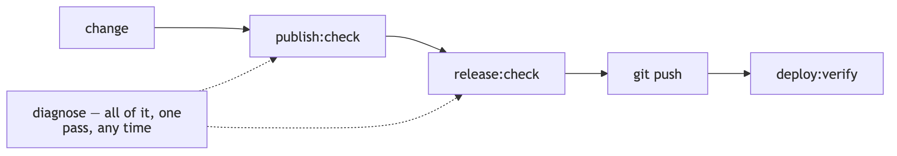

# Tests & Validation

Every change to this site passes through layered verification before it ships:
Node audits that assert invariants about the source, unit tests for the pure
library logic, Playwright specs that drive a real browser against the **built**
output, and post-push probes that re-check the live site. This directory holds the
first three; [`bin/`](../bin/) sequences them into gates.

> **Looking for detail?** This file is the tour. The exact assertions, every
> script, the code examples, and the troubleshooting tree live in the full
> reference: **[ARCHITECTURE.md](./ARCHITECTURE.md)**.

```
tests/
├── audits/        Node verifiers — assert an invariant, exit non-zero on failure
│   └── registry.mjs   single source of truth: which audits exist + which gate runs each
├── unit/          node:test specs for pure logic (Markdown DSL, CF functions, gate harness, registry)
└── playwright/    Browser specs — drive dist/ through a preview server
```

Every gate (`publish:check`, `diagnose`, `release:check`) derives its check list
from [`audits/registry.mjs`](./audits/registry.mjs), so a new audit is picked up
everywhere at once and no gate can silently fall out of sync.

## How it fits together

Three gates run in order. The first two are local; the third runs after the push.



<sup>Diagram source: [`docs/diagrams/testing-gates.mmd`](../docs/diagrams/testing-gates.mmd),
pre-rendered with [`diagram`](https://github.com/joeseverino/tools/blob/main/bin/diagram).</sup>

| Gate | Runs | Covers |
| :--- | :--- | :--- |
| `npm run publish:check` | local, pre-build | signatures, contrast, schema + edge parity, functions types, unit tests, preview guard, CSS, `astro check` + build, asset weight, internal links, page weight, structural HTML — also run by CI on every push (minus the local-only vault parity check) |
| `npm run release:check` | local, macOS | Playwright E2E + visual baselines, repository policy, clean-worktree check |
| `npm run deploy:verify` | after push | remote CI status, live HSTS/CSP headers, live sitemap 200s, open CodeQL alerts |

### The one-stop gate: `npm run diagnose`

The single source of truth for "is the codebase okay?". It runs **every** check
in the registry without stopping at the first failure, so one pass surfaces
every problem in the worktree:

- **Green** prints one summary line. There is nothing else to read.
- **Red** writes `.validation-report.md` — one row per failure, a concrete
  remediation, and the exact command to rerun that one check. Long output is
  clipped; the rerun command is the path to the full thing.
- **`--json`** emits a single machine-readable document (per-check status,
  durations, rerun + fix for each failure) instead of console output — the
  contract for agents and CI, no prose parsing.
- `--fast` runs only the static checks (~7s); `--no-tests` skips the browser
  suite.

See [the gate ladder](./ARCHITECTURE.md#1-the-gate-ladder) for the full breakdown.

## The three layers

**[`tests/audits/`](./audits/)** — fast Node checks with no browser. They prove
things the build itself won't catch: a [PGP-signed `security.txt`](./ARCHITECTURE.md#check-security-txtmjs)
that is current and resolves to a real WKD key, [WCAG contrast](./ARCHITECTURE.md#check-contrastmjs)
on every color token, [schema parity](./ARCHITECTURE.md#check-vault-mcp-paritymjs)
across the vault YAML, the Zod config, and the Python MCP server, no
[unused CSS variables](./ARCHITECTURE.md#check-cssmjs), a
[repository policy](./ARCHITECTURE.md#check-repository-policymjs) that keeps secrets,
build output, and unpinned Actions out of git,
[documentation integrity](./ARCHITECTURE.md#check-docsmjs) so every link and `npm run`
reference in the docs resolves, [functions/schema parity](./ARCHITECTURE.md#check-functions-paritymjs)
so the contact handler, the API Shield schema, and the D1 tables can't drift apart,
a [strict type check](./ARCHITECTURE.md#functions-type-check) over the Cloudflare
functions, and (post-build)
[internal link integrity](./ARCHITECTURE.md#check-linksmjs) across every built page,
a [page-weight budget](./ARCHITECTURE.md#check-page-weightmjs),
[structural HTML](./ARCHITECTURE.md#check-htmlmjs) (unique ids, alt on every image), and
[SEO metadata](./ARCHITECTURE.md#check-seomjs) on every rendered page.

**[`tests/unit/`](./unit/)** — `node:test` specs for pure logic, no browser and no
build. The [Markdown DSL](./ARCHITECTURE.md#the-unit-layer) in
[`src/lib/markdown.ts`](../src/lib/markdown.ts) is pinned block-by-block to the
exact HTML it must produce. The [Cloudflare Pages functions](./ARCHITECTURE.md#the-unit-layer)
(contact API, CSP report endpoint, header middleware) run request-in/response-out
with D1 and Turnstile stubbed — production serverless code verified before it
ships, not after. The [gate harness and the audit registry](./ARCHITECTURE.md#the-unit-layer)
are tested too, so the machinery the gates stand on can't rot silently. Runs on
Node's native test runner via type stripping — no extra dependency.

**[`tests/playwright/`](./playwright/)** — specs against the compiled site. The
[smoke suite](./ARCHITECTURE.md#smokespects) pulls every URL from the sitemap and
200-checks it, so new writeups are covered automatically. Others drive the
[mobile drawer](./ARCHITECTURE.md#menumobilespects),
[accessibility and motion](./ARCHITECTURE.md#css-qualityspects), the
[Turnstile-gated contact form](./ARCHITECTURE.md#contactspects) (mocked API, no
backend), [private-link tooltips](./ARCHITECTURE.md#tooltipsspects), and the
engine-agnostic [`*.single`](./ARCHITECTURE.md#4-testsplaywright--browser-specs)
checks for endpoints/404, image-variant resolution, `rel=noopener`, and an
[axe-core WCAG A/AA sweep](./ARCHITECTURE.md#a11ysinglespects) over the key
page archetypes.

> The `audit-` vs `check-` prefix is meaningful: `check-*` gates (fail), `audit-*`
> measures and reports — though the gates run the one `audit-*` (`audit-assets`)
> with `STRICT_ASSET_AUDIT=1`, so an oversized image fails too.
> [Why →](./ARCHITECTURE.md#naming-audit--vs-check-)

## What it catches

A full Playwright run, reported:


Visual regression pins page and component screenshots to macOS Chromium baselines.
A stray header-height change, for example, is caught as a pixel diff before it can
merge:

| Expected | Actual | Diff |
| :---: | :---: | :---: |
|  |  |  |

Functional failures screenshot the page at the moment of the failed assertion.
The full baseline gallery and more diff/failure examples are in
[ARCHITECTURE.md §5](./ARCHITECTURE.md#5-visual-regression).

## Run it

```sh
npm run help                     # grouped list of every script by role

npm run publish:check            # local build gate
npm run publish:check:ci         # the same gate under CI conditions (scratch keyring, CI=1)
npm run release:check            # full gate incl. Playwright + visual (macOS)
npm run diagnose                 # everything, no short-circuit (--fast | --no-tests | --json)

npm run test:unit                # unit suite: DSL, functions, harness, registry (fast, no browser)
npm run test:e2e                 # functional specs across Chromium, Firefox, WebKit
npm run test:e2e:visual          # visual regression (macOS Chromium)
npm run test:e2e:visual:update   # re-baseline after an intentional design change
```

---

**Full reference → [ARCHITECTURE.md](./ARCHITECTURE.md)** — validation matrix, every
script and spec, code examples, post-push `deploy:verify`, CI workflows, and the
troubleshooting tree.
