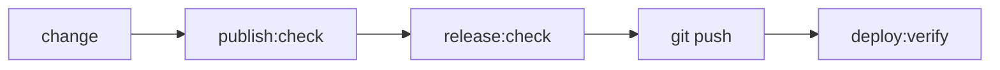

# Tests & Validation

Every change to this site passes through layered verification before it ships:
Node audits that assert invariants about the source, Playwright specs that drive a
real browser against the **built** output, and post-push probes that re-check the
live site. This directory holds the first two; [`bin/`](../bin/) sequences them
into gates.

> **Looking for detail?** This file is the tour. The exact assertions, every
> script, the code examples, and the troubleshooting tree live in the full
> reference: **[ARCHITECTURE.md](./ARCHITECTURE.md)**.

```
tests/
├── audits/        Node verifiers — assert an invariant, exit non-zero on failure
└── playwright/    Browser specs — drive dist/ through a preview server
```

## How it fits together

Three gates run in order. The first two are local; the third runs after the push.



| Gate | Runs | Covers |
| :--- | :--- | :--- |
| `npm run publish:check` | local, pre-build | signatures, contrast, schema parity, preview guard, CSS, `astro check` + build, asset weight |
| `npm run release:check` | local, macOS | Playwright E2E + visual baselines, repository policy, clean-worktree check |
| `npm run deploy:verify` | after push | remote CI status, live HSTS/CSP headers, live sitemap 200s, open CodeQL alerts |

`npm run diagnose` runs everything at once without stopping at the first failure.
See [the gate ladder](./ARCHITECTURE.md#1-the-gate-ladder) for the full breakdown.

## The two layers

**[`tests/audits/`](./audits/)** — fast Node checks with no browser. They prove
things the build itself won't catch: a [PGP-signed `security.txt`](./ARCHITECTURE.md#check-security-txtmjs)
that is current and resolves to a real WKD key, [WCAG contrast](./ARCHITECTURE.md#check-contrastmjs)
on every color token, [schema parity](./ARCHITECTURE.md#check-vault-mcp-paritymjs)
across the vault YAML, the Zod config, and the Python MCP server, no
[unused CSS variables](./ARCHITECTURE.md#check-cssmjs), a
[repository policy](./ARCHITECTURE.md#check-repository-policymjs) that keeps secrets,
build output, and unpinned Actions out of git,
[documentation integrity](./ARCHITECTURE.md#check-docsmjs) so every link and `npm run`
reference in the docs resolves, and (post-build)
[SEO metadata](./ARCHITECTURE.md#check-seomjs) on every rendered page.

**[`tests/playwright/`](./playwright/)** — specs against the compiled site. The
[smoke suite](./ARCHITECTURE.md#smokespects) pulls every URL from the sitemap and
200-checks it, so new writeups are covered automatically. Others drive the
[mobile drawer](./ARCHITECTURE.md#mobile-menuspects),
[accessibility and motion](./ARCHITECTURE.md#css-qualityspects), the
[Turnstile-gated contact form](./ARCHITECTURE.md#contactspects) (mocked API, no
backend), [private-link tooltips](./ARCHITECTURE.md#tooltipsspects), and the
engine-agnostic [`*.single`](./ARCHITECTURE.md#4-testsplaywright--browser-specs)
checks for endpoints/404, image-variant resolution, and `rel=noopener`.

> The `audit-` vs `check-` prefix is meaningful: `check-*` gates (fail), `audit-*`
> measures (warns). [Why →](./ARCHITECTURE.md#naming-audit--vs-check-)

## What it catches

A full Playwright run, reported:


Visual regression pins page and component screenshots to macOS Chromium baselines.
A stray header-height change, for example, is caught as a pixel diff before it can
merge:

| Expected | Actual | Diff |
| :---: | :---: | :---: |
|  |  |  |

Functional failures screenshot the page at the moment of the failed assertion.
The full baseline gallery and more diff/failure examples are in
[ARCHITECTURE.md §5](./ARCHITECTURE.md#5-visual-regression).

## Run it

```sh
npm run publish:check            # local build gate
npm run release:check            # full gate incl. Playwright + visual (macOS)
npm run diagnose                 # everything, no short-circuit

npm run test:e2e                 # functional specs across Chromium, Firefox, WebKit
npm run test:e2e:visual          # visual regression (macOS Chromium)
npm run test:e2e:visual:update   # re-baseline after an intentional design change
```

---

**Full reference → [ARCHITECTURE.md](./ARCHITECTURE.md)** — validation matrix, every
script and spec, code examples, post-push `deploy:verify`, CI workflows, and the
troubleshooting tree.
