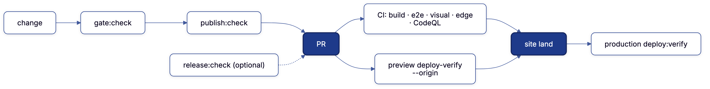

# Tests & Validation

Every change passes four layers: Node audits that assert invariants about the
source and the build, unit tests for the pure logic, Playwright specs that drive
the **built** output in a browser and through the Cloudflare runtime, and
post-deploy probes against each deployment. This directory holds the first
three; [`bin/`](../bin/) sequences them into gates.

> This file is the tour. Every audit with its fix, every spec, and the CI
> workflows are in the full reference: **[ARCHITECTURE.md](./ARCHITECTURE.md)**.

```
tests/
├── audits/        Node checks: assert an invariant, exit non-zero on failure
│   └── registry.ts   the audit inventory: which audits exist, which gate runs each
├── unit/          node:test specs for pure logic (Markdown DSL, Functions, gate harness, audit rules)
├── edge/          request specs against dist/ served by wrangler pages dev (Functions, _headers, built policy)
├── playwright/    browser specs against dist/ through a preview server
└── fixtures/      the synthetic content the visual suite builds
```

Every gate (`gate:check`, `publish:check`, `diagnose`, `release:check`) reads its
audits from [`audits/registry.ts`](./audits/registry.ts), so a new audit runs in
every gate that claims it.

## How it fits together



<sup>Diagram source: [`docs/diagrams/testing-gates.mmd`](../docs/diagrams/testing-gates.mmd),
pre-rendered with [`diagram`](https://github.com/joeseverino/tools/blob/main/bin/diagram).</sup>

| Gate | Runs | Covers |
| :--- | :--- | :--- |
| `npm run gate:check` | local and CI, first | the fast invariants: source parse, duplication, types, repository policy, docs, CSS lint, the snapshot's manifest and draft guards |
| `npm run publish:check` | local and CI | the pre-build audits, `astro check`, the production build, then asset weight, internal links, page weight, structural HTML, routing, and SEO; CI skips the local-only vault parity check |
| `npm run release:check` | local, macOS | `publish:check`, then Playwright E2E, visual baselines, the edge runtime suite, repository policy, and a clean-worktree check |
| `npm run deploy:verify` | after a deploy | live headers and CSP hash coverage of inline code, sitemap 200s, a real 404, the contact gate, `security.txt` parity; on production also remote CI status, the dependency audit, and open CodeQL alerts |

The exact audit list per gate is the generated [gate coverage](./ARCHITECTURE.md#gate-coverage) table.

### The one-stop gate: `npm run diagnose`

Runs **every** audit in the registry without stopping at the first failure:

- **Green** prints one summary line.
- **Red** writes `.validation-report.md`: one row per failure, the fix, and the
  exact command to rerun that check. Long output is clipped; the rerun command
  shows the rest.
- **`--json`** prints one document (per-check status, durations, rerun and fix
  for each failure) for agents and CI.
- `--fast` runs only the static checks; `--no-tests` skips the browser suites.

## The layers

**[`tests/audits/`](./audits/)**: Node checks with no browser. Before the build
they cover the signed `security.txt`, color contrast, contract parity on both
boundaries (vault/Zod/MCP and handler/OpenAPI/D1), strict types, duplicated
code, unused CSS variables, repository policy, and the docs' links and paths.
After the build they cover internal links, page weight, structural HTML
(including unprocessed directives), Functions routing, and SEO metadata.
The [audit table](./ARCHITECTURE.md#2-audits) says what each one asserts and how to fix it.

**[`tests/unit/`](./unit/)**: `node:test` specs for pure logic, no browser and no
build. The [content renderer](./ARCHITECTURE.md#the-unit-layer) in
[`src/lib/markdown/`](../src/lib/markdown/) is pinned block by block to the
HTML it must produce, and its guard to what it refuses. The Cloudflare Pages Functions (contact API, CSP report
endpoint, preview proxy) run request in, response out, with D1 and
Turnstile stubbed. The gate harness, the registry, the `site` CLI's publish and
land flows, and each audit's rule are tested too. Node runs the specs directly
by stripping types.

**[`tests/edge/`](./edge/)**: the build served by `wrangler pages dev`, so the
Functions and `public/_headers` answer as they do on
Cloudflare. [Details](./ARCHITECTURE.md#the-edge-runtime-suite-testsedge).

**[`tests/playwright/`](./playwright/)**: specs against the compiled site. The
[routes suite](./ARCHITECTURE.md#routessinglespects) requests every URL in the
sitemap, so new writeups are covered automatically. Others drive the
[mobile drawer](./ARCHITECTURE.md#menumobilespects),
[accessibility and motion](./ARCHITECTURE.md#css-qualityspects), the
[Turnstile-gated contact form](./ARCHITECTURE.md#contactspects) (mocked API, no
backend), portfolio interactions, `rel=noopener`, and an
[axe-core WCAG A/AA sweep](./ARCHITECTURE.md#a11ysinglespects) over the key
page archetypes. The visual suite renders the fixture content only, so a
publish never moves a baseline.

> The `audit-` vs `check-` prefix: `check-*` fails on a violation, `audit-*`
> measures and reports. The gates run the one `audit-*` (`audit-assets`) with
> `STRICT_ASSET_AUDIT=1`, so an oversized image fails too.

## What it catches

A full Playwright run, reported:


Visual regression pins page and component screenshots to macOS Chromium baselines.
A stray header-height change, for example, is caught as a pixel diff before it can
merge:

| Expected | Actual | Diff |
| :---: | :---: | :---: |
|  |  |  |

Functional failures screenshot the page at the moment of the failed assertion.
The full baseline gallery and more diff/failure examples are in
[ARCHITECTURE.md §5](./ARCHITECTURE.md#5-visual-regression).

## Run it

```sh
npm run help                     # grouped list of every script by role

npm run gate:check               # fast invariants, collect-all
npm run publish:check            # local build gate
npm run publish:check:ci         # the same gate under CI conditions (scratch keyring, CI=1)
npm run release:check            # full gate incl. Playwright + visual (macOS)
npm run diagnose                 # everything, no short-circuit (--fast | --no-tests | --json)

npm run test:unit                # unit suite (fast, no browser)
npm run test:edge                # the edge runtime suite
npm run test:e2e                 # functional specs across Chromium, Firefox, WebKit
npm run test:e2e:visual          # visual regression (macOS Chromium)
npm run test:e2e:visual:update   # re-baseline after an intentional design change
```

---

Full reference: [ARCHITECTURE.md](./ARCHITECTURE.md), with every audit and its
fix, every spec, post-deploy `deploy:verify`, and the CI workflows.
